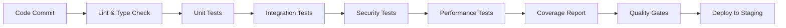

# EllaAI Assessment Execution System - Testing Strategy

## Executive Summary

This document outlines the comprehensive testing strategy for the EllaAI assessment execution system, designed to ensure robust, secure, and performant code execution capabilities for technical assessments.

## Testing Philosophy

Our testing approach follows the **Test Pyramid** methodology:

```
         /\
        /E2E\      <- Integration & E2E Tests (Few, High-Value)
       /------\
      /  API   \   <- Integration Tests (Moderate Coverage)
     /----------\
    /   Unit     \ <- Unit Tests (Many, Fast, Focused)
   /--------------\
```

### Core Principles

1. **Test-Driven Development (TDD)** - Write tests before implementation
2. **Defense in Depth** - Multiple layers of security testing
3. **Performance First** - Continuous performance validation
4. **Quality Gates** - Automated quality checks at every stage
5. **Real-World Scenarios** - Tests mirror actual usage patterns

## Test Coverage Requirements

### Coverage Thresholds
- **Statements**: 80% minimum
- **Branches**: 75% minimum  
- **Functions**: 80% minimum
- **Lines**: 80% minimum

### Critical Path Coverage
- **Code Execution Engine**: 95% coverage required
- **Security Validation**: 100% coverage required
- **Assessment Workflow**: 90% coverage required
- **User Interface Components**: 85% coverage required

## Testing Layers

### 1. Unit Tests

#### Frontend Components (Vitest + React Testing Library)
```typescript
// Component isolation testing
describe('CodeEditor', () => {
  it('should handle code changes and auto-save', async () => {
    const mockOnChange = vi.fn();
    const mockOnSave = vi.fn();
    
    render(<CodeEditor 
      value="initial code"
      onChange={mockOnChange}
      onSave={mockOnSave}
      autoSave={true}
    />);
    
    const editor = screen.getByTestId('monaco-editor');
    await user.type(editor, 'new code');
    
    // Auto-save should trigger after delay
    await waitFor(() => {
      expect(mockOnSave).toHaveBeenCalledWith('new code', 'javascript');
    }, { timeout: 3000 });
  });
});
```

**Coverage Areas:**
- User interaction handling
- State management
- Props validation
- Error boundaries
- Accessibility compliance
- Performance optimization

#### Backend Services (Jest)
```typescript
// Service logic testing
describe('CodeExecutionService', () => {
  it('should detect malicious code patterns', async () => {
    const maliciousCode = 'require("fs").readFileSync("/etc/passwd")';
    
    const result = await service.executeCode({
      code: maliciousCode,
      language: 'javascript',
      testCases: mockTestCases
    });
    
    expect(result.success).toBe(false);
    expect(result.error).toContain('unsafe operations');
  });
});
```

**Coverage Areas:**
- Business logic validation
- Data transformation
- Error handling
- External service integration
- Database operations

### 2. Integration Tests

#### API Endpoint Testing
```typescript
describe('Code Execution API', () => {
  it('should handle complete execution workflow', async () => {
    const response = await request(app)
      .post('/api/execute')
      .send({
        code: 'function solve(n) { return n * 2; }',
        language: 'javascript',
        testCases: validTestCases
      })
      .expect(200);

    expect(response.body).toMatchObject({
      success: true,
      testResults: expect.any(Array),
      score: expect.any(Number)
    });
  });
});
```

**Coverage Areas:**
- End-to-end API workflows
- Database integration
- Authentication/authorization
- Request/response validation
- Error propagation

### 3. Security Testing

#### Malicious Code Detection
```typescript
describe('Security Validation', () => {
  it('should block file system access attempts', async () => {
    const maliciousPatterns = [
      'require("fs").readFileSync("/etc/passwd")',
      'import os; os.system("rm -rf /")',
      'Runtime.getRuntime().exec("evil-command")'
    ];

    for (const pattern of maliciousPatterns) {
      const result = await service.executeCode({
        code: pattern,
        language: 'javascript',
        testCases: [basicTestCase]
      });

      expect(result.success).toBe(false);
      expect(result.error).toContain('unsafe operations');
    }
  });
});
```

**Security Test Categories:**
- **Code Injection Prevention**
  - File system access blocking
  - Process execution prevention
  - Network access restriction
  - Dynamic code execution detection

- **Resource Exhaustion Protection**
  - Infinite loop detection
  - Memory bomb prevention
  - CPU usage limitation
  - Timeout enforcement

- **Input Validation**
  - XSS attack prevention
  - SQL injection blocking
  - Command injection protection
  - Path traversal prevention

### 4. Performance Testing

#### Load Testing
```typescript
describe('Performance Tests', () => {
  it('should handle concurrent executions efficiently', async () => {
    const concurrentRequests = 50;
    const startTime = performance.now();
    
    const promises = Array.from({ length: concurrentRequests }, () =>
      service.executeCode(standardRequest)
    );
    
    const results = await Promise.all(promises);
    const duration = performance.now() - startTime;
    
    expect(results.every(r => r.success)).toBe(true);
    expect(duration).toBeLessThan(10000); // 10 seconds
  });
});
```

**Performance Benchmarks:**
- **Single Execution**: <500ms for simple code
- **Concurrent Load**: 50 simultaneous executions <10s
- **Memory Usage**: <100MB per execution
- **Database Operations**: <200ms per write
- **API Response Time**: <1s for complete workflow

## Test Environment Configuration

### Development Environment
```yaml
# Local development testing
environment:
  - Firebase Emulators (Firestore, Auth)
  - Mock external services
  - Test database with seed data
  - Hot reload for test changes
```

### CI/CD Environment
```yaml
# Automated testing pipeline
stages:
  - install_dependencies
  - lint_and_typecheck
  - unit_tests
  - integration_tests
  - security_tests
  - performance_tests
  - coverage_report
  - quality_gates
```

### Production-like Staging
```yaml
# Pre-deployment validation
environment:
  - Production Firebase project (staging)
  - Real external service integration
  - Load testing with production volumes
  - Security penetration testing
```

## Test Data Management

### Test Data Strategy
1. **Synthetic Data Generation** - Programmatically generated test cases
2. **Anonymized Production Data** - Real patterns without sensitive information
3. **Edge Case Scenarios** - Boundary conditions and error cases
4. **Security Test Vectors** - Known attack patterns and exploits

### Data Factories
```typescript
// Consistent test data generation
export const createMockAssessment = (overrides = {}) => ({
  id: faker.string.uuid(),
  title: faker.lorem.sentence(),
  difficulty: faker.helpers.arrayElement(['easy', 'medium', 'hard']),
  timeLimit: faker.number.int({ min: 15, max: 120 }),
  testCases: Array.from({ length: 5 }, () => createMockTestCase()),
  ...overrides
});
```

## Quality Gates

### Pre-Commit Hooks
```bash
# Automated quality checks
npm run pre-commit
├── lint (ESLint + Prettier)
├── typecheck (TypeScript)
├── unit tests (fast feedback)
└── security scan (basic patterns)
```

### Pull Request Requirements
```yaml
required_checks:
  - ✅ All tests passing
  - ✅ Coverage thresholds met
  - ✅ Security scan clean
  - ✅ Performance benchmarks met
  - ✅ Code review approved
  - ✅ Documentation updated
```

### Deployment Gates
```yaml
production_requirements:
  - ✅ Full test suite passing
  - ✅ Security penetration test
  - ✅ Load testing completed
  - ✅ Performance regression check
  - ✅ Database migration tested
  - ✅ Rollback plan validated
```

## Monitoring and Observability

### Test Metrics Tracking
- **Test Execution Time** - Monitor for performance regression
- **Flaky Test Detection** - Identify unreliable tests
- **Coverage Trends** - Track coverage over time
- **Security Test Effectiveness** - Measure vulnerability detection

### Production Monitoring
- **Error Rate Monitoring** - Real-time error tracking
- **Performance Metrics** - Response time and throughput
- **Security Incident Detection** - Automated threat detection
- **Resource Usage Tracking** - Memory and CPU utilization

## Risk Assessment & Mitigation

### High-Risk Areas
1. **Code Execution Engine** - Critical security and performance risks
2. **User Input Handling** - Injection attack vectors
3. **File Upload/Processing** - Malware and content risks
4. **Authentication/Authorization** - Access control vulnerabilities

### Mitigation Strategies
- **Multiple Security Layers** - Defense in depth approach
- **Automated Security Testing** - Continuous vulnerability scanning
- **Performance Monitoring** - Real-time alerting and auto-scaling
- **Incident Response Plan** - Documented procedures for security events

## Test Automation Pipeline

### Continuous Integration


### Test Scheduling
- **Unit Tests** - Every commit
- **Integration Tests** - Every PR
- **Security Tests** - Daily + every release
- **Performance Tests** - Weekly + every release
- **End-to-End Tests** - Before production deployment

## Team Responsibilities

### Development Team
- Write unit tests for all new features
- Maintain test coverage thresholds
- Update integration tests for API changes
- Monitor and fix flaky tests

### QA Team
- Design comprehensive test scenarios
- Execute manual exploratory testing
- Validate security requirements
- Performance testing and benchmarking

### DevOps Team
- Maintain test infrastructure
- Monitor test execution performance
- Implement quality gates in CI/CD
- Security scanning and compliance

### Security Team
- Define security test requirements
- Review malicious code patterns
- Conduct penetration testing
- Incident response and remediation

## Success Metrics

### Quality Metrics
- **Defect Escape Rate**: <2% bugs reaching production
- **Test Coverage**: >80% across all components
- **Test Execution Time**: <15 minutes for full suite
- **Flaky Test Rate**: <1% test failures due to flakiness

### Security Metrics
- **Vulnerability Detection**: 100% known patterns blocked
- **Incident Response Time**: <1 hour for critical issues
- **Security Test Coverage**: 100% attack vectors tested
- **False Positive Rate**: <5% security alerts

### Performance Metrics
- **Execution Time**: 95th percentile <2 seconds
- **Throughput**: >100 concurrent executions
- **Resource Efficiency**: <100MB average memory usage
- **Availability**: 99.9% uptime target

## Continuous Improvement

### Regular Reviews
- **Monthly** - Test metrics and trends analysis
- **Quarterly** - Security posture assessment
- **Annually** - Complete strategy review and updates

### Feedback Loops
- Developer feedback on test effectiveness
- Production incident analysis and test gaps
- Performance benchmark adjustments
- Security threat landscape updates

## Conclusion

This testing strategy ensures the EllaAI assessment execution system maintains the highest standards of quality, security, and performance. Through comprehensive automated testing, continuous monitoring, and regular reviews, we can confidently deliver a robust platform for technical assessments while protecting against security threats and maintaining optimal performance.

The multi-layered approach provides defense in depth, while the continuous improvement process ensures the testing strategy evolves with the system and threat landscape.