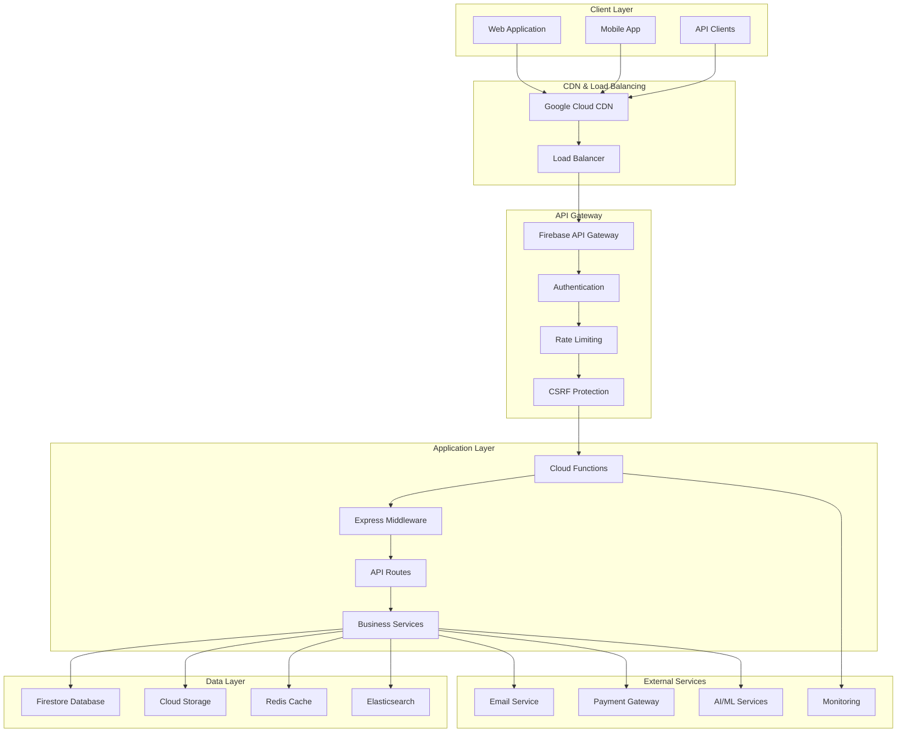
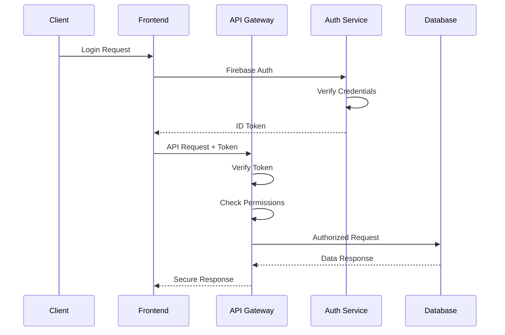
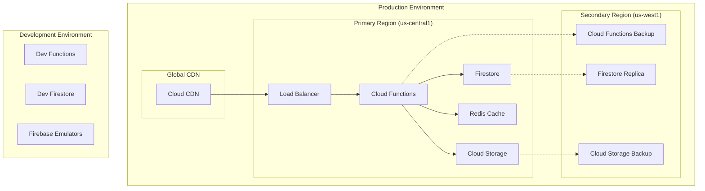

# EllaAI Platform Architecture

This document provides a comprehensive overview of the EllaAI platform architecture, including system design, component interactions, data flow, and infrastructure considerations.

## Table of Contents

- [System Overview](#system-overview)
- [Architecture Principles](#architecture-principles)
- [High-Level Architecture](#high-level-architecture)
- [Frontend Architecture](#frontend-architecture)
- [Backend Architecture](#backend-architecture)
- [Database Design](#database-design)
- [Security Architecture](#security-architecture)
- [Infrastructure Architecture](#infrastructure-architecture)
- [Integration Architecture](#integration-architecture)
- [Performance Architecture](#performance-architecture)
- [Monitoring Architecture](#monitoring-architecture)

## System Overview

EllaAI is a cloud-native, enterprise-grade technical assessment platform built on Google Cloud Platform and Firebase. The platform follows a modern microservices architecture with serverless computing, enabling high scalability, security, and performance.

### Key Architectural Goals

- **Scalability**: Handle thousands of concurrent assessments
- **Security**: Enterprise-grade security with multi-layer protection
- **Performance**: Sub-200ms API response times globally
- **Reliability**: 99.9% uptime SLA with automated failover
- **Maintainability**: Modular design with clear separation of concerns
- **Cost Efficiency**: Pay-per-use serverless architecture

## Architecture Principles

### 1. Cloud-Native Design
- Serverless-first approach using Firebase Cloud Functions
- Managed services to reduce operational overhead
- Auto-scaling based on demand

### 2. Security by Design
- Zero-trust security model
- End-to-end encryption
- Principle of least privilege
- Comprehensive audit logging

### 3. Event-Driven Architecture
- Asynchronous processing for heavy operations
- Real-time updates using WebSockets
- Event sourcing for audit trails

### 4. API-First Design
- RESTful APIs with OpenAPI specifications
- Consistent error handling and response formats
- Comprehensive API documentation

### 5. Multi-Tenant Architecture
- Secure data isolation between companies
- Shared infrastructure with tenant-specific customization
- Row-level security in database

## High-Level Architecture



## Frontend Architecture

### Technology Stack

**Core Framework:**
- React 18 with TypeScript for type safety
- Vite for fast development and optimized builds
- Material-UI (MUI) for consistent design system

**State Management:**
- Zustand for global state management
- React Query for server state caching
- React Context for component-level state

**Routing & Navigation:**
- React Router v6 for client-side routing
- Protected routes with role-based access

**Code Editor:**
- Monaco Editor for coding assessments
- Syntax highlighting for multiple languages
- Real-time collaboration features

### Component Architecture

```
src/
├── components/           # Reusable UI components
│   ├── common/          # Generic components (Button, Input, etc.)
│   ├── forms/           # Form components with validation
│   ├── layout/          # Layout components (Header, Sidebar)
│   └── assessment/      # Assessment-specific components
├── pages/               # Route components
│   ├── auth/           # Authentication pages
│   ├── dashboard/      # Dashboard pages
│   ├── assessment/     # Assessment pages
│   └── admin/          # Admin pages
├── hooks/              # Custom React hooks
├── services/           # API integration layer
├── contexts/           # React contexts
├── utils/              # Helper functions
└── types/              # TypeScript type definitions
```

### State Management Pattern

```typescript
// Zustand store example
interface AppState {
  user: User | null;
  currentAssessment: Assessment | null;
  ui: {
    loading: boolean;
    error: string | null;
  };
}

const useAppStore = create<AppState>((set, get) => ({
  user: null,
  currentAssessment: null,
  ui: { loading: false, error: null },
  
  // Actions
  setUser: (user: User) => set((state) => ({ ...state, user })),
  setAssessment: (assessment: Assessment) => 
    set((state) => ({ ...state, currentAssessment: assessment })),
  setLoading: (loading: boolean) => 
    set((state) => ({ ...state, ui: { ...state.ui, loading } })),
}));
```

### Performance Optimizations

- **Code Splitting**: Dynamic imports for route-based splitting
- **Lazy Loading**: Components loaded on demand
- **Memoization**: React.memo and useMemo for expensive computations
- **Virtual Scrolling**: For large data lists
- **Service Worker**: For offline functionality

## Backend Architecture

### Technology Stack

**Runtime & Framework:**
- Node.js 18 LTS runtime
- Express.js for HTTP handling
- Firebase Cloud Functions for serverless execution

**Database & Storage:**
- Firestore for primary database
- Cloud Storage for file storage
- Redis for caching and session storage

**Security & Auth:**
- Firebase Authentication
- JWT tokens with custom claims
- Express middleware for security headers

### Service Architecture

```
functions/src/
├── routes/              # API route handlers
│   ├── auth.ts         # Authentication endpoints
│   ├── assessments.ts  # Assessment management
│   ├── candidates.ts   # Candidate management
│   ├── companies.ts    # Company management
│   └── admin.ts        # Admin operations
├── middleware/         # Express middleware
│   ├── auth.ts        # Authentication middleware
│   ├── validation.ts  # Request validation
│   ├── security.ts    # Security headers
│   └── audit.ts       # Audit logging
├── services/          # Business logic services
│   ├── AssessmentService.ts
│   ├── CandidateService.ts
│   ├── EmailService.ts
│   └── AnalyticsService.ts
├── utils/             # Utility functions
├── config/            # Configuration files
└── types/             # TypeScript definitions
```

### API Design Patterns

```typescript
// Standard API response format
interface ApiResponse<T = any> {
  success: boolean;
  data?: T;
  error?: {
    code: string;
    message: string;
    details?: any;
  };
  meta?: {
    pagination?: PaginationInfo;
    timestamp: string;
    requestId: string;
  };
}

// Error handling pattern
class ApiError extends Error {
  constructor(
    public code: string,
    message: string,
    public statusCode: number = 500,
    public details?: any
  ) {
    super(message);
    this.name = 'ApiError';
  }
}

// Service pattern
export class AssessmentService {
  constructor(private db: FirebaseFirestore.Firestore) {}

  async createAssessment(data: CreateAssessmentData): Promise<Assessment> {
    // Validation
    const validatedData = await this.validateAssessmentData(data);
    
    // Business logic
    const assessment = await this.buildAssessment(validatedData);
    
    // Persistence
    const result = await this.db.collection('assessments').add(assessment);
    
    // Audit logging
    await this.auditLog('assessment_created', result.id);
    
    return { ...assessment, id: result.id };
  }
}
```

### Middleware Stack

```typescript
// Security middleware stack
export const securityMiddleware = [
  helmet({
    contentSecurityPolicy: {
      directives: {
        defaultSrc: ["'self'"],
        styleSrc: ["'self'", "'unsafe-inline'"],
        scriptSrc: ["'self'"],
        imgSrc: ["'self'", "data:", "https:"],
      },
    },
  }),
  cors({
    origin: process.env.ALLOWED_ORIGINS?.split(','),
    credentials: true,
  }),
  rateLimit({
    windowMs: 15 * 60 * 1000, // 15 minutes
    max: 100, // limit each IP to 100 requests per windowMs
  }),
];

// Authentication middleware
export async function authenticateToken(
  req: AuthenticatedRequest,
  res: Response,
  next: NextFunction
) {
  try {
    const token = req.headers.authorization?.split(' ')[1];
    const decodedToken = await admin.auth().verifyIdToken(token);
    req.user = decodedToken;
    next();
  } catch (error) {
    res.status(401).json({ error: 'Invalid token' });
  }
}
```

## Database Design

### Firestore Data Model

```typescript
// Collections structure
interface DatabaseSchema {
  // User management
  users: {
    [userId: string]: User;
  };
  
  // Company management
  companies: {
    [companyId: string]: Company;
  };
  
  // Assessment data
  assessments: {
    [assessmentId: string]: Assessment;
  };
  
  // Candidate responses
  candidates: {
    [candidateId: string]: Candidate;
  };
  
  // Assessment attempts
  assessment_attempts: {
    [attemptId: string]: AssessmentAttempt;
  };
  
  // Audit logging
  audit_logs: {
    [logId: string]: AuditLog;
  };
}

// User document structure
interface User {
  uid: string;
  email: string;
  displayName: string;
  role: 'admin' | 'recruiter' | 'candidate';
  companyId?: string;
  profile: UserProfile;
  permissions: string[];
  createdAt: Timestamp;
  updatedAt: Timestamp;
  lastLoginAt: Timestamp;
  isActive: boolean;
}

// Assessment document structure
interface Assessment {
  id: string;
  title: string;
  description: string;
  companyId: string;
  createdBy: string;
  questions: QuestionReference[];
  settings: {
    timeLimit: number; // minutes
    difficulty: 'easy' | 'medium' | 'hard';
    allowRetakes: boolean;
    randomizeQuestions: boolean;
  };
  status: 'draft' | 'active' | 'archived';
  analytics: AssessmentAnalytics;
  createdAt: Timestamp;
  updatedAt: Timestamp;
}
```

### Data Access Patterns

```typescript
// Optimized query patterns
export class DataAccessLayer {
  constructor(private db: FirebaseFirestore.Firestore) {}

  // Get assessments with pagination
  async getAssessmentsByCompany(
    companyId: string,
    limit: number = 20,
    startAfter?: DocumentSnapshot
  ) {
    let query = this.db
      .collection('assessments')
      .where('companyId', '==', companyId)
      .where('status', '==', 'active')
      .orderBy('createdAt', 'desc')
      .limit(limit);

    if (startAfter) {
      query = query.startAfter(startAfter);
    }

    return query.get();
  }

  // Complex query with multiple conditions
  async getCandidatesByStatusAndDate(
    companyId: string,
    status: string,
    dateRange: { start: Date; end: Date }
  ) {
    return this.db
      .collection('candidates')
      .where('companyId', '==', companyId)
      .where('status', '==', status)
      .where('createdAt', '>=', dateRange.start)
      .where('createdAt', '<=', dateRange.end)
      .orderBy('createdAt', 'desc')
      .get();
  }
}
```

### Indexes and Performance

```json
// firestore.indexes.json
{
  "indexes": [
    {
      "collectionGroup": "assessments",
      "queryScope": "COLLECTION",
      "fields": [
        {"fieldPath": "companyId", "order": "ASCENDING"},
        {"fieldPath": "status", "order": "ASCENDING"},
        {"fieldPath": "createdAt", "order": "DESCENDING"}
      ]
    },
    {
      "collectionGroup": "candidates",
      "queryScope": "COLLECTION",
      "fields": [
        {"fieldPath": "companyId", "order": "ASCENDING"},
        {"fieldPath": "assessmentId", "order": "ASCENDING"},
        {"fieldPath": "status", "order": "ASCENDING"}
      ]
    },
    {
      "collectionGroup": "audit_logs",
      "queryScope": "COLLECTION",
      "fields": [
        {"fieldPath": "userId", "order": "ASCENDING"},
        {"fieldPath": "timestamp", "order": "DESCENDING"}
      ]
    }
  ]
}
```

## Security Architecture

### Authentication Flow



### Role-Based Access Control

```typescript
// Permission system
interface Permission {
  resource: string;
  action: 'create' | 'read' | 'update' | 'delete';
  conditions?: {
    companyId?: string;
    userId?: string;
    role?: string[];
  };
}

const rolePermissions: Record<string, Permission[]> = {
  admin: [
    { resource: '*', action: 'create' },
    { resource: '*', action: 'read' },
    { resource: '*', action: 'update' },
    { resource: '*', action: 'delete' },
  ],
  recruiter: [
    { resource: 'assessments', action: 'create', conditions: { companyId: 'self' } },
    { resource: 'assessments', action: 'read', conditions: { companyId: 'self' } },
    { resource: 'candidates', action: 'read', conditions: { companyId: 'self' } },
  ],
  candidate: [
    { resource: 'assessments', action: 'read', conditions: { userId: 'self' } },
    { resource: 'profile', action: 'update', conditions: { userId: 'self' } },
  ],
};

// Permission checking middleware
export function requirePermission(resource: string, action: string) {
  return async (req: AuthenticatedRequest, res: Response, next: NextFunction) => {
    const hasPermission = await checkPermission(req.user, resource, action, req);
    if (!hasPermission) {
      return res.status(403).json({ error: 'Insufficient permissions' });
    }
    next();
  };
}
```

### Data Security

```typescript
// Firestore security rules
rules_version = '2';
service cloud.firestore {
  match /databases/{database}/documents {
    // Users can only access their own data
    match /users/{userId} {
      allow read, write: if request.auth != null 
        && request.auth.uid == userId;
    }
    
    // Company data isolation
    match /companies/{companyId} {
      allow read, write: if request.auth != null
        && request.auth.token.companyId == companyId
        && request.auth.token.role in ['admin', 'recruiter'];
    }
    
    // Assessment access control
    match /assessments/{assessmentId} {
      allow read: if request.auth != null
        && (isCompanyMember(assessmentId) || isCandidateAssessment(assessmentId));
      allow write: if request.auth != null
        && isCompanyMember(assessmentId)
        && request.auth.token.role in ['admin', 'recruiter'];
    }
  }
}
```

## Infrastructure Architecture

### Google Cloud Platform Services

```yaml
# Infrastructure components
services:
  compute:
    - Firebase Cloud Functions (Node.js 18)
    - Cloud Run (for background jobs)
    - App Engine (admin dashboard)
  
  storage:
    - Firestore (primary database)
    - Cloud Storage (file storage)
    - Memorystore (Redis cache)
  
  networking:
    - Cloud CDN (global content delivery)
    - Cloud Load Balancing
    - Cloud Armor (DDoS protection)
  
  security:
    - Identity and Access Management (IAM)
    - Secret Manager (credential storage)
    - Cloud KMS (encryption keys)
  
  monitoring:
    - Cloud Monitoring
    - Cloud Logging
    - Error Reporting
    - Cloud Trace
```

### Deployment Architecture



### Auto-Scaling Configuration

```typescript
// Cloud Functions scaling configuration
export const runtimeOptions: RuntimeOptions = {
  timeoutSeconds: 300,
  memory: '512MB',
  maxInstances: 100,
  minInstances: 2, // Keep warm instances
  concurrency: 100,
};

// Auto-scaling policies
const autoScalingConfig = {
  functions: {
    api: {
      minInstances: 2,
      maxInstances: 100,
      targetConcurrency: 80,
    },
    assessmentProcessor: {
      minInstances: 0,
      maxInstances: 50,
      targetConcurrency: 10,
    },
  },
  
  database: {
    firestore: {
      maxConcurrentConnections: 1000,
      cacheSizeGB: 2,
    },
    redis: {
      memoryGB: 4,
      maxConnections: 1000,
    },
  },
};
```

## Integration Architecture

### External Service Integration

```typescript
// Service integration pattern
interface ExternalService {
  name: string;
  baseUrl: string;
  auth: AuthConfig;
  rateLimit: RateLimitConfig;
  timeout: number;
}

class ServiceIntegrator {
  constructor(private config: ExternalService) {}

  async makeRequest<T>(endpoint: string, options: RequestOptions): Promise<T> {
    const url = `${this.config.baseUrl}${endpoint}`;
    
    // Add authentication
    const headers = await this.addAuthHeaders(options.headers);
    
    // Rate limiting
    await this.checkRateLimit();
    
    // Make request with retry logic
    return this.requestWithRetry(url, { ...options, headers });
  }

  private async requestWithRetry<T>(
    url: string, 
    options: RequestOptions, 
    maxRetries = 3
  ): Promise<T> {
    for (let attempt = 1; attempt <= maxRetries; attempt++) {
      try {
        const response = await fetch(url, {
          ...options,
          timeout: this.config.timeout,
        });
        
        if (!response.ok) {
          throw new Error(`HTTP ${response.status}: ${response.statusText}`);
        }
        
        return await response.json();
      } catch (error) {
        if (attempt === maxRetries) {
          throw error;
        }
        
        // Exponential backoff
        await this.delay(Math.pow(2, attempt) * 1000);
      }
    }
  }
}

// Email service integration
export class EmailService extends ServiceIntegrator {
  async sendAssessmentInvite(candidate: Candidate, assessment: Assessment) {
    return this.makeRequest('/send', {
      method: 'POST',
      body: JSON.stringify({
        to: candidate.email,
        template: 'assessment-invite',
        variables: {
          candidateName: candidate.name,
          assessmentTitle: assessment.title,
          inviteLink: this.generateInviteLink(candidate.id, assessment.id),
        },
      }),
    });
  }
}
```

### Webhook Architecture

```typescript
// Webhook handler pattern
export class WebhookHandler {
  private readonly verifySignature = (payload: string, signature: string): boolean => {
    const expectedSignature = crypto
      .createHmac('sha256', process.env.WEBHOOK_SECRET!)
      .update(payload)
      .digest('hex');
    
    return crypto.timingSafeEqual(
      Buffer.from(`sha256=${expectedSignature}`),
      Buffer.from(signature)
    );
  };

  async handleWebhook(req: Request, res: Response) {
    const payload = req.body;
    const signature = req.headers['x-signature'] as string;
    
    // Verify signature
    if (!this.verifySignature(JSON.stringify(payload), signature)) {
      return res.status(401).json({ error: 'Invalid signature' });
    }
    
    // Process webhook
    try {
      await this.processWebhookEvent(payload);
      res.status(200).json({ status: 'processed' });
    } catch (error) {
      console.error('Webhook processing error:', error);
      res.status(500).json({ error: 'Processing failed' });
    }
  }

  private async processWebhookEvent(event: WebhookEvent) {
    switch (event.type) {
      case 'payment.succeeded':
        await this.handlePaymentSuccess(event.data);
        break;
      case 'user.created':
        await this.handleUserCreated(event.data);
        break;
      default:
        console.warn('Unhandled webhook event type:', event.type);
    }
  }
}
```

## Performance Architecture

### Caching Strategy

```typescript
// Multi-level caching
class CacheManager {
  constructor(
    private redis: Redis,
    private memCache: Map<string, any> = new Map()
  ) {}

  async get<T>(key: string): Promise<T | null> {
    // L1 Cache: In-memory
    if (this.memCache.has(key)) {
      return this.memCache.get(key);
    }
    
    // L2 Cache: Redis
    const redisValue = await this.redis.get(key);
    if (redisValue) {
      const parsed = JSON.parse(redisValue);
      this.memCache.set(key, parsed);
      return parsed;
    }
    
    return null;
  }

  async set<T>(key: string, value: T, ttl = 3600): Promise<void> {
    // Set in both caches
    this.memCache.set(key, value);
    await this.redis.setex(key, ttl, JSON.stringify(value));
  }

  async invalidate(pattern: string): Promise<void> {
    // Clear memory cache
    for (const key of this.memCache.keys()) {
      if (key.includes(pattern)) {
        this.memCache.delete(key);
      }
    }
    
    // Clear Redis cache
    const keys = await this.redis.keys(`*${pattern}*`);
    if (keys.length > 0) {
      await this.redis.del(...keys);
    }
  }
}

// Usage in services
export class AssessmentService {
  constructor(private cache: CacheManager) {}

  async getAssessment(id: string): Promise<Assessment> {
    const cacheKey = `assessment:${id}`;
    
    // Try cache first
    let assessment = await this.cache.get<Assessment>(cacheKey);
    if (assessment) {
      return assessment;
    }
    
    // Fetch from database
    assessment = await this.fetchFromDatabase(id);
    
    // Cache for future requests
    await this.cache.set(cacheKey, assessment, 1800); // 30 minutes
    
    return assessment;
  }
}
```

### Database Optimization

```typescript
// Query optimization
export class OptimizedQueries {
  // Batch operations for better performance
  async batchGetAssessments(ids: string[]): Promise<Assessment[]> {
    const promises = ids.map(id => 
      this.db.collection('assessments').doc(id).get()
    );
    
    const snapshots = await Promise.all(promises);
    return snapshots
      .filter(snap => snap.exists)
      .map(snap => ({ id: snap.id, ...snap.data() } as Assessment));
  }

  // Pagination with cursor
  async getPaginatedResults<T>(
    collection: string,
    pageSize: number,
    cursor?: string,
    filters?: Record<string, any>
  ): Promise<{ data: T[]; nextCursor?: string }> {
    let query = this.db.collection(collection);
    
    // Apply filters
    if (filters) {
      Object.entries(filters).forEach(([field, value]) => {
        query = query.where(field, '==', value);
      });
    }
    
    query = query.orderBy('createdAt', 'desc').limit(pageSize);
    
    // Apply cursor for pagination
    if (cursor) {
      const cursorDoc = await this.db.doc(cursor).get();
      query = query.startAfter(cursorDoc);
    }
    
    const snapshot = await query.get();
    const data = snapshot.docs.map(doc => ({
      id: doc.id,
      ...doc.data(),
    })) as T[];
    
    const nextCursor = snapshot.docs.length === pageSize
      ? snapshot.docs[snapshot.docs.length - 1].ref.path
      : undefined;
    
    return { data, nextCursor };
  }
}
```

## Monitoring Architecture

### Observability Stack

```typescript
// Comprehensive monitoring setup
class MonitoringService {
  private metrics = new Map<string, number>();
  private traces = new Map<string, any>();

  // Custom metrics collection
  recordMetric(name: string, value: number, tags: Record<string, string> = {}) {
    const metricKey = `${name}:${JSON.stringify(tags)}`;
    this.metrics.set(metricKey, value);
    
    // Send to monitoring service
    this.sendToMonitoring({
      metric: name,
      value,
      tags,
      timestamp: Date.now(),
    });
  }

  // Distributed tracing
  startTrace(operationName: string): TraceSpan {
    const traceId = this.generateTraceId();
    const span = new TraceSpan(traceId, operationName);
    this.traces.set(traceId, span);
    return span;
  }

  // Application health checks
  async healthCheck(): Promise<HealthStatus> {
    const checks = await Promise.allSettled([
      this.checkDatabase(),
      this.checkCache(),
      this.checkExternalServices(),
    ]);

    const status = checks.every(check => check.status === 'fulfilled')
      ? 'healthy'
      : 'unhealthy';

    return {
      status,
      timestamp: new Date().toISOString(),
      services: {
        database: checks[0].status === 'fulfilled',
        cache: checks[1].status === 'fulfilled',
        external: checks[2].status === 'fulfilled',
      },
    };
  }

  // Error tracking
  captureError(error: Error, context: any = {}) {
    const errorData = {
      message: error.message,
      stack: error.stack,
      context,
      timestamp: new Date().toISOString(),
      environment: process.env.NODE_ENV,
    };

    // Send to error tracking service
    this.sendErrorToSentry(errorData);
    
    // Log for debugging
    console.error('Application error:', errorData);
  }
}

// Usage in middleware
export function monitoringMiddleware(monitor: MonitoringService) {
  return (req: Request, res: Response, next: NextFunction) => {
    const startTime = Date.now();
    const trace = monitor.startTrace(`${req.method} ${req.path}`);
    
    // Add trace context to request
    (req as any).trace = trace;
    
    res.on('finish', () => {
      const duration = Date.now() - startTime;
      
      // Record metrics
      monitor.recordMetric('http_request_duration', duration, {
        method: req.method,
        path: req.path,
        status: res.statusCode.toString(),
      });
      
      monitor.recordMetric('http_requests_total', 1, {
        method: req.method,
        path: req.path,
        status: res.statusCode.toString(),
      });
      
      // Complete trace
      trace.finish();
    });
    
    next();
  };
}
```

### Alert Configuration

```yaml
# monitoring/alerts.yaml
alerts:
  - name: high_error_rate
    condition: error_rate > 0.05
    duration: 5m
    severity: critical
    actions:
      - email: oncall@ellaai.com
      - slack: #alerts
      
  - name: slow_response_time
    condition: p95_response_time > 2000ms
    duration: 10m
    severity: warning
    actions:
      - slack: #engineering
      
  - name: database_connection_failures
    condition: db_connection_failures > 10
    duration: 1m
    severity: critical
    actions:
      - email: oncall@ellaai.com
      - pagerduty: high
      
  - name: concurrent_users_high
    condition: concurrent_users > 1000
    duration: 5m
    severity: info
    actions:
      - slack: #operations
```

---

This architecture documentation provides a comprehensive view of the EllaAI platform's design and implementation. For specific implementation details, refer to the corresponding technical documentation and code examples in the repository.