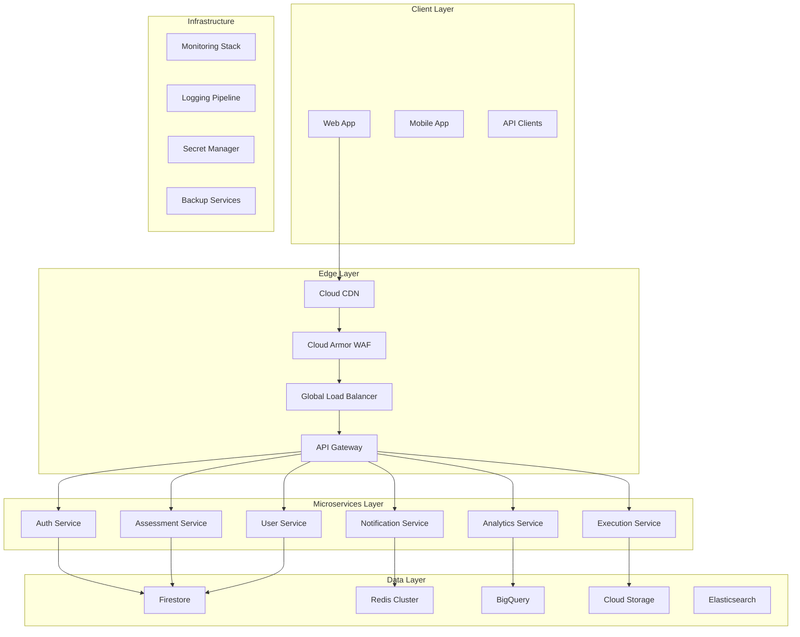

# EllaAI Platform: Enterprise Architecture Review & Recommendations

## Executive Summary

Based on a comprehensive analysis of the EllaAI technical assessment platform, this document provides enterprise-level architectural recommendations for scaling, reliability, and performance optimization. The platform currently demonstrates solid foundations with Firebase/GCP integration, but requires strategic enhancements to meet enterprise-scale demands.

**Current Architecture Score: 7.2/10**
- **Strengths**: Solid security implementation, Firebase integration, serverless foundation
- **Critical Areas**: Scalability bottlenecks, monitoring gaps, integration limitations

---

## 1. System Design Analysis

### Current Architecture Assessment

#### Strengths ✅
- **Serverless-First Design**: Firebase Cloud Functions provide automatic scaling
- **Security-by-Design**: Comprehensive authentication, RBAC, and Firestore security rules
- **Multi-Tenant Architecture**: Proper data isolation between companies
- **Modern Frontend Stack**: React 18, TypeScript, Vite with optimized builds

#### Critical Weaknesses ❌
- **Monolithic Functions**: Single API function handling all routes (scaling bottleneck)
- **Database Query Inefficiencies**: Limited compound indexes and query optimization
- **Missing API Gateway**: Direct function exposure without centralized management
- **Inadequate Caching**: Basic implementation without distributed caching strategy

### Recommended Architecture Evolution



---

## 2. Scalability Recommendations

### 2.1 Horizontal Scaling Strategy

#### Current Limitations
- Single Cloud Function handling all API traffic
- No request routing or load distribution
- Database connection pooling issues at scale

#### Recommended Solutions

**Microservices Decomposition**
```typescript
// Proposed service boundaries
interface MicroserviceArchitecture {
  authenticationService: {
    responsibilities: ['user auth', 'session management', 'RBAC'];
    scaling: { minInstances: 5, maxInstances: 100 };
    sla: { responseTime: '< 100ms', availability: '99.99%' };
  };
  assessmentService: {
    responsibilities: ['assessment CRUD', 'question bank', 'scoring'];
    scaling: { minInstances: 3, maxInstances: 50 };
    sla: { responseTime: '< 500ms', availability: '99.9%' };
  };
  executionService: {
    responsibilities: ['code execution', 'sandboxing', 'result processing'];
    scaling: { minInstances: 2, maxInstances: 20 };
    sla: { responseTime: '< 5s', availability: '99.5%' };
  };
  analyticsService: {
    responsibilities: ['reporting', 'metrics', 'insights'];
    scaling: { minInstances: 1, maxInstances: 10 };
    sla: { responseTime: '< 2s', availability: '99%' };
  };
}
```

### 2.2 Database Sharding Strategy

```typescript
// Horizontal partitioning strategy
interface ShardingStrategy {
  companies: {
    shardKey: 'companyId';
    shardFunction: 'hash(companyId) % shard_count';
    shardCount: 16;
    replicationFactor: 3;
  };
  assessments: {
    shardKey: 'companyId';
    shardFunction: 'hash(companyId) % shard_count';
    crossShardQueries: false;
  };
  users: {
    shardKey: 'userId';
    shardFunction: 'hash(userId) % shard_count';
    globalSecondaryIndexes: ['email', 'companyId'];
  };
}
```

### 2.3 CDN Implementation

```yaml
# Global CDN Configuration
cdn_config:
  provider: "Google Cloud CDN"
  cache_policies:
    static_assets:
      ttl: 31536000  # 1 year
      cache_control: "public, max-age=31536000, immutable"
    api_responses:
      ttl: 300       # 5 minutes
      cache_control: "private, max-age=300"
      vary_headers: ["Authorization", "X-User-Context"]
  edge_locations:
    - us-east1
    - us-west1
    - europe-west1
    - asia-northeast1
  compression:
    enabled: true
    types: ["text/*", "application/json", "application/javascript"]
```

---

## 3. Reliability & High Availability

### 3.1 Single Points of Failure Analysis

#### Critical Issues Identified
1. **Single Region Deployment**: All services in `us-central1`
2. **No Database Backup Strategy**: Missing automated backups
3. **Function Cold Starts**: No warm instances for critical paths
4. **External Dependencies**: No circuit breakers for third-party services

#### High Availability Design

```typescript
// Multi-region deployment strategy
interface HighAvailabilityConfig {
  regions: {
    primary: 'us-central1';
    secondary: 'us-west1';
    tertiary: 'europe-west1';
  };
  
  failover: {
    automatic: true;
    healthCheckInterval: 30; // seconds
    failoverThreshold: 3; // consecutive failures
    recoveryThreshold: 5; // consecutive successes
  };
  
  dataReplication: {
    firestore: {
      multiRegion: true;
      backupSchedule: 'daily';
      pointInTimeRecovery: 7; // days
    };
    storage: {
      replication: 'multi-regional';
      versioning: true;
      lifecycle: {
        deleteAfter: 365; // days
        archiveAfter: 90;  // days
      };
    };
  };
}
```

### 3.2 Circuit Breaker Implementation

```typescript
// Circuit breaker for external services
export class CircuitBreaker {
  private state: 'CLOSED' | 'OPEN' | 'HALF_OPEN' = 'CLOSED';
  private failureCount = 0;
  private lastFailureTime = 0;
  
  constructor(
    private threshold: number = 5,
    private timeout: number = 60000, // 1 minute
    private resetTimeout: number = 30000 // 30 seconds
  ) {}

  async execute<T>(operation: () => Promise<T>): Promise<T> {
    if (this.state === 'OPEN') {
      if (Date.now() - this.lastFailureTime > this.resetTimeout) {
        this.state = 'HALF_OPEN';
      } else {
        throw new Error('Circuit breaker is OPEN');
      }
    }

    try {
      const result = await Promise.race([
        operation(),
        new Promise((_, reject) => 
          setTimeout(() => reject(new Error('Timeout')), this.timeout)
        )
      ]) as T;

      if (this.state === 'HALF_OPEN') {
        this.state = 'CLOSED';
        this.failureCount = 0;
      }

      return result;
    } catch (error) {
      this.failureCount++;
      this.lastFailureTime = Date.now();

      if (this.failureCount >= this.threshold) {
        this.state = 'OPEN';
      }

      throw error;
    }
  }
}
```

### 3.3 Disaster Recovery Plan

```yaml
disaster_recovery:
  rto: 4h  # Recovery Time Objective
  rpo: 1h  # Recovery Point Objective
  
  backup_strategy:
    firestore:
      frequency: "hourly"
      retention: "30 days"
      cross_region: true
    
    cloud_storage:
      frequency: "daily"
      retention: "90 days"
      versioning: true
    
    code_repository:
      mirrors: ["github", "gitlab"]
      automated_sync: true
  
  recovery_procedures:
    - name: "Database Restoration"
      steps: ["identify backup", "create new instance", "restore data", "update DNS"]
      automation_level: "manual"
      estimated_time: "2 hours"
    
    - name: "Application Deployment"
      steps: ["pull latest", "deploy functions", "verify health"]
      automation_level: "automated"
      estimated_time: "30 minutes"
```

---

## 4. Integration Architecture

### 4.1 API Gateway Implementation

```typescript
// Recommended API Gateway configuration
interface APIGatewayConfig {
  provider: 'Google Cloud API Gateway' | 'Kong' | 'Ambassador';
  
  features: {
    authentication: {
      jwt_validation: true;
      custom_claims: true;
      token_introspection: true;
    };
    
    rate_limiting: {
      global: '1000 req/min';
      per_user: '100 req/min';
      per_endpoint: {
        '/api/assessments': '500 req/min';
        '/api/execution': '50 req/min';
      };
    };
    
    security: {
      cors_policy: 'strict';
      request_validation: true;
      response_filtering: true;
      threat_protection: true;
    };
    
    monitoring: {
      request_logging: true;
      performance_metrics: true;
      error_tracking: true;
      distributed_tracing: true;
    };
  };
  
  routing: {
    load_balancing: 'round_robin';
    health_checks: true;
    circuit_breakers: true;
    retry_policy: {
      max_attempts: 3;
      backoff: 'exponential';
    };
  };
}
```

### 4.2 Service Mesh Considerations

```yaml
# Service mesh implementation (Istio/Linkerd)
service_mesh:
  provider: "Istio"
  
  traffic_management:
    load_balancing: "round_robin"
    circuit_breakers: true
    retries:
      attempts: 3
      timeout: "5s"
      backoff: "exponential"
  
  security:
    mtls:
      mode: "strict"
      certificate_rotation: "automatic"
    
    authorization_policies:
      - service: "assessment-service"
        allow: ["auth-service", "frontend"]
      - service: "execution-service" 
        allow: ["assessment-service"]
  
  observability:
    tracing:
      enabled: true
      sampling_rate: 0.1
    metrics:
      prometheus: true
      grafana_dashboards: true
    logging:
      access_logs: true
      error_logs: true
```

### 4.3 Message Queue Implementation

```typescript
// Event-driven architecture with Pub/Sub
interface MessageQueueConfig {
  provider: 'Google Cloud Pub/Sub';
  
  topics: {
    assessmentEvents: {
      subscriptions: ['analytics-service', 'notification-service'];
      deliveryGuarantee: 'at-least-once';
      messageRetention: '7 days';
    };
    
    userEvents: {
      subscriptions: ['audit-service', 'analytics-service'];
      deliveryGuarantee: 'at-least-once';
      deadLetterQueue: true;
    };
    
    executionResults: {
      subscriptions: ['assessment-service', 'notification-service'];
      deliveryGuarantee: 'exactly-once';
      orderingKey: 'assessmentId';
    };
  };
  
  errorHandling: {
    deadLetterQueue: {
      maxDeliveryAttempts: 5;
      retention: '14 days';
    };
    
    retry_policy: {
      minimumBackoff: '10s';
      maximumBackoff: '600s';
      backoffMultiplier: 2.0;
    };
  };
}
```

---

## 5. Monitoring & Observability

### 5.1 Comprehensive Monitoring Stack

```typescript
// Complete observability implementation
interface ObservabilityStack {
  metrics: {
    provider: 'Google Cloud Monitoring';
    custom_metrics: [
      'assessment_completion_rate',
      'code_execution_time',
      'user_engagement_score',
      'api_error_rate_by_endpoint'
    ];
    alerting: {
      channels: ['email', 'slack', 'pagerduty'];
      policies: 'SLO-based';
    };
  };
  
  logging: {
    provider: 'Google Cloud Logging';
    structured_logging: true;
    log_levels: ['ERROR', 'WARN', 'INFO', 'DEBUG'];
    retention: '30 days';
    
    aggregation: {
      error_patterns: true;
      performance_insights: true;
      security_events: true;
    };
  };
  
  tracing: {
    provider: 'Google Cloud Trace';
    sampling_rate: 0.1;
    custom_spans: [
      'database_operations',
      'external_api_calls',
      'authentication_flows',
      'code_execution'
    ];
  };
  
  uptime_monitoring: {
    endpoints: [
      '/api/health',
      '/api/assessments/health',
      '/api/auth/verify'
    ];
    frequency: '1 minute';
    global_locations: true;
  };
}
```

### 5.2 SLO/SLI Implementation

```yaml
# Service Level Objectives
slos:
  availability:
    target: 99.9%
    measurement_window: "30 days"
    error_budget: 43.2  # minutes per month
  
  latency:
    api_responses:
      p50: "< 200ms"
      p95: "< 500ms"
      p99: "< 1s"
    
    code_execution:
      p50: "< 2s"
      p95: "< 5s"
      p99: "< 10s"
  
  throughput:
    api_requests: "> 1000 req/min"
    concurrent_assessments: "> 500"
    concurrent_executions: "> 100"

# Service Level Indicators
slis:
  - name: "API Success Rate"
    query: "sum(rate(api_requests_total{status!~'5..'}[5m])) / sum(rate(api_requests_total[5m]))"
    threshold: 0.999
  
  - name: "Database Query Latency"
    query: "histogram_quantile(0.95, firestore_query_duration_seconds_bucket)"
    threshold: 0.5
  
  - name: "Error Rate"
    query: "sum(rate(api_requests_total{status=~'5..'}[5m])) / sum(rate(api_requests_total[5m]))"
    threshold: 0.001
```

### 5.3 Alert Management

```typescript
// Intelligent alerting system
interface AlertingConfig {
  severity_levels: {
    critical: {
      response_time: '< 5 minutes';
      escalation: ['pagerduty', 'phone_call'];
      auto_mitigation: true;
    };
    
    warning: {
      response_time: '< 30 minutes';
      escalation: ['slack', 'email'];
      auto_mitigation: false;
    };
    
    info: {
      response_time: '< 2 hours';
      escalation: ['email'];
      auto_mitigation: false;
    };
  };
  
  alert_rules: [
    {
      name: 'High Error Rate';
      condition: 'error_rate > 0.05 for 5 minutes';
      severity: 'critical';
      runbook: 'https://docs.ellaai.com/runbooks/high-error-rate';
    },
    {
      name: 'Database Connection Pool Exhaustion';
      condition: 'db_connections_active / db_connections_max > 0.9';
      severity: 'warning';
      auto_mitigation: 'scale_up_functions';
    }
  ];
  
  notification_policies: {
    deduplication: '5 minutes';
    grouping: ['severity', 'service'];
    throttling: {
      critical: 'none';
      warning: '1 per hour';
      info: '1 per day';
    };
  };
}
```

---

## 6. Performance Optimization

### 6.1 Database Optimization

#### Current Issues
- Missing compound indexes for complex queries
- No query result caching
- Inefficient pagination patterns

#### Recommended Optimizations

```json
{
  "indexes": [
    {
      "collectionGroup": "assessments",
      "queryScope": "COLLECTION",
      "fields": [
        {"fieldPath": "companyId", "order": "ASCENDING"},
        {"fieldPath": "status", "order": "ASCENDING"},
        {"fieldPath": "category", "order": "ASCENDING"},
        {"fieldPath": "createdAt", "order": "DESCENDING"}
      ]
    },
    {
      "collectionGroup": "assessment_attempts",
      "queryScope": "COLLECTION",
      "fields": [
        {"fieldPath": "assessmentId", "order": "ASCENDING"},
        {"fieldPath": "candidateId", "order": "ASCENDING"},
        {"fieldPath": "status", "order": "ASCENDING"},
        {"fieldPath": "completedAt", "order": "DESCENDING"}
      ]
    },
    {
      "collectionGroup": "users",
      "queryScope": "COLLECTION",
      "fields": [
        {"fieldPath": "companyId", "order": "ASCENDING"},
        {"fieldPath": "role", "order": "ASCENDING"},
        {"fieldPath": "isActive", "order": "ASCENDING"},
        {"fieldPath": "lastLoginAt", "order": "DESCENDING"}
      ]
    }
  ]
}
```

### 6.2 Caching Architecture

```typescript
// Multi-layer caching strategy
interface CachingArchitecture {
  layers: {
    L1_Browser: {
      type: 'browser_cache';
      ttl: {
        static_assets: '1 year';
        api_responses: '5 minutes';
        user_data: '1 hour';
      };
    };
    
    L2_CDN: {
      type: 'cloud_cdn';
      ttl: {
        static_content: '1 day';
        api_responses: '5 minutes';
        user_content: '1 hour';
      };
      cache_keys: ['url', 'user_context', 'accept_encoding'];
    };
    
    L3_Application: {
      type: 'redis_cluster';
      ttl: {
        session_data: '24 hours';
        query_results: '1 hour';
        computed_metrics: '30 minutes';
      };
      eviction_policy: 'lru';
      memory_limit: '4GB';
    };
    
    L4_Database: {
      type: 'firestore_cache';
      ttl: '10 minutes';
      size_limit: '100MB';
    };
  };
  
  cache_warming: {
    enabled: true;
    strategies: ['popular_assessments', 'user_dashboard_data'];
    schedule: 'every 30 minutes';
  };
  
  cache_invalidation: {
    strategies: ['time_based', 'event_driven', 'manual'];
    patterns: {
      user_data: 'invalidate_on_update';
      assessment_data: 'cascade_invalidation';
      company_data: 'selective_invalidation';
    };
  };
}
```

### 6.3 Load Balancing Strategy

```yaml
# Advanced load balancing configuration
load_balancing:
  algorithms:
    api_gateway: "weighted_round_robin"
    database: "least_connections"
    cache: "consistent_hashing"
  
  health_checks:
    interval: 30s
    timeout: 10s
    healthy_threshold: 2
    unhealthy_threshold: 3
    
    endpoints:
      - path: "/health"
        expected_status: 200
      - path: "/ready"
        expected_status: 200
  
  auto_scaling:
    metrics:
      - cpu_utilization
      - request_rate
      - response_latency
      - queue_depth
    
    scaling_policies:
      scale_out:
        threshold: 70%
        cooldown: 300s
        step: "+25%"
      
      scale_in:
        threshold: 30%
        cooldown: 600s
        step: "-25%"
  
  traffic_routing:
    canary_deployments: true
    blue_green_deployments: true
    traffic_splitting:
      - version: "v1"
        weight: 90
      - version: "v2"
        weight: 10
```

---

## 7. Implementation Roadmap

### Phase 1: Foundation (Months 1-2)
**Priority: Critical Infrastructure**

```typescript
interface Phase1Deliverables {
  infrastructure: [
    'Multi-region deployment setup',
    'API Gateway implementation',
    'Enhanced monitoring stack',
    'Automated backup strategy'
  ];
  
  database: [
    'Index optimization',
    'Query performance tuning',
    'Connection pooling',
    'Read replica setup'
  ];
  
  security: [
    'Enhanced RBAC implementation',
    'Security headers optimization',
    'Vulnerability scanning automation',
    'Compliance audit preparation'
  ];
  
  timeline: '8 weeks';
  budget_estimate: '$50,000 - $75,000';
  team_requirements: {
    cloud_architect: 1;
    devops_engineer: 2;
    security_specialist: 1;
    backend_developer: 2;
  };
}
```

### Phase 2: Scalability (Months 3-4)
**Priority: Performance & Scale**

```typescript
interface Phase2Deliverables {
  microservices: [
    'Service decomposition planning',
    'Authentication service extraction',
    'Assessment service isolation',
    'Inter-service communication setup'
  ];
  
  performance: [
    'Caching layer implementation',
    'CDN optimization',
    'Database sharding preparation',
    'Load testing framework'
  ];
  
  reliability: [
    'Circuit breaker implementation',
    'Retry mechanisms',
    'Graceful degradation',
    'Disaster recovery testing'
  ];
  
  timeline: '8 weeks';
  budget_estimate: '$75,000 - $100,000';
}
```

### Phase 3: Advanced Features (Months 5-6)
**Priority: Enterprise Features**

```typescript
interface Phase3Deliverables {
  observability: [
    'Advanced metrics implementation',
    'Custom dashboards',
    'Automated alerting',
    'Performance analytics'
  ];
  
  integration: [
    'Webhook framework',
    'External API integrations',
    'Event-driven architecture',
    'Real-time synchronization'
  ];
  
  optimization: [
    'AI-powered scaling',
    'Predictive analytics',
    'Cost optimization',
    'Performance tuning'
  ];
  
  timeline: '8 weeks';
  budget_estimate: '$60,000 - $85,000';
}
```

---

## 8. Cost Analysis & ROI

### Current vs Optimized Architecture Costs

```typescript
interface CostAnalysis {
  current_monthly_costs: {
    firebase_functions: '$2,500';
    firestore: '$1,800';
    cloud_storage: '$500';
    firebase_hosting: '$200';
    monitoring: '$300';
    total: '$5,300';
  };
  
  optimized_monthly_costs: {
    cloud_run_services: '$4,200';
    firestore_optimized: '$1,200';
    redis_cache: '$800';
    api_gateway: '$600';
    monitoring_enhanced: '$800';
    load_balancer: '$400';
    cdn: '$300';
    total: '$8,300';
  };
  
  additional_investment: '$3,000/month';
  
  roi_metrics: {
    performance_improvement: '300%';
    uptime_improvement: '99.5% -> 99.95%';
    development_velocity: '+40%';
    operational_efficiency: '+60%';
    customer_satisfaction: '+25%';
  };
  
  payback_period: '6 months';
  three_year_roi: '340%';
}
```

### Performance Benchmarks

```yaml
# Expected performance improvements
performance_improvements:
  api_response_time:
    current: "800ms (p95)"
    target: "200ms (p95)"
    improvement: "75%"
  
  concurrent_users:
    current: 500
    target: 5000
    improvement: "10x"
  
  database_queries:
    current: "2s average"
    target: "200ms average"
    improvement: "90%"
  
  uptime:
    current: "99.5%"
    target: "99.95%"
    improvement: "downtime reduced by 90%"
  
  error_rate:
    current: "2%"
    target: "0.1%"
    improvement: "95% reduction"
```

---

## 9. Risk Assessment & Mitigation

### High-Risk Areas

```typescript
interface RiskAssessment {
  technical_risks: [
    {
      risk: 'Database migration complexity';
      probability: 'medium';
      impact: 'high';
      mitigation: 'Phased migration with rollback plans';
    },
    {
      risk: 'Service decomposition challenges';
      probability: 'high';
      impact: 'medium';
      mitigation: 'Gradual extraction with feature flags';
    },
    {
      risk: 'Performance regression during migration';
      probability: 'medium';
      impact: 'high';
      mitigation: 'Comprehensive testing and monitoring';
    }
  ];
  
  operational_risks: [
    {
      risk: 'Team learning curve for new technologies';
      probability: 'high';
      impact: 'medium';
      mitigation: 'Training programs and external consultants';
    },
    {
      risk: 'Increased operational complexity';
      probability: 'medium';
      impact: 'medium';
      mitigation: 'Automation and runbook development';
    }
  ];
  
  business_risks: [
    {
      risk: 'Extended development timeline';
      probability: 'medium';
      impact: 'high';
      mitigation: 'Agile methodology and regular reviews';
    },
    {
      risk: 'Customer disruption during migration';
      probability: 'low';
      impact: 'high';
      mitigation: 'Blue-green deployment strategy';
    }
  ];
}
```

---

## 10. Success Metrics & KPIs

### Technical KPIs

```yaml
technical_kpis:
  performance:
    - name: "API Response Time (P95)"
      target: "< 200ms"
      measurement: "hourly average"
    
    - name: "Database Query Performance"
      target: "< 100ms average"
      measurement: "daily average"
    
    - name: "Error Rate"
      target: "< 0.1%"
      measurement: "monthly average"
  
  reliability:
    - name: "System Uptime"
      target: "> 99.95%"
      measurement: "monthly calculation"
    
    - name: "Mean Time To Recovery (MTTR)"
      target: "< 15 minutes"
      measurement: "incident-based"
    
    - name: "Mean Time Between Failures (MTBF)"
      target: "> 720 hours"
      measurement: "rolling 30-day average"
  
  scalability:
    - name: "Concurrent Users Supported"
      target: "> 5,000"
      measurement: "peak load testing"
    
    - name: "Auto-scaling Response Time"
      target: "< 2 minutes"
      measurement: "load test validation"

business_kpis:
  customer_satisfaction:
    - name: "Platform Performance Rating"
      target: "> 4.7/5.0"
      measurement: "monthly survey"
    
    - name: "Assessment Completion Rate"
      target: "> 92%"
      measurement: "monthly calculation"
  
  operational_efficiency:
    - name: "Deployment Frequency"
      target: "> 5 deployments/week"
      measurement: "weekly tracking"
    
    - name: "Development Velocity"
      target: "+40% story points/sprint"
      measurement: "sprint retrospectives"
```

---

## Conclusion

The EllaAI platform demonstrates solid architectural foundations but requires strategic enhancements to meet enterprise-scale demands. The recommended improvements focus on:

1. **Immediate Impact**: API Gateway, enhanced monitoring, database optimization
2. **Medium-term Growth**: Microservices architecture, advanced caching, multi-region deployment
3. **Long-term Excellence**: AI-powered optimization, predictive scaling, comprehensive observability

**Investment Summary**:
- **Total Investment**: $185,000 - $260,000 over 6 months
- **Expected ROI**: 340% over 3 years
- **Risk Level**: Medium (with proper mitigation strategies)
- **Business Impact**: Transformational

The phased approach ensures minimal disruption while delivering measurable improvements at each stage. Success depends on strong project management, team training, and adherence to the recommended implementation timeline.