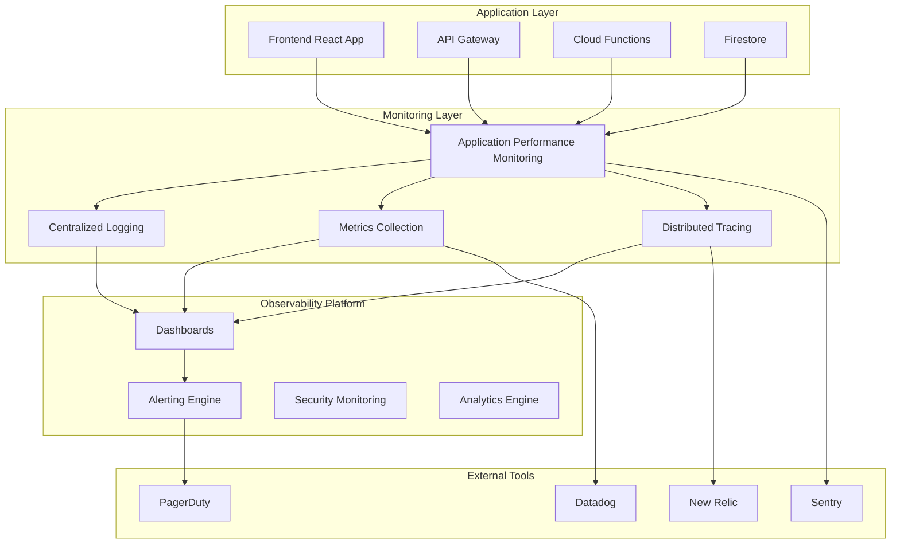

# EllaAI Monitoring and Observability Guide

This comprehensive guide covers monitoring, logging, alerting, and observability for the EllaAI platform in production environments.

## Table of Contents

- [Overview](#overview)
- [Monitoring Architecture](#monitoring-architecture)
- [Application Performance Monitoring](#application-performance-monitoring)
- [Infrastructure Monitoring](#infrastructure-monitoring)
- [Log Management](#log-management)
- [Error Tracking](#error-tracking)
- [Business Metrics](#business-metrics)
- [Alerting & Notifications](#alerting--notifications)
- [Dashboards](#dashboards)
- [SLA Monitoring](#sla-monitoring)
- [Troubleshooting](#troubleshooting)
- [Monitoring Tools Setup](#monitoring-tools-setup)

## Overview

The EllaAI platform implements comprehensive observability using a modern monitoring stack that provides deep insights into application performance, user experience, and system health.

### Monitoring Principles

- **Proactive Monitoring**: Detect issues before they impact users
- **Full-Stack Observability**: Monitor from frontend to database
- **Business-Focused Metrics**: Track KPIs that matter to the business
- **Automated Alerting**: Reduce MTTR with intelligent notifications
- **Data-Driven Decisions**: Use metrics to guide optimization efforts

### Key Objectives

- **99.9% Uptime SLA**: Maintain high availability
- **< 200ms API Response Time**: Ensure fast user experience
- **< 5 Minutes MTTR**: Quick incident resolution
- **Zero Data Loss**: Protect all user data
- **Security Monitoring**: Detect threats in real-time

## Monitoring Architecture

### High-Level Architecture



### Monitoring Stack Components

**Application Performance Monitoring:**
- Google Cloud Monitoring
- Firebase Performance Monitoring
- Custom application metrics

**Error Tracking:**
- Sentry for error aggregation
- Firebase Crashlytics
- Custom error reporting

**Log Management:**
- Google Cloud Logging
- Structured logging with Winston
- Log aggregation and analysis

**Infrastructure Monitoring:**
- Google Cloud Monitoring
- Resource utilization tracking
- Service health monitoring

## Application Performance Monitoring

### Frontend Monitoring

#### Performance Metrics

```typescript
// Frontend performance monitoring
class PerformanceMonitor {
  private analytics: Analytics;
  
  constructor() {
    this.analytics = getAnalytics();
  }
  
  // Track page load performance
  trackPageLoad(pageName: string) {
    const observer = new PerformanceObserver((list) => {
      const entries = list.getEntries();
      
      entries.forEach((entry) => {
        if (entry.entryType === 'navigation') {
          const navEntry = entry as PerformanceNavigationTiming;
          
          // Track Core Web Vitals
          this.trackMetric('page_load_time', navEntry.loadEventEnd - navEntry.navigationStart, {
            page: pageName
          });
          
          this.trackMetric('dom_content_loaded', navEntry.domContentLoadedEventEnd - navEntry.navigationStart, {
            page: pageName
          });
          
          this.trackMetric('first_contentful_paint', navEntry.domContentLoadedEventStart - navEntry.navigationStart, {
            page: pageName
          });
        }
      });
    });
    
    observer.observe({ entryTypes: ['navigation'] });
  }
  
  // Track API response times
  trackAPICall(endpoint: string, method: string, duration: number, status: number) {
    this.trackMetric('api_response_time', duration, {
      endpoint,
      method,
      status: status.toString()
    });
    
    // Track error rates
    if (status >= 400) {
      this.trackMetric('api_error_rate', 1, {
        endpoint,
        method,
        status: status.toString()
      });
    }
  }
  
  // Track user interactions
  trackUserAction(action: string, component: string, duration?: number) {
    logEvent(this.analytics, 'user_action', {
      action,
      component,
      duration,
      timestamp: Date.now()
    });
  }
  
  private trackMetric(name: string, value: number, labels: Record<string, string>) {
    // Send to Google Analytics
    logEvent(this.analytics, 'performance_metric', {
      metric_name: name,
      metric_value: value,
      ...labels
    });
    
    // Send to custom monitoring endpoint
    fetch('/api/metrics', {
      method: 'POST',
      headers: { 'Content-Type': 'application/json' },
      body: JSON.stringify({
        metric: name,
        value,
        labels,
        timestamp: Date.now()
      })
    });
  }
}
```

#### Real User Monitoring (RUM)

```typescript
// RUM implementation
export class RealUserMonitoring {
  private sessionId: string;
  private userId?: string;
  
  constructor(userId?: string) {
    this.sessionId = this.generateSessionId();
    this.userId = userId;
    this.initializeMonitoring();
  }
  
  private initializeMonitoring() {
    // Monitor JavaScript errors
    window.addEventListener('error', (event) => {
      this.trackError({
        type: 'javascript_error',
        message: event.message,
        filename: event.filename,
        lineno: event.lineno,
        colno: event.colno,
        stack: event.error?.stack
      });
    });
    
    // Monitor unhandled promise rejections
    window.addEventListener('unhandledrejection', (event) => {
      this.trackError({
        type: 'unhandled_rejection',
        message: event.reason?.message || 'Unhandled promise rejection',
        stack: event.reason?.stack
      });
    });
    
    // Monitor Core Web Vitals
    this.trackWebVitals();
    
    // Monitor network connectivity
    this.trackNetworkStatus();
    
    // Monitor user engagement
    this.trackUserEngagement();
  }
  
  private trackWebVitals() {
    // Track Largest Contentful Paint (LCP)
    new PerformanceObserver((entryList) => {
      const entries = entryList.getEntries();
      const lastEntry = entries[entries.length - 1];
      
      this.trackMetric('largest_contentful_paint', lastEntry.startTime);
    }).observe({ entryTypes: ['largest-contentful-paint'] });
    
    // Track First Input Delay (FID)
    new PerformanceObserver((entryList) => {
      const firstEntry = entryList.getEntries()[0];
      
      this.trackMetric('first_input_delay', firstEntry.processingStart - firstEntry.startTime);
    }).observe({ entryTypes: ['first-input'] });
    
    // Track Cumulative Layout Shift (CLS)
    let cumulativeLayoutShift = 0;
    
    new PerformanceObserver((entryList) => {
      for (const entry of entryList.getEntries()) {
        if (!entry.hadRecentInput) {
          cumulativeLayoutShift += entry.value;
        }
      }
      
      this.trackMetric('cumulative_layout_shift', cumulativeLayoutShift);
    }).observe({ entryTypes: ['layout-shift'] });
  }
  
  private trackError(error: any) {
    fetch('/api/monitoring/errors', {
      method: 'POST',
      headers: { 'Content-Type': 'application/json' },
      body: JSON.stringify({
        sessionId: this.sessionId,
        userId: this.userId,
        error,
        url: window.location.href,
        userAgent: navigator.userAgent,
        timestamp: Date.now()
      })
    });
  }
}
```

### Backend Monitoring

#### API Performance Tracking

```typescript
// Express middleware for API monitoring
export function apiMonitoringMiddleware() {
  return (req: Request, res: Response, next: NextFunction) => {
    const startTime = Date.now();
    const requestId = req.headers['x-request-id'] as string || generateRequestId();
    
    // Add request context
    (req as any).requestId = requestId;
    (req as any).startTime = startTime;
    
    // Override res.json to capture response
    const originalJson = res.json;
    res.json = function(data: any) {
      const endTime = Date.now();
      const duration = endTime - startTime;
      
      // Track API metrics
      trackAPIMetrics({
        method: req.method,
        path: req.route?.path || req.path,
        statusCode: res.statusCode,
        duration,
        requestId,
        userId: (req as any).user?.uid,
        timestamp: startTime
      });
      
      // Track errors
      if (res.statusCode >= 400) {
        trackAPIError({
          method: req.method,
          path: req.route?.path || req.path,
          statusCode: res.statusCode,
          error: data.error,
          requestId,
          userId: (req as any).user?.uid,
          timestamp: startTime
        });
      }
      
      return originalJson.call(this, data);
    };
    
    next();
  };
}

function trackAPIMetrics(data: APIMetrics) {
  // Send to monitoring service
  console.log(JSON.stringify({
    type: 'api_metrics',
    ...data
  }));
  
  // Send to external monitoring (Datadog, New Relic, etc.)
  if (process.env.DATADOG_API_KEY) {
    sendToDatadog('api.response_time', data.duration, {
      method: data.method,
      path: data.path,
      status: data.statusCode.toString()
    });
  }
}

function trackAPIError(data: APIError) {
  // Send to error tracking service
  console.error(JSON.stringify({
    type: 'api_error',
    ...data
  }));
  
  // Send to Sentry
  if (process.env.SENTRY_DSN) {
    Sentry.captureException(new Error(data.error?.message), {
      tags: {
        method: data.method,
        path: data.path,
        statusCode: data.statusCode.toString()
      },
      extra: data
    });
  }
}
```

#### Cloud Functions Monitoring

```typescript
// Cloud Functions monitoring
export function instrumentCloudFunction(functionName: string) {
  return (target: any, propertyName: string, descriptor: PropertyDescriptor) => {
    const method = descriptor.value;
    
    descriptor.value = async function (...args: any[]) {
      const startTime = Date.now();
      const invocationId = generateInvocationId();
      
      console.log(JSON.stringify({
        type: 'function_start',
        functionName,
        invocationId,
        timestamp: startTime
      }));
      
      try {
        const result = await method.apply(this, args);
        const duration = Date.now() - startTime;
        
        console.log(JSON.stringify({
          type: 'function_success',
          functionName,
          invocationId,
          duration,
          timestamp: startTime
        }));
        
        // Track success metrics
        trackFunctionMetrics(functionName, duration, 'success');
        
        return result;
      } catch (error) {
        const duration = Date.now() - startTime;
        
        console.error(JSON.stringify({
          type: 'function_error',
          functionName,
          invocationId,
          duration,
          error: error.message,
          stack: error.stack,
          timestamp: startTime
        }));
        
        // Track error metrics
        trackFunctionMetrics(functionName, duration, 'error');
        
        // Send to error tracking
        Sentry.captureException(error, {
          tags: { functionName, invocationId },
          extra: { duration }
        });
        
        throw error;
      }
    };
  };
}

function trackFunctionMetrics(functionName: string, duration: number, status: string) {
  // Send metrics to Google Cloud Monitoring
  const monitoring = require('@google-cloud/monitoring');
  const client = new monitoring.MetricServiceClient();
  
  const projectPath = client.projectPath(process.env.GOOGLE_CLOUD_PROJECT);
  
  const timeSeriesData = {
    metric: {
      type: 'custom.googleapis.com/function/execution_time',
      labels: {
        function_name: functionName,
        status: status
      }
    },
    resource: {
      type: 'cloud_function',
      labels: {
        function_name: functionName,
        region: process.env.FUNCTION_REGION || 'us-central1'
      }
    },
    points: [{
      interval: {
        endTime: {
          seconds: Date.now() / 1000
        }
      },
      value: {
        doubleValue: duration
      }
    }]
  };
  
  client.createTimeSeries({
    name: projectPath,
    timeSeries: [timeSeriesData]
  });
}
```

## Infrastructure Monitoring

### Google Cloud Platform Monitoring

```typescript
// GCP infrastructure monitoring setup
export class InfrastructureMonitor {
  private monitoring = new MonitoringClient();
  private projectId = process.env.GOOGLE_CLOUD_PROJECT;
  
  async setupInfrastructureAlerts() {
    const alerts = [
      {
        displayName: 'High CPU Usage',
        combiner: 'OR',
        conditions: [{
          displayName: 'Cloud Functions CPU > 80%',
          conditionThreshold: {
            filter: 'resource.type="cloud_function"',
            comparison: 'COMPARISON_GREATER_THAN',
            thresholdValue: 0.8,
            duration: { seconds: 300 } // 5 minutes
          }
        }]
      },
      {
        displayName: 'High Memory Usage',
        combiner: 'OR',
        conditions: [{
          displayName: 'Cloud Functions Memory > 90%',
          conditionThreshold: {
            filter: 'resource.type="cloud_function"',
            comparison: 'COMPARISON_GREATER_THAN',
            thresholdValue: 0.9,
            duration: { seconds: 180 } // 3 minutes
          }
        }]
      },
      {
        displayName: 'Firestore Read Errors',
        combiner: 'OR',
        conditions: [{
          displayName: 'Firestore Error Rate > 5%',
          conditionThreshold: {
            filter: 'resource.type="firestore_database"',
            comparison: 'COMPARISON_GREATER_THAN',
            thresholdValue: 0.05,
            duration: { seconds: 300 }
          }
        }]
      }
    ];
    
    for (const alert of alerts) {
      await this.createAlertPolicy(alert);
    }
  }
  
  async trackCustomMetric(metricType: string, value: number, labels: Record<string, string>) {
    const request = {
      name: this.monitoring.projectPath(this.projectId),
      timeSeries: [{
        metric: {
          type: `custom.googleapis.com/${metricType}`,
          labels
        },
        resource: {
          type: 'global',
          labels: {
            project_id: this.projectId
          }
        },
        points: [{
          interval: {
            endTime: { seconds: Math.floor(Date.now() / 1000) }
          },
          value: { doubleValue: value }
        }]
      }]
    };
    
    await this.monitoring.createTimeSeries(request);
  }
  
  private async createAlertPolicy(policy: any) {
    const request = {
      name: this.monitoring.projectPath(this.projectId),
      alertPolicy: {
        displayName: policy.displayName,
        combiner: policy.combiner,
        conditions: policy.conditions,
        enabled: true,
        notificationChannels: await this.getNotificationChannels()
      }
    };
    
    await this.monitoring.createAlertPolicy(request);
  }
}
```

### Database Monitoring

```typescript
// Firestore monitoring
export class DatabaseMonitor {
  private db = admin.firestore();
  
  async trackDatabaseMetrics() {
    // Track query performance
    this.trackQueryPerformance();
    
    // Track connection health
    this.trackConnectionHealth();
    
    // Track data usage
    this.trackDataUsage();
  }
  
  private trackQueryPerformance() {
    const originalGet = this.db.collection.prototype.get;
    
    this.db.collection.prototype.get = async function() {
      const startTime = Date.now();
      const collectionPath = this._path.segments.join('/');
      
      try {
        const result = await originalGet.apply(this, arguments);
        const duration = Date.now() - startTime;
        
        // Track successful query
        console.log(JSON.stringify({
          type: 'firestore_query',
          collection: collectionPath,
          duration,
          resultCount: result.size,
          status: 'success',
          timestamp: startTime
        }));
        
        // Track slow queries
        if (duration > 1000) { // Queries slower than 1 second
          console.warn(JSON.stringify({
            type: 'slow_query',
            collection: collectionPath,
            duration,
            timestamp: startTime
          }));
        }
        
        return result;
      } catch (error) {
        const duration = Date.now() - startTime;
        
        console.error(JSON.stringify({
          type: 'firestore_error',
          collection: collectionPath,
          duration,
          error: error.message,
          timestamp: startTime
        }));
        
        throw error;
      }
    };
  }
  
  private async trackConnectionHealth() {
    try {
      const healthCheck = await this.db.collection('_health').limit(1).get();
      
      console.log(JSON.stringify({
        type: 'database_health_check',
        status: 'success',
        timestamp: Date.now()
      }));
    } catch (error) {
      console.error(JSON.stringify({
        type: 'database_health_check',
        status: 'error',
        error: error.message,
        timestamp: Date.now()
      }));
    }
  }
  
  private async trackDataUsage() {
    // This would require custom implementation based on your data model
    const collections = ['users', 'companies', 'assessments', 'candidates'];
    
    for (const collection of collections) {
      try {
        const snapshot = await this.db.collection(collection).count().get();
        
        console.log(JSON.stringify({
          type: 'data_usage',
          collection,
          documentCount: snapshot.data().count,
          timestamp: Date.now()
        }));
      } catch (error) {
        console.error(`Error counting ${collection}:`, error);
      }
    }
  }
}
```

## Log Management

### Structured Logging

```typescript
// Structured logging with Winston
import winston from 'winston';
import { LoggingWinston } from '@google-cloud/logging-winston';

const loggingWinston = new LoggingWinston({
  projectId: process.env.GOOGLE_CLOUD_PROJECT,
  keyFilename: process.env.GOOGLE_APPLICATION_CREDENTIALS,
  logName: 'ellaai-application-log'
});

export const logger = winston.createLogger({
  level: process.env.LOG_LEVEL || 'info',
  format: winston.format.combine(
    winston.format.timestamp(),
    winston.format.errors({ stack: true }),
    winston.format.json(),
    winston.format.printf((info) => {
      return JSON.stringify({
        timestamp: info.timestamp,
        level: info.level,
        message: info.message,
        service: 'ellaai-api',
        version: process.env.APP_VERSION,
        environment: process.env.NODE_ENV,
        requestId: info.requestId,
        userId: info.userId,
        ...info
      });
    })
  ),
  transports: [
    new winston.transports.Console(),
    loggingWinston
  ]
});

// Usage examples
export function logUserAction(userId: string, action: string, details?: any) {
  logger.info('User action performed', {
    userId,
    action,
    details,
    category: 'user_activity'
  });
}

export function logSecurityEvent(event: string, userId?: string, details?: any) {
  logger.warn('Security event detected', {
    event,
    userId,
    details,
    category: 'security'
  });
}

export function logBusinessEvent(event: string, metrics: Record<string, any>) {
  logger.info('Business event tracked', {
    event,
    metrics,
    category: 'business'
  });
}
```

### Log Analysis and Aggregation

```typescript
// Log analysis service
export class LogAnalyzer {
  private bigQuery = new BigQueryClient();
  
  async analyzeErrorPatterns(timeframe: string = '24h'): Promise<ErrorAnalysis> {
    const query = `
      SELECT 
        JSON_EXTRACT_SCALAR(jsonPayload, '$.error.type') as error_type,
        JSON_EXTRACT_SCALAR(jsonPayload, '$.error.message') as error_message,
        COUNT(*) as occurrences,
        ARRAY_AGG(DISTINCT JSON_EXTRACT_SCALAR(jsonPayload, '$.userId')) as affected_users
      FROM \`${this.projectId}.logs.ellaai_application_log\`
      WHERE 
        timestamp >= TIMESTAMP_SUB(CURRENT_TIMESTAMP(), INTERVAL 1 DAY)
        AND severity = 'ERROR'
      GROUP BY error_type, error_message
      ORDER BY occurrences DESC
      LIMIT 20
    `;
    
    const [job] = await this.bigQuery.createQueryJob({ query });
    const [rows] = await job.getQueryResults();
    
    return {
      timeframe,
      totalErrors: rows.reduce((sum, row) => sum + row.occurrences, 0),
      errorPatterns: rows.map(row => ({
        type: row.error_type,
        message: row.error_message,
        occurrences: row.occurrences,
        affectedUsers: row.affected_users.length
      }))
    };
  }
  
  async generatePerformanceReport(timeframe: string = '7d'): Promise<PerformanceReport> {
    const query = `
      SELECT 
        JSON_EXTRACT_SCALAR(jsonPayload, '$.endpoint') as endpoint,
        AVG(CAST(JSON_EXTRACT_SCALAR(jsonPayload, '$.duration') AS FLOAT64)) as avg_duration,
        APPROX_QUANTILES(CAST(JSON_EXTRACT_SCALAR(jsonPayload, '$.duration') AS FLOAT64), 100)[OFFSET(95)] as p95_duration,
        COUNT(*) as request_count,
        COUNTIF(CAST(JSON_EXTRACT_SCALAR(jsonPayload, '$.statusCode') AS INT64) >= 400) as error_count
      FROM \`${this.projectId}.logs.ellaai_application_log\`
      WHERE 
        timestamp >= TIMESTAMP_SUB(CURRENT_TIMESTAMP(), INTERVAL 7 DAY)
        AND JSON_EXTRACT_SCALAR(jsonPayload, '$.type') = 'api_request'
      GROUP BY endpoint
      ORDER BY request_count DESC
    `;
    
    const [job] = await this.bigQuery.createQueryJob({ query });
    const [rows] = await job.getQueryResults();
    
    return {
      timeframe,
      endpoints: rows.map(row => ({
        endpoint: row.endpoint,
        avgDuration: row.avg_duration,
        p95Duration: row.p95_duration,
        requestCount: row.request_count,
        errorRate: (row.error_count / row.request_count) * 100
      }))
    };
  }
}
```

## Error Tracking

### Sentry Integration

```typescript
// Sentry configuration
import * as Sentry from '@sentry/node';
import * as Tracing from '@sentry/tracing';

export function initializeSentry() {
  Sentry.init({
    dsn: process.env.SENTRY_DSN,
    environment: process.env.NODE_ENV,
    release: process.env.APP_VERSION,
    
    // Performance monitoring
    tracesSampleRate: process.env.NODE_ENV === 'production' ? 0.1 : 1.0,
    
    // Error filtering
    beforeSend(event, hint) {
      // Filter out expected errors
      if (event.exception?.values?.some(ex => 
        ex.type === 'ValidationError' || 
        ex.type === 'AuthenticationError'
      )) {
        return null;
      }
      
      // Add additional context
      if (event.request) {
        event.tags = {
          ...event.tags,
          endpoint: event.request.url,
          method: event.request.method
        };
      }
      
      return event;
    },
    
    // Custom integrations
    integrations: [
      new Sentry.Integrations.Http({ tracing: true }),
      new Tracing.Integrations.Express({ app: undefined }),
      new Tracing.Integrations.Prisma({ client: undefined })
    ]
  });
}

// Error handling middleware
export function sentryErrorHandler() {
  return Sentry.Handlers.errorHandler({
    shouldHandleError(error) {
      // Send 4xx and 5xx errors to Sentry
      return error.status >= 400;
    }
  });
}

// Custom error tracking
export function trackError(error: Error, context?: any) {
  Sentry.withScope((scope) => {
    if (context) {
      scope.setContext('error_context', context);
    }
    
    scope.setTag('error_boundary', 'custom');
    Sentry.captureException(error);
  });
}
```

### Error Analysis Dashboard

```typescript
// Error metrics aggregation
export class ErrorMetrics {
  async getErrorSummary(timeframe: '1h' | '24h' | '7d' = '24h'): Promise<ErrorSummary> {
    const errors = await this.getErrorsInTimeframe(timeframe);
    
    return {
      totalErrors: errors.length,
      uniqueErrors: this.getUniqueErrorCount(errors),
      errorRate: this.calculateErrorRate(errors, timeframe),
      topErrors: this.getTopErrors(errors, 10),
      errorsByService: this.groupErrorsByService(errors),
      errorTrends: this.calculateErrorTrends(errors)
    };
  }
  
  private getUniqueErrorCount(errors: ErrorEvent[]): number {
    const uniqueErrors = new Set(errors.map(e => `${e.type}:${e.message}`));
    return uniqueErrors.size;
  }
  
  private calculateErrorRate(errors: ErrorEvent[], timeframe: string): number {
    const totalRequests = this.getTotalRequestsInTimeframe(timeframe);
    return (errors.length / totalRequests) * 100;
  }
  
  private getTopErrors(errors: ErrorEvent[], limit: number): TopError[] {
    const errorCounts = new Map<string, { count: number; error: ErrorEvent }>();
    
    errors.forEach(error => {
      const key = `${error.type}:${error.message}`;
      if (errorCounts.has(key)) {
        errorCounts.get(key)!.count++;
      } else {
        errorCounts.set(key, { count: 1, error });
      }
    });
    
    return Array.from(errorCounts.entries())
      .sort(([, a], [, b]) => b.count - a.count)
      .slice(0, limit)
      .map(([key, value]) => ({
        type: value.error.type,
        message: value.error.message,
        count: value.count,
        lastOccurrence: value.error.timestamp
      }));
  }
}
```

## Business Metrics

### Key Performance Indicators (KPIs)

```typescript
// Business metrics tracking
export class BusinessMetrics {
  private analytics = getAnalytics();
  
  // Assessment completion metrics
  async trackAssessmentCompletion(assessmentId: string, candidateId: string, result: AssessmentResult) {
    const metrics = {
      assessment_id: assessmentId,
      candidate_id: candidateId,
      completion_time: result.completionTime,
      score: result.score,
      completed_questions: result.completedQuestions,
      total_questions: result.totalQuestions,
      completion_rate: (result.completedQuestions / result.totalQuestions) * 100
    };
    
    // Track in Google Analytics
    logEvent(this.analytics, 'assessment_completed', metrics);
    
    // Track custom metrics
    await this.trackCustomMetric('assessment_completion_rate', metrics.completion_rate, {
      assessment_id: assessmentId
    });
    
    await this.trackCustomMetric('assessment_score', result.score, {
      assessment_id: assessmentId,
      difficulty: result.difficulty
    });
  }
  
  // User engagement metrics
  async trackUserEngagement(userId: string, sessionData: UserSession) {
    const engagementScore = this.calculateEngagementScore(sessionData);
    
    const metrics = {
      user_id: userId,
      session_duration: sessionData.duration,
      pages_viewed: sessionData.pagesViewed,
      actions_performed: sessionData.actionsPerformed,
      engagement_score: engagementScore
    };
    
    logEvent(this.analytics, 'user_engagement', metrics);
    
    await this.trackCustomMetric('user_engagement_score', engagementScore, {
      user_type: sessionData.userType
    });
  }
  
  // Revenue metrics (for SaaS)
  async trackRevenueMetrics(companyId: string, subscription: Subscription) {
    const mrr = subscription.monthlyValue;
    const arr = mrr * 12;
    
    await this.trackCustomMetric('monthly_recurring_revenue', mrr, {
      company_id: companyId,
      plan: subscription.plan
    });
    
    await this.trackCustomMetric('annual_recurring_revenue', arr, {
      company_id: companyId,
      plan: subscription.plan
    });
    
    logEvent(this.analytics, 'subscription_revenue', {
      company_id: companyId,
      plan: subscription.plan,
      mrr,
      arr
    });
  }
  
  // Conversion funnel metrics
  async trackConversionFunnel(step: string, userId: string, metadata?: any) {
    const funnelData = {
      step,
      user_id: userId,
      timestamp: Date.now(),
      ...metadata
    };
    
    logEvent(this.analytics, 'funnel_step', funnelData);
    
    // Track conversion rates
    const conversionRate = await this.calculateConversionRate(step);
    await this.trackCustomMetric('conversion_rate', conversionRate, { step });
  }
  
  private calculateEngagementScore(session: UserSession): number {
    // Complex engagement scoring algorithm
    const durationScore = Math.min(session.duration / (30 * 60 * 1000), 1); // Max 30 minutes
    const actionScore = Math.min(session.actionsPerformed / 50, 1); // Max 50 actions
    const pageScore = Math.min(session.pagesViewed / 10, 1); // Max 10 pages
    
    return (durationScore * 0.4 + actionScore * 0.4 + pageScore * 0.2) * 100;
  }
  
  private async trackCustomMetric(name: string, value: number, labels: Record<string, string>) {
    // Implementation depends on your monitoring service
    console.log(JSON.stringify({
      type: 'business_metric',
      metric: name,
      value,
      labels,
      timestamp: Date.now()
    }));
  }
}
```

### A/B Testing Metrics

```typescript
// A/B testing metrics
export class ABTestingMetrics {
  async trackExperiment(experimentId: string, userId: string, variant: string, outcome?: any) {
    const event = {
      experiment_id: experimentId,
      user_id: userId,
      variant,
      outcome,
      timestamp: Date.now()
    };
    
    // Track experiment exposure
    logEvent(getAnalytics(), 'experiment_exposure', event);
    
    // If outcome is provided, track conversion
    if (outcome) {
      logEvent(getAnalytics(), 'experiment_conversion', event);
    }
    
    // Store for statistical analysis
    await this.storeExperimentData(event);
  }
  
  async analyzeExperiment(experimentId: string): Promise<ExperimentResults> {
    const data = await this.getExperimentData(experimentId);
    
    const results: ExperimentResults = {
      experimentId,
      totalUsers: data.length,
      variants: {},
      confidence: 0,
      significantAt: 0.05
    };
    
    // Group by variant
    const variantData = this.groupBy(data, 'variant');
    
    Object.entries(variantData).forEach(([variant, users]) => {
      const conversions = users.filter(u => u.outcome);
      
      results.variants[variant] = {
        users: users.length,
        conversions: conversions.length,
        conversionRate: conversions.length / users.length,
        confidenceInterval: this.calculateConfidenceInterval(conversions.length, users.length)
      };
    });
    
    // Calculate statistical significance
    results.confidence = this.calculateStatisticalSignificance(results.variants);
    
    return results;
  }
  
  private calculateConfidenceInterval(conversions: number, users: number): [number, number] {
    const rate = conversions / users;
    const margin = 1.96 * Math.sqrt((rate * (1 - rate)) / users);
    return [Math.max(0, rate - margin), Math.min(1, rate + margin)];
  }
  
  private calculateStatisticalSignificance(variants: Record<string, any>): number {
    // Implement chi-square test or similar statistical test
    // This is a simplified version
    const variantKeys = Object.keys(variants);
    if (variantKeys.length !== 2) return 0;
    
    const [controlKey, treatmentKey] = variantKeys;
    const control = variants[controlKey];
    const treatment = variants[treatmentKey];
    
    // Z-test for two proportions
    const p1 = control.conversions / control.users;
    const p2 = treatment.conversions / treatment.users;
    const pooledP = (control.conversions + treatment.conversions) / (control.users + treatment.users);
    
    const se = Math.sqrt(pooledP * (1 - pooledP) * (1/control.users + 1/treatment.users));
    const z = Math.abs(p1 - p2) / se;
    
    // Convert z-score to confidence level (simplified)
    return Math.min(0.99, z / 2.58); // 2.58 is z-score for 99% confidence
  }
}
```

## Alerting & Notifications

### Alert Configuration

```yaml
# Alert configuration file
alerts:
  # High error rate alert
  - name: "high_error_rate"
    description: "API error rate exceeds 5% for 5 minutes"
    condition: "api_error_rate > 0.05"
    duration: "5m"
    severity: "critical"
    channels:
      - pagerduty
      - slack
      - email
    
  # Slow response time alert
  - name: "slow_response_time"
    description: "API response time P95 > 2 seconds"
    condition: "api_response_time_p95 > 2000"
    duration: "10m"
    severity: "warning"
    channels:
      - slack
      - email
    
  # High CPU usage alert
  - name: "high_cpu_usage"
    description: "Cloud Function CPU usage > 80%"
    condition: "function_cpu_usage > 0.8"
    duration: "5m"
    severity: "warning"
    channels:
      - slack
    
  # Database connection errors
  - name: "database_connection_errors"
    description: "Database connection failures > 10 in 5 minutes"
    condition: "database_connection_errors > 10"
    duration: "5m"
    severity: "critical"
    channels:
      - pagerduty
      - slack
    
  # Business metric alerts
  - name: "low_assessment_completion_rate"
    description: "Assessment completion rate < 70%"
    condition: "assessment_completion_rate < 0.7"
    duration: "1h"
    severity: "warning"
    channels:
      - email
    
  - name: "high_user_churn"
    description: "User churn rate > 10%"
    condition: "user_churn_rate > 0.1"
    duration: "24h"
    severity: "high"
    channels:
      - slack
      - email
```

### Notification Channels

```typescript
// Notification service
export class NotificationService {
  private slackClient = new WebClient(process.env.SLACK_TOKEN);
  private emailClient = new SendGridClient(process.env.SENDGRID_API_KEY);
  private pagerDutyClient = new PagerDutyClient(process.env.PAGERDUTY_API_KEY);
  
  async sendAlert(alert: Alert, channels: string[]) {
    const message = this.formatAlertMessage(alert);
    
    const promises = channels.map(channel => {
      switch (channel) {
        case 'slack':
          return this.sendSlackAlert(alert, message);
        case 'email':
          return this.sendEmailAlert(alert, message);
        case 'pagerduty':
          return this.sendPagerDutyAlert(alert);
        default:
          console.warn(`Unknown notification channel: ${channel}`);
      }
    });
    
    await Promise.allSettled(promises);
  }
  
  private async sendSlackAlert(alert: Alert, message: string) {
    const color = this.getSeverityColor(alert.severity);
    
    await this.slackClient.chat.postMessage({
      channel: '#alerts',
      attachments: [{
        color,
        title: `🚨 ${alert.name}`,
        text: message,
        fields: [
          { title: 'Severity', value: alert.severity, short: true },
          { title: 'Time', value: new Date().toISOString(), short: true }
        ],
        actions: [{
          type: 'button',
          text: 'View Dashboard',
          url: `https://monitoring.ellaai.com/alerts/${alert.id}`
        }]
      }]
    });
  }
  
  private async sendEmailAlert(alert: Alert, message: string) {
    const recipients = await this.getAlertRecipients(alert.severity);
    
    await this.emailClient.send({
      to: recipients,
      from: 'alerts@ellaai.com',
      subject: `[${alert.severity.toUpperCase()}] ${alert.name}`,
      html: this.generateAlertEmail(alert, message)
    });
  }
  
  private async sendPagerDutyAlert(alert: Alert) {
    await this.pagerDutyClient.incidents.create({
      incident: {
        type: 'incident',
        title: alert.name,
        service: { id: process.env.PAGERDUTY_SERVICE_ID, type: 'service_reference' },
        urgency: alert.severity === 'critical' ? 'high' : 'low',
        body: {
          type: 'incident_body',
          details: alert.description
        }
      }
    });
  }
  
  private getSeverityColor(severity: string): string {
    const colors = {
      critical: '#ff0000',
      high: '#ff8c00',
      warning: '#ffff00',
      info: '#00ff00'
    };
    return colors[severity] || '#808080';
  }
}
```

## Dashboards

### Grafana Dashboard Configuration

```json
{
  "dashboard": {
    "id": null,
    "title": "EllaAI Production Dashboard",
    "tags": ["ellaai", "production"],
    "timezone": "browser",
    "panels": [
      {
        "id": 1,
        "title": "API Response Time",
        "type": "graph",
        "targets": [
          {
            "expr": "histogram_quantile(0.95, rate(api_request_duration_seconds_bucket[5m]))",
            "legendFormat": "95th percentile"
          },
          {
            "expr": "histogram_quantile(0.50, rate(api_request_duration_seconds_bucket[5m]))",
            "legendFormat": "50th percentile"
          }
        ],
        "yAxes": [
          {
            "label": "Response Time (ms)",
            "min": 0
          }
        ],
        "thresholds": [
          {
            "value": 2000,
            "colorMode": "critical",
            "op": "gt"
          }
        ]
      },
      {
        "id": 2,
        "title": "Error Rate",
        "type": "singlestat",
        "targets": [
          {
            "expr": "rate(api_requests_total{status=~\"4..|5..\"}[5m]) / rate(api_requests_total[5m]) * 100",
            "legendFormat": "Error Rate %"
          }
        ],
        "thresholds": "1,5",
        "colorBackground": true
      },
      {
        "id": 3,
        "title": "Active Users",
        "type": "graph",
        "targets": [
          {
            "expr": "increase(user_sessions_total[1h])",
            "legendFormat": "Hourly Active Users"
          }
        ]
      },
      {
        "id": 4,
        "title": "Assessment Completion Rate",
        "type": "graph",
        "targets": [
          {
            "expr": "assessment_completed_total / assessment_started_total * 100",
            "legendFormat": "Completion Rate %"
          }
        ]
      },
      {
        "id": 5,
        "title": "Infrastructure Health",
        "type": "table",
        "targets": [
          {
            "expr": "up",
            "format": "table",
            "instant": true
          }
        ],
        "columns": [
          { "text": "Instance", "value": "instance" },
          { "text": "Status", "value": "Value" },
          { "text": "Last Seen", "value": "__timestamp__" }
        ]
      }
    ],
    "time": {
      "from": "now-1h",
      "to": "now"
    },
    "refresh": "30s"
  }
}
```

### Custom Dashboard Components

```typescript
// Dashboard data service
export class DashboardService {
  async getSystemOverview(): Promise<SystemOverview> {
    const [
      responseTimeMetrics,
      errorRateMetrics,
      userMetrics,
      businessMetrics
    ] = await Promise.all([
      this.getResponseTimeMetrics(),
      this.getErrorRateMetrics(),
      this.getUserMetrics(),
      this.getBusinessMetrics()
    ]);
    
    return {
      responseTime: {
        current: responseTimeMetrics.p95,
        trend: responseTimeMetrics.trend,
        threshold: 2000
      },
      errorRate: {
        current: errorRateMetrics.rate,
        trend: errorRateMetrics.trend,
        threshold: 0.05
      },
      activeUsers: {
        current: userMetrics.active,
        total: userMetrics.total,
        trend: userMetrics.trend
      },
      assessments: {
        completed: businessMetrics.assessmentsCompleted,
        completionRate: businessMetrics.completionRate,
        averageScore: businessMetrics.averageScore
      }
    };
  }
  
  async getDetailedMetrics(timeframe: string = '24h'): Promise<DetailedMetrics> {
    // Implementation for detailed metrics retrieval
    return {
      apiMetrics: await this.getAPIMetrics(timeframe),
      infrastructureMetrics: await this.getInfrastructureMetrics(timeframe),
      businessMetrics: await this.getDetailedBusinessMetrics(timeframe),
      securityMetrics: await this.getSecurityMetrics(timeframe)
    };
  }
  
  private async getResponseTimeMetrics(): Promise<ResponseTimeMetrics> {
    // Query monitoring system for response time data
    const query = `
      SELECT 
        APPROX_QUANTILES(duration, 100)[OFFSET(95)] as p95,
        APPROX_QUANTILES(duration, 100)[OFFSET(50)] as p50,
        AVG(duration) as avg
      FROM monitoring_data 
      WHERE timestamp >= TIMESTAMP_SUB(CURRENT_TIMESTAMP(), INTERVAL 1 HOUR)
    `;
    
    // Execute query and return formatted results
    const results = await this.executeQuery(query);
    return this.formatResponseTimeMetrics(results);
  }
}
```

## SLA Monitoring

### Service Level Objectives (SLOs)

```typescript
// SLO tracking and reporting
export class SLOMonitor {
  private slos = {
    availability: {
      target: 0.999, // 99.9%
      window: '30d',
      errorBudget: 0.001 // 0.1%
    },
    latency: {
      target: 0.95, // 95% of requests < 2s
      threshold: 2000,
      window: '7d'
    },
    errorRate: {
      target: 0.99, // 99% success rate
      window: '24h'
    }
  };
  
  async calculateSLO(sloType: string, timeWindow: string): Promise<SLOResult> {
    const slo = this.slos[sloType];
    if (!slo) {
      throw new Error(`Unknown SLO type: ${sloType}`);
    }
    
    const results = await this.getSLOData(sloType, timeWindow);
    const currentValue = this.calculateSLOValue(results, sloType);
    const errorBudgetRemaining = this.calculateErrorBudget(slo.target, currentValue, timeWindow);
    
    return {
      sloType,
      target: slo.target,
      current: currentValue,
      status: currentValue >= slo.target ? 'met' : 'missed',
      errorBudgetRemaining,
      timeWindow,
      lastUpdated: new Date().toISOString()
    };
  }
  
  async generateSLOReport(period: string = '30d'): Promise<SLOReport> {
    const [availability, latency, errorRate] = await Promise.all([
      this.calculateSLO('availability', period),
      this.calculateSLO('latency', period),
      this.calculateSLO('errorRate', period)
    ]);
    
    return {
      period,
      overall: {
        met: [availability, latency, errorRate].every(slo => slo.status === 'met'),
        score: [availability, latency, errorRate].reduce((acc, slo) => acc + slo.current, 0) / 3
      },
      slos: { availability, latency, errorRate },
      generatedAt: new Date().toISOString()
    };
  }
  
  private calculateErrorBudget(target: number, current: number, timeWindow: string): number {
    const totalBudget = 1 - target;
    const used = Math.max(0, target - current);
    return Math.max(0, totalBudget - used);
  }
  
  // Alert on SLO violations
  async checkSLOViolations(): Promise<void> {
    const sloResults = await Promise.all([
      this.calculateSLO('availability', '1h'),
      this.calculateSLO('latency', '1h'),
      this.calculateSLO('errorRate', '1h')
    ]);
    
    for (const sloResult of sloResults) {
      if (sloResult.status === 'missed') {
        await this.alertSLOViolation(sloResult);
      }
      
      // Alert when error budget is low
      if (sloResult.errorBudgetRemaining < 0.1) {
        await this.alertLowErrorBudget(sloResult);
      }
    }
  }
}
```

## Troubleshooting

### Common Monitoring Issues

#### 1. High Memory Usage

```bash
# Check memory usage
gcloud monitoring metrics list --filter="metric.type:compute.googleapis.com/instance/memory" --project=ellaai-production

# Investigate memory leaks
node --inspect-brk app.js
# Use Chrome DevTools to profile memory usage
```

#### 2. Slow Database Queries

```typescript
// Enable Firestore query monitoring
export function monitorFirestorePerformance() {
  const admin = require('firebase-admin');
  const db = admin.firestore();
  
  // Monitor slow queries
  db._settings = {
    ...db._settings,
    ignoreUndefinedProperties: true
  };
  
  // Add query timing
  const originalGet = db.prototype.get;
  db.prototype.get = async function() {
    const start = Date.now();
    const result = await originalGet.apply(this, arguments);
    const duration = Date.now() - start;
    
    if (duration > 1000) {
      console.warn(`Slow query detected: ${duration}ms`, {
        collection: this._path?.segments?.join('/'),
        query: this._query
      });
    }
    
    return result;
  };
}
```

#### 3. Alert Fatigue

```typescript
// Smart alerting with suppression
export class SmartAlerting {
  private alertSuppressions = new Map<string, number>();
  
  async processAlert(alert: Alert): Promise<boolean> {
    const alertKey = `${alert.name}:${alert.severity}`;
    const now = Date.now();
    const suppressionPeriod = this.getSuppressionPeriod(alert.severity);
    
    // Check if alert is suppressed
    if (this.alertSuppressions.has(alertKey)) {
      const lastAlert = this.alertSuppressions.get(alertKey)!;
      if (now - lastAlert < suppressionPeriod) {
        return false; // Suppress duplicate alert
      }
    }
    
    // Send alert and record timestamp
    this.alertSuppressions.set(alertKey, now);
    await this.sendAlert(alert);
    return true;
  }
  
  private getSuppressionPeriod(severity: string): number {
    const suppressionPeriods = {
      'critical': 5 * 60 * 1000,  // 5 minutes
      'high': 15 * 60 * 1000,     // 15 minutes  
      'warning': 60 * 60 * 1000,  // 1 hour
      'info': 4 * 60 * 60 * 1000  // 4 hours
    };
    
    return suppressionPeriods[severity] || 60 * 60 * 1000;
  }
}
```

## Monitoring Tools Setup

### Google Cloud Monitoring Setup

```bash
#!/bin/bash
# Setup Google Cloud Monitoring

# Enable required APIs
gcloud services enable monitoring.googleapis.com
gcloud services enable logging.googleapis.com
gcloud services enable clouderrorreporting.googleapis.com

# Create notification channels
gcloud alpha monitoring channels create \
  --display-name="Slack Alerts" \
  --type=slack \
  --channel-labels=channel_name=#alerts,url=https://hooks.slack.com/services/YOUR/SLACK/WEBHOOK

# Create alert policies
gcloud alpha monitoring policies create alert-policy.yaml

# Set up uptime checks
gcloud monitoring uptime create \
  --display-name="EllaAI API Health Check" \
  --http-check-path=/api/health \
  --hostname=api.ellaai.com \
  --port=443 \
  --use-ssl
```

### Prometheus Configuration

```yaml
# prometheus.yml
global:
  scrape_interval: 15s
  evaluation_interval: 15s

rule_files:
  - "ellaai-rules.yml"

alerting:
  alertmanagers:
    - static_configs:
        - targets:
          - alertmanager:9093

scrape_configs:
  - job_name: 'ellaai-api'
    static_configs:
      - targets: ['localhost:3000']
    scrape_interval: 5s
    metrics_path: /metrics
    
  - job_name: 'firebase-functions'
    gce_sd_configs:
      - project: ellaai-production
        zone: us-central1-a
        port: 8080
    relabel_configs:
      - source_labels: [__meta_gce_label_function_name]
        target_label: function_name

  - job_name: 'node-exporter'
    static_configs:
      - targets: ['node-exporter:9100']
```

### Docker Compose for Monitoring Stack

```yaml
# docker-compose.monitoring.yml
version: '3.8'

services:
  prometheus:
    image: prom/prometheus:latest
    ports:
      - "9090:9090"
    volumes:
      - ./prometheus.yml:/etc/prometheus/prometheus.yml
      - prometheus-data:/prometheus
    command:
      - '--config.file=/etc/prometheus/prometheus.yml'
      - '--storage.tsdb.path=/prometheus'
      - '--web.console.libraries=/etc/prometheus/console_libraries'
      - '--web.console.templates=/etc/prometheus/consoles'
      - '--web.enable-lifecycle'

  grafana:
    image: grafana/grafana:latest
    ports:
      - "3000:3000"
    volumes:
      - grafana-data:/var/lib/grafana
      - ./grafana/dashboards:/etc/grafana/provisioning/dashboards
      - ./grafana/datasources:/etc/grafana/provisioning/datasources
    environment:
      - GF_SECURITY_ADMIN_PASSWORD=admin123
      - GF_USERS_ALLOW_SIGN_UP=false

  alertmanager:
    image: prom/alertmanager:latest
    ports:
      - "9093:9093"
    volumes:
      - ./alertmanager.yml:/etc/alertmanager/alertmanager.yml
      - alertmanager-data:/alertmanager

volumes:
  prometheus-data:
  grafana-data:
  alertmanager-data:
```

---

This monitoring guide provides comprehensive coverage of observability for the EllaAI platform. For specific monitoring issues or questions, contact the SRE team at sre@ellaai.com.