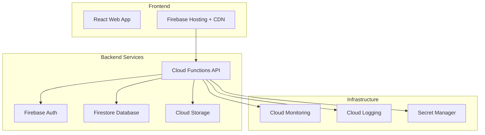

# EllaAI Operations Runbook

This comprehensive runbook provides step-by-step procedures for operating, maintaining, and troubleshooting the EllaAI platform in production environments.

## Table of Contents

- [Overview](#overview)
- [System Architecture Summary](#system-architecture-summary)
- [Daily Operations](#daily-operations)
- [Health Checks](#health-checks)
- [Deployment Procedures](#deployment-procedures)
- [Monitoring and Alerting](#monitoring-and-alerting)
- [Incident Response](#incident-response)
- [Maintenance Procedures](#maintenance-procedures)
- [Backup and Recovery](#backup-and-recovery)
- [Security Operations](#security-operations)
- [Performance Optimization](#performance-optimization)
- [Troubleshooting Playbooks](#troubleshooting-playbooks)
- [Emergency Procedures](#emergency-procedures)
- [Escalation Matrix](#escalation-matrix)

## Overview

The EllaAI platform is a cloud-native application built on Google Cloud Platform and Firebase. This runbook provides operational guidance for the SRE team, on-call engineers, and system administrators.

### Key Responsibilities

- **Availability**: Maintain 99.9% uptime SLA
- **Performance**: Keep API response times < 200ms (P95)
- **Security**: Monitor for threats and maintain compliance
- **Data Integrity**: Ensure zero data loss and consistency
- **Cost Optimization**: Monitor and optimize cloud spend

### Service Levels

| Component | SLA | RTO | RPO |
|-----------|-----|-----|-----|
| API Gateway | 99.9% | 5 min | 0 |
| Database | 99.95% | 10 min | 15 min |
| Frontend | 99.5% | 2 min | 0 |
| Authentication | 99.9% | 5 min | 0 |

## System Architecture Summary

### Core Components



### Key Services

- **Frontend**: React SPA hosted on Firebase Hosting
- **API**: Node.js Cloud Functions with Express
- **Database**: Firestore for primary data storage
- **Authentication**: Firebase Authentication with JWT
- **Storage**: Cloud Storage for file uploads
- **Monitoring**: Cloud Monitoring with custom metrics

## Daily Operations

### Morning Checklist (9:00 AM UTC)

```bash
#!/bin/bash
# daily-morning-check.sh

echo "🌅 EllaAI Daily Morning Health Check - $(date)"
echo "================================================"

# 1. System Health Check
echo "1. Checking system health..."
curl -f https://api.ellaai.com/api/health || echo "❌ API health check failed"

# 2. Check overnight alerts
echo "2. Checking overnight alerts..."
gcloud logging read "severity=ERROR AND timestamp>=\"$(date -d '24 hours ago' -u +%Y-%m-%dT%H:%M:%SZ)\"" \
  --limit=10 --format=table

# 3. Review key metrics
echo "3. Key metrics (last 24h)..."
echo "- API Response Time (P95):"
# Query monitoring API for response time metrics

echo "- Error Rate:"
# Query monitoring API for error rate

echo "- Active Users:"
# Query analytics for active users

# 4. Check resource utilization
echo "4. Resource utilization..."
gcloud monitoring metrics list \
  --filter="metric.type:compute.googleapis.com/instance/cpu" \
  --project=ellaai-production | head -5

# 5. Database health
echo "5. Database health..."
gcloud firestore databases describe --project=ellaai-production

echo "✅ Morning health check completed"
```

### Evening Checklist (6:00 PM UTC)

```bash
#!/bin/bash
# daily-evening-check.sh

echo "🌇 EllaAI Daily Evening Review - $(date)"
echo "======================================="

# 1. Daily metrics summary
echo "1. Daily metrics summary..."
node scripts/generate-daily-report.js

# 2. Check for any pending alerts
echo "2. Pending alerts review..."
gcloud alpha monitoring policies list --filter="enabled=true" --project=ellaai-production

# 3. Review deployment status
echo "3. Deployment status..."
firebase deploy:history --project=ellaai-production --limit=5

# 4. Check backup status
echo "4. Backup status..."
gsutil ls -l gs://ellaai-backups/ | tail -5

# 5. Plan tomorrow's maintenance (if any)
echo "5. Maintenance planning..."
echo "Check maintenance calendar and prepare for scheduled tasks"

echo "✅ Evening review completed"
```

## Health Checks

### Automated Health Monitoring

```typescript
// health-monitor.ts
export class HealthMonitor {
  async performComprehensiveHealthCheck(): Promise<HealthStatus> {
    const checks = await Promise.allSettled([
      this.checkAPIHealth(),
      this.checkDatabaseHealth(),
      this.checkAuthenticationHealth(),
      this.checkStorageHealth(),
      this.checkExternalServices()
    ]);

    const results = checks.map((check, index) => ({
      service: ['api', 'database', 'auth', 'storage', 'external'][index],
      status: check.status === 'fulfilled' ? check.value : 'failed',
      error: check.status === 'rejected' ? check.reason.message : null
    }));

    const overallHealth = results.every(r => r.status === 'healthy') ? 'healthy' : 'unhealthy';

    return {
      overall: overallHealth,
      timestamp: new Date().toISOString(),
      services: results,
      uptime: await this.calculateUptime()
    };
  }

  private async checkAPIHealth(): Promise<'healthy' | 'degraded' | 'unhealthy'> {
    try {
      const response = await fetch('https://api.ellaai.com/api/health', {
        timeout: 5000
      });
      
      if (!response.ok) {
        return 'unhealthy';
      }

      const responseTime = parseInt(response.headers.get('x-response-time') || '0');
      return responseTime < 2000 ? 'healthy' : 'degraded';
    } catch (error) {
      return 'unhealthy';
    }
  }

  private async checkDatabaseHealth(): Promise<'healthy' | 'degraded' | 'unhealthy'> {
    try {
      const startTime = Date.now();
      await admin.firestore().collection('_health_check').limit(1).get();
      const responseTime = Date.now() - startTime;
      
      if (responseTime > 2000) return 'degraded';
      return 'healthy';
    } catch (error) {
      return 'unhealthy';
    }
  }

  private async checkAuthenticationHealth(): Promise<'healthy' | 'degraded' | 'unhealthy'> {
    try {
      // Test token verification
      const testToken = await this.generateTestToken();
      await admin.auth().verifyIdToken(testToken);
      return 'healthy';
    } catch (error) {
      return 'unhealthy';
    }
  }
}

// Usage in monitoring cron job
const healthMonitor = new HealthMonitor();
setInterval(async () => {
  const health = await healthMonitor.performComprehensiveHealthCheck();
  
  if (health.overall !== 'healthy') {
    await sendAlert({
      severity: 'warning',
      title: 'Health Check Failed',
      description: `System health: ${health.overall}`,
      details: health.services
    });
  }
  
  // Log health status
  console.log(JSON.stringify({
    type: 'health_check',
    ...health
  }));
}, 60000); // Every minute
```

### Manual Health Verification

```bash
#!/bin/bash
# manual-health-check.sh

echo "🔍 Manual Health Check - $(date)"
echo "================================"

# Function to check HTTP endpoint
check_endpoint() {
  local url=$1
  local expected_status=${2:-200}
  local name=$3
  
  echo -n "Checking $name... "
  
  status=$(curl -s -o /dev/null -w "%{http_code}" "$url")
  response_time=$(curl -s -o /dev/null -w "%{time_total}" "$url")
  
  if [ "$status" -eq "$expected_status" ]; then
    echo "✅ OK (${response_time}s)"
  else
    echo "❌ FAIL (Status: $status, Time: ${response_time}s)"
  fi
}

# Check critical endpoints
check_endpoint "https://api.ellaai.com/api/health" 200 "API Health"
check_endpoint "https://api.ellaai.com/api/auth/verify" 401 "Auth Endpoint"
check_endpoint "https://app.ellaai.com" 200 "Frontend"

# Check database connectivity
echo -n "Checking database... "
if gcloud firestore databases describe --project=ellaai-production --quiet > /dev/null 2>&1; then
  echo "✅ Connected"
else
  echo "❌ Connection failed"
fi

# Check recent errors
echo "Recent errors (last 1 hour):"
gcloud logging read "severity=ERROR AND timestamp>=\"$(date -d '1 hour ago' -u +%Y-%m-%dT%H:%M:%SZ)\"" \
  --limit=5 --format="table(timestamp,jsonPayload.message)"

# Check resource usage
echo "Current resource usage:"
gcloud monitoring metrics list \
  --filter="metric.type:compute.googleapis.com/instance/cpu" \
  --project=ellaai-production --limit=3

echo "✅ Manual health check completed"
```

## Deployment Procedures

### Standard Deployment Process

```bash
#!/bin/bash
# deploy-production.sh

set -e

echo "🚀 EllaAI Production Deployment - $(date)"
echo "=========================================="

# Pre-deployment checks
echo "1. Pre-deployment validation..."

# Check if user is authenticated
if ! firebase projects:list > /dev/null 2>&1; then
  echo "❌ Firebase authentication required"
  exit 1
fi

# Check current project
CURRENT_PROJECT=$(firebase use --project)
if [[ "$CURRENT_PROJECT" != *"ellaai-production"* ]]; then
  echo "❌ Wrong Firebase project. Expected ellaai-production, got $CURRENT_PROJECT"
  exit 1
fi

# Run tests
echo "2. Running test suite..."
npm run test:production || {
  echo "❌ Tests failed"
  exit 1
}

# Build application
echo "3. Building application..."
npm run build || {
  echo "❌ Build failed"
  exit 1
}

# Security scan
echo "4. Security validation..."
npm audit --production --audit-level=high || {
  echo "⚠️  Security vulnerabilities found"
  read -p "Continue deployment? (y/N) " -n 1 -r
  echo
  if [[ ! $REPLY =~ ^[Yy]$ ]]; then
    exit 1
  fi
}

# Deploy to staging first
echo "5. Deploying to staging..."
firebase use ellaai-staging
firebase deploy --only functions,hosting
echo "✅ Staging deployment completed"

# Run staging tests
echo "6. Running staging validation..."
npm run test:staging || {
  echo "❌ Staging tests failed"
  exit 1
}

# Deploy to production
echo "7. Deploying to production..."
firebase use ellaai-production

# Backup current state
echo "   Creating backup..."
gcloud firestore export gs://ellaai-backups/pre-deployment-$(date +%Y%m%d-%H%M%S) \
  --project=ellaai-production

# Deploy functions first (zero-downtime)
echo "   Deploying Cloud Functions..."
firebase deploy --only functions

# Deploy hosting
echo "   Deploying frontend..."
firebase deploy --only hosting

# Deploy Firestore rules and indexes
echo "   Deploying Firestore configuration..."
firebase deploy --only firestore

echo "8. Post-deployment validation..."
sleep 30  # Allow services to stabilize

# Health check
if curl -f https://api.ellaai.com/api/health > /dev/null 2>&1; then
  echo "✅ Health check passed"
else
  echo "❌ Health check failed - initiating rollback"
  ./scripts/emergency-rollback.sh
  exit 1
fi

# Performance check
response_time=$(curl -w "%{time_total}" -o /dev/null -s https://api.ellaai.com/api/health)
if (( $(echo "$response_time < 2.0" | bc -l) )); then
  echo "✅ Performance check passed (${response_time}s)"
else
  echo "⚠️  Performance degraded (${response_time}s)"
fi

echo "🎉 Production deployment completed successfully!"

# Send notification
curl -X POST -H 'Content-type: application/json' \
  --data "{\"text\":\"🎉 EllaAI production deployment completed successfully at $(date)\"}" \
  $SLACK_WEBHOOK_URL
```

### Rollback Procedure

```bash
#!/bin/bash
# rollback-production.sh

set -e

echo "🔄 EllaAI Production Rollback - $(date)"
echo "======================================"

# Get previous version
PREVIOUS_VERSION=$(firebase deploy:history --project=ellaai-production --limit=5 | \
  grep "success" | head -2 | tail -1 | awk '{print $1}')

if [ -z "$PREVIOUS_VERSION" ]; then
  echo "❌ No previous successful deployment found"
  exit 1
fi

echo "Rolling back to version: $PREVIOUS_VERSION"
read -p "Are you sure you want to rollback? (y/N) " -n 1 -r
echo
if [[ ! $REPLY =~ ^[Yy]$ ]]; then
  echo "Rollback cancelled"
  exit 1
fi

# Rollback functions
echo "1. Rolling back Cloud Functions..."
firebase functions:delete --force --project=ellaai-production
firebase deploy --only functions --project=ellaai-production --version=$PREVIOUS_VERSION

# Rollback hosting
echo "2. Rolling back frontend..."
firebase deploy --only hosting --project=ellaai-production --version=$PREVIOUS_VERSION

# Verify rollback
echo "3. Verifying rollback..."
sleep 30

if curl -f https://api.ellaai.com/api/health > /dev/null 2>&1; then
  echo "✅ Rollback successful"
  
  # Send notification
  curl -X POST -H 'Content-type: application/json' \
    --data "{\"text\":\"✅ EllaAI rollback to $PREVIOUS_VERSION completed successfully\"}" \
    $SLACK_WEBHOOK_URL
else
  echo "❌ Rollback failed - manual intervention required"
  
  # Send emergency notification
  curl -X POST -H 'Content-type: application/json' \
    --data "{\"text\":\"🚨 CRITICAL: EllaAI rollback failed - manual intervention required\"}" \
    $SLACK_WEBHOOK_URL
  
  exit 1
fi

echo "🎉 Rollback completed successfully!"
```

## Monitoring and Alerting

### Critical Alerts Configuration

```yaml
# alerts/critical-alerts.yaml
alerts:
  - name: "api_down"
    description: "API endpoint returning 5xx errors"
    query: "increase(api_requests_5xx_total[5m]) > 10"
    duration: "2m"
    severity: "critical"
    actions:
      - pagerduty
      - slack
    runbook: "https://runbook.ellaai.com/api-down"
    
  - name: "database_unavailable"
    description: "Database connection failures"
    query: "increase(database_connection_failures_total[5m]) > 5"
    duration: "1m"
    severity: "critical"
    actions:
      - pagerduty
      - slack
    runbook: "https://runbook.ellaai.com/database-down"
    
  - name: "high_error_rate"
    description: "Error rate above 5%"
    query: "rate(api_requests_errors_total[10m]) / rate(api_requests_total[10m]) > 0.05"
    duration: "5m"
    severity: "warning"
    actions:
      - slack
    runbook: "https://runbook.ellaai.com/high-error-rate"
```

### Alert Response Procedures

#### API Down Alert

**When you receive this alert:**

1. **Immediate Response (0-2 minutes)**
   ```bash
   # Check API status
   curl -v https://api.ellaai.com/api/health
   
   # Check recent deployments
   firebase deploy:history --project=ellaai-production --limit=3
   
   # Check Cloud Functions logs
   gcloud functions logs read api --limit=20 --project=ellaai-production
   ```

2. **Investigation (2-5 minutes)**
   ```bash
   # Check function status
   gcloud functions list --project=ellaai-production
   
   # Check for quota issues
   gcloud logging read "protoPayload.serviceName=cloudfunctions.googleapis.com" --limit=10
   
   # Check database connectivity
   gcloud firestore databases describe --project=ellaai-production
   ```

3. **Resolution Actions**
   - If recent deployment caused issue: Rollback immediately
   - If quota exceeded: Request quota increase or implement throttling
   - If database issue: Check database runbook
   - If unknown: Escalate to senior engineer

#### High Error Rate Alert

**Response Steps:**

1. **Identify Error Sources**
   ```bash
   # Get error breakdown
   gcloud logging read "severity=ERROR" --limit=50 --format=json | \
     jq '.[] | .jsonPayload.error.type' | sort | uniq -c
   ```

2. **Analyze Recent Changes**
   ```bash
   # Check recent deployments
   git log --oneline --since="2 hours ago"
   
   # Check configuration changes
   firebase functions:config:get --project=ellaai-production
   ```

3. **Take Action**
   - If specific endpoint: Disable problematic feature
   - If authentication issues: Check Firebase Auth status
   - If database issues: Follow database runbook

### Custom Metrics Dashboard

```typescript
// monitoring-dashboard.ts
export class MonitoringDashboard {
  async generateDashboardData(): Promise<DashboardData> {
    const [
      apiMetrics,
      userMetrics,
      businessMetrics,
      systemMetrics
    ] = await Promise.all([
      this.getAPIMetrics(),
      this.getUserMetrics(),
      this.getBusinessMetrics(),
      this.getSystemMetrics()
    ]);

    return {
      timestamp: new Date().toISOString(),
      api: {
        responseTime: apiMetrics.p95ResponseTime,
        errorRate: apiMetrics.errorRate,
        requestsPerMinute: apiMetrics.requestsPerMinute,
        availability: apiMetrics.availability
      },
      users: {
        activeUsers: userMetrics.activeUsers,
        newRegistrations: userMetrics.newRegistrations,
        sessionDuration: userMetrics.avgSessionDuration
      },
      business: {
        assessmentsCompleted: businessMetrics.assessmentsCompleted,
        completionRate: businessMetrics.completionRate,
        revenue: businessMetrics.revenue
      },
      system: {
        cpuUsage: systemMetrics.cpuUsage,
        memoryUsage: systemMetrics.memoryUsage,
        diskUsage: systemMetrics.diskUsage
      }
    };
  }

  private async getAPIMetrics(): Promise<APIMetrics> {
    // Query monitoring service for API metrics
    const query = `
      SELECT 
        APPROX_QUANTILES(duration, 100)[OFFSET(95)] as p95_response_time,
        COUNT(*) as total_requests,
        COUNTIF(status_code >= 400) as error_requests,
        COUNTIF(status_code = 200) / COUNT(*) as availability
      FROM api_requests 
      WHERE timestamp >= TIMESTAMP_SUB(CURRENT_TIMESTAMP(), INTERVAL 1 HOUR)
    `;

    const results = await this.executeQuery(query);
    
    return {
      p95ResponseTime: results[0].p95_response_time,
      requestsPerMinute: results[0].total_requests / 60,
      errorRate: results[0].error_requests / results[0].total_requests,
      availability: results[0].availability
    };
  }
}
```

## Incident Response

### Incident Classification

| Severity | Definition | Response Time | Example |
|----------|------------|---------------|---------|
| P0 (Critical) | Complete service outage | 15 minutes | API completely down |
| P1 (High) | Major functionality impacted | 1 hour | Authentication failing |
| P2 (Medium) | Some functionality impacted | 4 hours | Slow response times |
| P3 (Low) | Minor issues | 24 hours | UI cosmetic issues |

### Incident Response Process

#### P0/P1 Incident Response

```bash
#!/bin/bash
# incident-response-p0.sh

echo "🚨 P0/P1 INCIDENT RESPONSE INITIATED"
echo "Incident ID: INC-$(date +%Y%m%d-%H%M%S)"
echo "Time: $(date)"
echo "=================================="

# 1. Immediate actions
echo "1. IMMEDIATE ACTIONS"
echo "- Alert team members"
curl -X POST -H 'Content-type: application/json' \
  --data '{"text":"🚨 P0 INCIDENT: EllaAI service degradation detected"}' \
  $SLACK_URGENT_WEBHOOK

# 2. Create incident channel
echo "- Creating incident Slack channel #incident-$(date +%Y%m%d-%H%M%S)"

# 3. Start incident timeline
echo "2. INCIDENT TIMELINE STARTED"
echo "$(date): Incident detected and response initiated" >> incident-timeline.log

# 4. Quick diagnostics
echo "3. QUICK DIAGNOSTICS"
echo "API Status:"
curl -f https://api.ellaai.com/api/health || echo "❌ API DOWN"

echo "Database Status:"
gcloud firestore databases describe --project=ellaai-production --quiet && echo "✅ DB OK" || echo "❌ DB ISSUE"

echo "Recent Errors:"
gcloud logging read "severity=ERROR" --limit=5 --format="table(timestamp,jsonPayload.message)"

# 5. Escalation if needed
echo "4. ESCALATION CHECK"
echo "If issue not resolved in 30 minutes, escalate to senior engineer"
echo "Senior on-call: +1-XXX-XXX-XXXX"

# 6. Communication template
cat << EOF

📧 COMMUNICATION TEMPLATE:
Subject: [P0] EllaAI Service Incident - $(date)

Hi team,

We are currently experiencing a service incident affecting EllaAI.

Status: Investigating
Impact: [Describe user impact]
ETA: [Provide estimate if available]

We will provide updates every 15 minutes.

Incident Commander: [Your name]
Incident ID: INC-$(date +%Y%m%d-%H%M%S)
EOF

echo "=================================="
echo "Use this script output for incident documentation"
```

### Incident Communication

```typescript
// incident-communication.ts
export class IncidentCommunicator {
  private slackClient: WebClient;
  private emailClient: SendGridMail;
  
  constructor() {
    this.slackClient = new WebClient(process.env.SLACK_TOKEN);
    this.emailClient = new SendGridMail(process.env.SENDGRID_API_KEY);
  }

  async createIncident(severity: 'P0' | 'P1' | 'P2' | 'P3', description: string): Promise<string> {
    const incidentId = `INC-${Date.now()}`;
    const channelName = `incident-${Date.now()}`;
    
    // Create incident channel
    const channel = await this.slackClient.conversations.create({
      name: channelName,
      is_private: false
    });

    // Invite key responders
    await this.slackClient.conversations.invite({
      channel: channel.channel!.id!,
      users: await this.getIncidentResponders(severity)
    });

    // Post initial incident message
    await this.slackClient.chat.postMessage({
      channel: channel.channel!.id!,
      text: `🚨 ${severity} Incident: ${description}`,
      blocks: [
        {
          type: 'header',
          text: {
            type: 'plain_text',
            text: `${severity} Incident: ${incidentId}`
          }
        },
        {
          type: 'section',
          fields: [
            {
              type: 'mrkdwn',
              text: `*Severity:* ${severity}`
            },
            {
              type: 'mrkdwn',
              text: `*Status:* Investigating`
            },
            {
              type: 'mrkdwn',
              text: `*Started:* ${new Date().toISOString()}`
            },
            {
              type: 'mrkdwn',
              text: `*Description:* ${description}`
            }
          ]
        }
      ]
    });

    // Send external notifications for P0/P1
    if (severity === 'P0' || severity === 'P1') {
      await this.sendCustomerNotification(incidentId, severity, description);
    }

    return incidentId;
  }

  private async sendCustomerNotification(incidentId: string, severity: string, description: string) {
    // Update status page
    await fetch('https://api.statuspage.io/v1/pages/YOUR_PAGE_ID/incidents', {
      method: 'POST',
      headers: {
        'Authorization': `OAuth ${process.env.STATUSPAGE_API_KEY}`,
        'Content-Type': 'application/json'
      },
      body: JSON.stringify({
        incident: {
          name: `Service Disruption - ${incidentId}`,
          status: 'investigating',
          impact: severity === 'P0' ? 'major' : 'minor',
          body: description
        }
      })
    });

    // Send email to enterprise customers
    const enterpriseCustomers = await this.getEnterpriseCustomers();
    
    await this.emailClient.send({
      to: enterpriseCustomers.map(c => c.email),
      from: 'incidents@ellaai.com',
      subject: `[EllaAI] Service Incident Notification - ${incidentId}`,
      html: this.generateIncidentEmail(incidentId, severity, description)
    });
  }
}
```

## Maintenance Procedures

### Scheduled Maintenance

```bash
#!/bin/bash
# scheduled-maintenance.sh

echo "🔧 EllaAI Scheduled Maintenance - $(date)"
echo "========================================"

# Pre-maintenance checklist
echo "1. PRE-MAINTENANCE CHECKLIST"
echo "□ Maintenance window approved"
echo "□ Customer notification sent"
echo "□ Backup completed"
echo "□ Rollback plan prepared"
read -p "All items checked? (y/N) " -n 1 -r
echo
if [[ ! $REPLY =~ ^[Yy]$ ]]; then
  echo "❌ Pre-maintenance checklist not complete"
  exit 1
fi

# Enable maintenance mode
echo "2. ENABLING MAINTENANCE MODE"
firebase functions:config:set maintenance.enabled=true --project=ellaai-production
firebase deploy --only functions --project=ellaai-production

# Wait for deployment
echo "Waiting 60 seconds for deployment..."
sleep 60

# Verify maintenance mode
if curl -s https://api.ellaai.com/api/health | grep -q "maintenance"; then
  echo "✅ Maintenance mode enabled"
else
  echo "❌ Maintenance mode not active"
  exit 1
fi

# Perform maintenance tasks
echo "3. PERFORMING MAINTENANCE TASKS"

# Database maintenance
echo "   Database optimization..."
gcloud firestore operations list --project=ellaai-production

# Update indexes if needed
echo "   Updating database indexes..."
firebase deploy --only firestore:indexes --project=ellaai-production

# Clean up old data
echo "   Cleaning up expired data..."
node scripts/cleanup-expired-data.js

# Update secrets
echo "   Rotating secrets..."
node scripts/rotate-secrets.js

# System updates
echo "   Applying system updates..."
# Any system-level updates go here

echo "4. POST-MAINTENANCE VERIFICATION"

# Disable maintenance mode
firebase functions:config:set maintenance.enabled=false --project=ellaai-production
firebase deploy --only functions --project=ellaai-production

# Wait for deployment
sleep 60

# Comprehensive health check
./scripts/manual-health-check.sh

# Performance verification
echo "   Performance check..."
response_time=$(curl -w "%{time_total}" -o /dev/null -s https://api.ellaai.com/api/health)
if (( $(echo "$response_time < 2.0" | bc -l) )); then
  echo "✅ Performance check passed (${response_time}s)"
else
  echo "⚠️  Performance check warning (${response_time}s)"
fi

# Send completion notification
curl -X POST -H 'Content-type: application/json' \
  --data "{\"text\":\"✅ EllaAI scheduled maintenance completed successfully\"}" \
  $SLACK_WEBHOOK_URL

echo "🎉 Scheduled maintenance completed successfully!"
```

### Database Maintenance

```bash
#!/bin/bash
# database-maintenance.sh

echo "🗄️  Database Maintenance - $(date)"
echo "================================"

# 1. Create backup before maintenance
echo "1. Creating backup..."
BACKUP_NAME="maintenance-$(date +%Y%m%d-%H%M%S)"
gcloud firestore export "gs://ellaai-backups/$BACKUP_NAME" --project=ellaai-production

# 2. Analyze query performance
echo "2. Analyzing query performance..."
gcloud logging read "jsonPayload.type=\"slow_query\"" --limit=20 --project=ellaai-production

# 3. Check index usage
echo "3. Checking index usage..."
gcloud firestore indexes list --project=ellaai-production

# 4. Clean up expired data
echo "4. Cleaning up expired data..."
node << 'EOF'
const admin = require('firebase-admin');
admin.initializeApp();

const db = admin.firestore();

async function cleanupExpiredSessions() {
  const cutoffDate = new Date();
  cutoffDate.setDate(cutoffDate.getDate() - 30); // 30 days old
  
  const expiredSessions = await db.collection('sessions')
    .where('lastActivity', '<', cutoffDate)
    .limit(100)
    .get();
  
  const batch = db.batch();
  expiredSessions.docs.forEach(doc => {
    batch.delete(doc.ref);
  });
  
  await batch.commit();
  console.log(`Deleted ${expiredSessions.size} expired sessions`);
}

async function cleanupOldLogs() {
  const cutoffDate = new Date();
  cutoffDate.setDate(cutoffDate.getDate() - 90); // 90 days old
  
  const oldLogs = await db.collection('audit_logs')
    .where('timestamp', '<', cutoffDate)
    .limit(500)
    .get();
  
  const batch = db.batch();
  oldLogs.docs.forEach(doc => {
    batch.delete(doc.ref);
  });
  
  await batch.commit();
  console.log(`Deleted ${oldLogs.size} old audit logs`);
}

cleanupExpiredSessions().then(() => cleanupOldLogs()).then(() => {
  console.log('Database cleanup completed');
  process.exit(0);
}).catch(console.error);
EOF

# 5. Optimize indexes
echo "5. Optimizing indexes..."
firebase deploy --only firestore:indexes --project=ellaai-production

# 6. Generate database health report
echo "6. Generating database health report..."
node scripts/generate-db-health-report.js > "db-health-$(date +%Y%m%d).json"

echo "✅ Database maintenance completed"
```

## Security Operations

### Security Monitoring

```bash
#!/bin/bash
# security-monitoring.sh

echo "🔒 Security Monitoring Check - $(date)"
echo "====================================="

# 1. Check for suspicious authentication attempts
echo "1. Checking authentication anomalies..."
gcloud logging read "protoPayload.serviceName=firebase.googleapis.com AND protoPayload.methodName=google.firebase.auth.v1.Auth" \
  --filter="timestamp>=\"$(date -d '24 hours ago' -u +%Y-%m-%dT%H:%M:%SZ)\"" \
  --limit=100 | grep -E "(PERMISSION_DENIED|UNAUTHENTICATED)" | wc -l

# 2. Monitor for unusual API access patterns
echo "2. Checking API access patterns..."
gcloud logging read "severity=WARNING AND jsonPayload.type=\"rate_limit_exceeded\"" \
  --filter="timestamp>=\"$(date -d '1 hour ago' -u +%Y-%m-%dT%H:%M:%SZ)\"" \
  --limit=20

# 3. Check for security rule violations
echo "3. Checking security rule violations..."
gcloud logging read "protoPayload.serviceName=firestore.googleapis.com AND protoPayload.authenticationInfo.principalEmail:*" \
  --filter="severity=ERROR AND timestamp>=\"$(date -d '24 hours ago' -u +%Y-%m-%dT%H:%M:%SZ)\"" \
  --limit=10

# 4. Monitor for data export attempts
echo "4. Monitoring data export attempts..."
gcloud logging read "protoPayload.methodName=google.firestore.admin.v1.FirestoreAdmin.ExportDocuments" \
  --filter="timestamp>=\"$(date -d '24 hours ago' -u +%Y-%m-%dT%H:%M:%SZ)\""

# 5. Check SSL/TLS configuration
echo "5. Checking SSL/TLS configuration..."
echo | openssl s_client -connect api.ellaai.com:443 2>/dev/null | openssl x509 -noout -dates

# 6. Verify security headers
echo "6. Verifying security headers..."
curl -s -I https://api.ellaai.com/api/health | grep -E "(X-Content-Type-Options|X-Frame-Options|Strict-Transport-Security)"

echo "✅ Security monitoring check completed"
```

### Incident Response for Security

```bash
#!/bin/bash
# security-incident-response.sh

echo "🚨 SECURITY INCIDENT RESPONSE - $(date)"
echo "====================================="

INCIDENT_ID="SEC-$(date +%Y%m%d-%H%M%S)"
echo "Incident ID: $INCIDENT_ID"

# 1. Immediate containment
echo "1. IMMEDIATE CONTAINMENT"
read -p "Suspected compromised user ID (or press Enter to skip): " COMPROMISED_USER

if [ ! -z "$COMPROMISED_USER" ]; then
  echo "   Disabling user account: $COMPROMISED_USER"
  firebase auth:import --users <(echo '[{"uid":"'$COMPROMISED_USER'","disabled":true}]') --project=ellaai-production
  
  echo "   Revoking all sessions for user: $COMPROMISED_USER"
  node -e "
    const admin = require('firebase-admin');
    admin.initializeApp();
    admin.auth().revokeRefreshTokens('$COMPROMISED_USER').then(() => {
      console.log('Sessions revoked for $COMPROMISED_USER');
    }).catch(console.error);
  "
fi

# 2. Evidence collection
echo "2. EVIDENCE COLLECTION"
mkdir -p "security-incident-$INCIDENT_ID"
cd "security-incident-$INCIDENT_ID"

echo "   Collecting audit logs..."
gcloud logging read "severity>=WARNING" \
  --filter="timestamp>=\"$(date -d '24 hours ago' -u +%Y-%m-%dT%H:%M:%SZ)\"" \
  --format=json > audit-logs.json

echo "   Collecting authentication logs..."
gcloud logging read "protoPayload.serviceName=firebase.googleapis.com" \
  --filter="timestamp>=\"$(date -d '24 hours ago' -u +%Y-%m-%dT%H:%M:%SZ)\"" \
  --format=json > auth-logs.json

echo "   Collecting database access logs..."
gcloud logging read "protoPayload.serviceName=firestore.googleapis.com" \
  --filter="timestamp>=\"$(date -d '24 hours ago' -u +%Y-%m-%dT%H:%M:%SZ)\"" \
  --format=json > db-logs.json

# 3. Threat assessment
echo "3. THREAT ASSESSMENT"
echo "   Analyzing access patterns..."
# Run threat analysis scripts
node ../scripts/analyze-threat-patterns.js audit-logs.json > threat-analysis.txt

# 4. Notification
echo "4. NOTIFICATIONS"
echo "   Notifying security team..."
curl -X POST -H 'Content-type: application/json' \
  --data "{\"text\":\"🚨 SECURITY INCIDENT: $INCIDENT_ID detected. Containment measures active.\"}" \
  $SLACK_SECURITY_WEBHOOK

echo "   Creating incident ticket..."
# Create ticket in your incident management system

# 5. Communication plan
echo "5. COMMUNICATION PLAN"
cat > communication-template.txt << EOF
SECURITY INCIDENT NOTIFICATION

Incident ID: $INCIDENT_ID
Detected: $(date)
Status: Under Investigation

Impact Assessment:
- Affected Users: [TBD]
- Data at Risk: [TBD]
- Service Impact: [TBD]

Immediate Actions Taken:
- Suspicious user accounts disabled
- Session tokens revoked
- Enhanced monitoring enabled
- Evidence collection in progress

Next Steps:
- Complete forensic analysis
- Determine full scope of impact
- Implement additional security measures
- Customer notification (if required)

Incident Commander: [Your Name]
Contact: [Your Contact Info]
EOF

echo "   Communication template created: communication-template.txt"

cd ..

echo "================================="
echo "Security incident response initiated"
echo "Evidence stored in: security-incident-$INCIDENT_ID/"
echo "Continue investigation following security playbook"
echo "Escalate to security team if needed: security@ellaai.com"
```

## Backup and Recovery

### Automated Backup Procedures

```bash
#!/bin/bash
# automated-backup.sh

echo "💾 Automated Backup Process - $(date)"
echo "===================================="

BACKUP_TIMESTAMP=$(date +%Y%m%d-%H%M%S)
BACKUP_BUCKET="gs://ellaai-backups"

# 1. Database backup
echo "1. Creating database backup..."
BACKUP_PATH="$BACKUP_BUCKET/database/$BACKUP_TIMESTAMP"
gcloud firestore export "$BACKUP_PATH" --project=ellaai-production

if [ $? -eq 0 ]; then
  echo "✅ Database backup completed: $BACKUP_PATH"
else
  echo "❌ Database backup failed"
  exit 1
fi

# 2. Configuration backup
echo "2. Backing up configuration..."
CONFIG_BACKUP="$BACKUP_BUCKET/config/$BACKUP_TIMESTAMP"

# Export Firebase configuration
firebase functions:config:get --project=ellaai-production > temp-config.json
gsutil cp temp-config.json "$CONFIG_BACKUP/functions-config.json"

# Export Firestore rules
firebase firestore:rules:get --project=ellaai-production > temp-rules.txt
gsutil cp temp-rules.txt "$CONFIG_BACKUP/firestore-rules.txt"

# Export Firestore indexes
gsutil cp firestore.indexes.json "$CONFIG_BACKUP/"

rm temp-config.json temp-rules.txt

# 3. Code backup (if not using Git)
echo "3. Creating code snapshot..."
CODE_BACKUP="$BACKUP_BUCKET/code/$BACKUP_TIMESTAMP"
tar -czf temp-code.tar.gz --exclude=node_modules --exclude=.git .
gsutil cp temp-code.tar.gz "$CODE_BACKUP/source-code.tar.gz"
rm temp-code.tar.gz

# 4. Cleanup old backups (keep 30 days)
echo "4. Cleaning up old backups..."
CUTOFF_DATE=$(date -d '30 days ago' +%Y%m%d)
gsutil ls -l "$BACKUP_BUCKET/database/" | while read -r line; do
  if [[ $line == *"$BACKUP_BUCKET"* ]]; then
    BACKUP_DATE=$(echo "$line" | grep -o '[0-9]\{8\}' | head -1)
    if [[ $BACKUP_DATE < $CUTOFF_DATE ]]; then
      BACKUP_TO_DELETE=$(echo "$line" | awk '{print $3}')
      echo "Deleting old backup: $BACKUP_TO_DELETE"
      gsutil -m rm -r "$BACKUP_TO_DELETE"
    fi
  fi
done

# 5. Verify backup integrity
echo "5. Verifying backup integrity..."
gsutil ls "$BACKUP_PATH/" > /dev/null
if [ $? -eq 0 ]; then
  echo "✅ Backup verification passed"
  
  # Log successful backup
  echo "$(date): Backup completed successfully - $BACKUP_PATH" >> /var/log/ellaai-backups.log
  
  # Send notification
  curl -X POST -H 'Content-type: application/json' \
    --data "{\"text\":\"✅ EllaAI backup completed: $BACKUP_TIMESTAMP\"}" \
    $SLACK_WEBHOOK_URL
else
  echo "❌ Backup verification failed"
  
  # Send error notification
  curl -X POST -H 'Content-type: application/json' \
    --data "{\"text\":\"❌ EllaAI backup verification failed: $BACKUP_TIMESTAMP\"}" \
    $SLACK_WEBHOOK_URL
  
  exit 1
fi

echo "🎉 Automated backup completed successfully!"
```

### Disaster Recovery

```bash
#!/bin/bash
# disaster-recovery.sh

echo "🚨 DISASTER RECOVERY PROCEDURE - $(date)"
echo "======================================="

echo "WARNING: This will restore data from backup and may result in data loss."
echo "Only proceed if this is a genuine disaster recovery scenario."
read -p "Are you sure you want to proceed? Type 'CONFIRM' to continue: " CONFIRMATION

if [ "$CONFIRMATION" != "CONFIRM" ]; then
  echo "Disaster recovery cancelled"
  exit 1
fi

# Get available backups
echo "Available backups:"
gsutil ls gs://ellaai-backups/database/ | tail -10

read -p "Enter backup timestamp to restore (YYYYMMDD-HHMMSS): " BACKUP_TIMESTAMP

if [ -z "$BACKUP_TIMESTAMP" ]; then
  echo "❌ No backup timestamp provided"
  exit 1
fi

BACKUP_PATH="gs://ellaai-backups/database/$BACKUP_TIMESTAMP"

# Verify backup exists
if ! gsutil ls "$BACKUP_PATH/" > /dev/null 2>&1; then
  echo "❌ Backup not found: $BACKUP_PATH"
  exit 1
fi

echo "🚨 STARTING DISASTER RECOVERY"
echo "Backup to restore: $BACKUP_PATH"
echo "Target project: ellaai-production"

# 1. Enable maintenance mode
echo "1. Enabling maintenance mode..."
firebase functions:config:set maintenance.enabled=true maintenance.message="System recovery in progress" --project=ellaai-production
firebase deploy --only functions --project=ellaai-production

# 2. Create current state backup before restore
echo "2. Creating emergency backup of current state..."
EMERGENCY_BACKUP="gs://ellaai-backups/emergency/$(date +%Y%m%d-%H%M%S)"
gcloud firestore export "$EMERGENCY_BACKUP" --project=ellaai-production

# 3. Import backup data
echo "3. Importing backup data..."
echo "This may take several minutes..."
gcloud firestore import "$BACKUP_PATH" --project=ellaai-production

if [ $? -eq 0 ]; then
  echo "✅ Database restore completed"
else
  echo "❌ Database restore failed"
  echo "Emergency backup available at: $EMERGENCY_BACKUP"
  exit 1
fi

# 4. Restore configuration
echo "4. Restoring configuration..."
CONFIG_BACKUP="gs://ellaai-backups/config/$BACKUP_TIMESTAMP"

# Download and restore Firebase configuration
gsutil cp "$CONFIG_BACKUP/functions-config.json" ./temp-config.json
# Note: Manual intervention may be required for sensitive config

# Download and restore Firestore rules
gsutil cp "$CONFIG_BACKUP/firestore-rules.txt" ./firestore.rules
firebase deploy --only firestore:rules --project=ellaai-production

# 5. Verification
echo "5. Verifying recovery..."
sleep 30

# Disable maintenance mode
firebase functions:config:set maintenance.enabled=false --project=ellaai-production
firebase deploy --only functions --project=ellaai-production

# Health check
./scripts/manual-health-check.sh

# 6. Post-recovery validation
echo "6. Post-recovery validation..."
echo "   Checking critical data..."
node << 'EOF'
const admin = require('firebase-admin');
admin.initializeApp();

const db = admin.firestore();

async function validateRecovery() {
  try {
    const collections = ['users', 'companies', 'assessments'];
    
    for (const collection of collections) {
      const snapshot = await db.collection(collection).limit(1).get();
      console.log(`✅ ${collection}: ${snapshot.size > 0 ? 'Data present' : 'No data'}`);
    }
    
    console.log('Recovery validation completed');
  } catch (error) {
    console.error('Recovery validation failed:', error);
  }
  
  process.exit(0);
}

validateRecovery();
EOF

# 7. Notifications
echo "7. Sending notifications..."
curl -X POST -H 'Content-type: application/json' \
  --data "{\"text\":\"🚨 DISASTER RECOVERY COMPLETED\\n\\nRestored from: $BACKUP_TIMESTAMP\\nTime: $(date)\\nEmergency backup: $EMERGENCY_BACKUP\"}" \
  $SLACK_URGENT_WEBHOOK

# Email notification to key stakeholders
curl -X POST \
  -H "Authorization: Bearer $SENDGRID_API_KEY" \
  -H "Content-Type: application/json" \
  -d '{
    "personalizations": [{
      "to": [{"email": "cto@ellaai.com"}, {"email": "operations@ellaai.com"}]
    }],
    "from": {"email": "alerts@ellaai.com"},
    "subject": "DISASTER RECOVERY COMPLETED - EllaAI",
    "content": [{
      "type": "text/plain",
      "value": "Disaster recovery has been completed for EllaAI platform.\n\nRestored from backup: '$BACKUP_TIMESTAMP'\nCompleted at: $(date)\n\nPlease verify system functionality and user access."
    }]
  }' \
  "https://api.sendgrid.com/v3/mail/send"

echo "================================="
echo "🎉 DISASTER RECOVERY COMPLETED"
echo "Emergency backup stored at: $EMERGENCY_BACKUP"
echo "Please verify all systems are functioning correctly"
echo "Consider running additional validation tests"
```

## Emergency Procedures

### Emergency Contact Information

```
EMERGENCY CONTACTS
==================

On-Call Engineer (Primary): +1-XXX-XXX-XXXX
On-Call Engineer (Secondary): +1-XXX-XXX-XXXX

CTO: +1-XXX-XXX-XXXX
VP Engineering: +1-XXX-XXX-XXXX

Google Cloud Support: +1-XXX-XXX-XXXX (Enterprise)
Firebase Support: [Through Firebase Console]

Security Team: security@ellaai.com
Infrastructure Team: infra@ellaai.com
```

### Emergency Shutdown

```bash
#!/bin/bash
# emergency-shutdown.sh

echo "🚨 EMERGENCY SHUTDOWN PROCEDURE"
echo "==============================="

echo "This will immediately shut down all EllaAI services."
echo "Only use in extreme emergencies (security breach, data corruption, etc.)"
read -p "Type 'EMERGENCY_SHUTDOWN' to proceed: " CONFIRMATION

if [ "$CONFIRMATION" != "EMERGENCY_SHUTDOWN" ]; then
  echo "Emergency shutdown cancelled"
  exit 1
fi

echo "🚨 INITIATING EMERGENCY SHUTDOWN"

# 1. Disable all Cloud Functions
echo "1. Disabling Cloud Functions..."
firebase functions:config:set emergency.shutdown=true --project=ellaai-production
firebase deploy --only functions --project=ellaai-production

# 2. Block all traffic at CDN level if possible
echo "2. Blocking traffic..."
# Implementation depends on your CDN provider

# 3. Update status page
echo "3. Updating status page..."
curl -X POST \
  -H "Authorization: OAuth $STATUSPAGE_API_KEY" \
  -H "Content-Type: application/json" \
  -d '{
    "incident": {
      "name": "Emergency Maintenance",
      "status": "investigating",
      "impact": "major",
      "body": "We are currently experiencing a service outage and are working to resolve it as quickly as possible."
    }
  }' \
  "https://api.statuspage.io/v1/pages/$STATUSPAGE_PAGE_ID/incidents"

# 4. Notify all stakeholders
echo "4. Notifying stakeholders..."
curl -X POST -H 'Content-type: application/json' \
  --data '{"text":"🚨 EMERGENCY SHUTDOWN ACTIVATED - All EllaAI services are offline"}' \
  $SLACK_URGENT_WEBHOOK

# 5. Log the emergency shutdown
echo "5. Logging emergency shutdown..."
gcloud logging write emergency-log '{
  "severity": "CRITICAL",
  "message": "Emergency shutdown activated",
  "timestamp": "'$(date -u +%Y-%m-%dT%H:%M:%SZ)'",
  "operator": "'$(whoami)'",
  "reason": "Emergency procedure executed"
}' --project=ellaai-production

echo "================================="
echo "🚨 EMERGENCY SHUTDOWN COMPLETE"
echo "All services are now offline"
echo "Use emergency-restore.sh to bring services back online"
echo "Contact senior engineering team immediately"
```

## Escalation Matrix

### Escalation Levels

| Level | Who | When | Contact Method | Response Time |
|-------|-----|------|----------------|---------------|
| L1 | On-Call Engineer | First response | PagerDuty | 15 minutes |
| L2 | Senior Engineer | L1 can't resolve | Phone/Slack | 30 minutes |
| L3 | Engineering Manager | Major incidents | Phone | 1 hour |
| L4 | CTO | Business critical | Phone | 2 hours |

### Escalation Triggers

**Automatic Escalation:**
- P0 incidents not resolved in 30 minutes
- P1 incidents not resolved in 2 hours
- Any data loss or security breach
- Multiple simultaneous system failures

**Manual Escalation:**
- Complex issues requiring senior expertise
- Issues affecting multiple customers
- Regulatory compliance concerns
- Media attention or public incidents

### Escalation Script

```bash
#!/bin/bash
# escalate-incident.sh

INCIDENT_ID=$1
ESCALATION_LEVEL=$2
REASON=$3

if [ $# -ne 3 ]; then
  echo "Usage: $0 <incident_id> <escalation_level> <reason>"
  echo "Escalation levels: L2, L3, L4"
  exit 1
fi

echo "📞 ESCALATING INCIDENT $INCIDENT_ID TO $ESCALATION_LEVEL"
echo "Reason: $REASON"
echo "Time: $(date)"

case $ESCALATION_LEVEL in
  "L2")
    CONTACT="+1-XXX-XXX-XXXX (Senior Engineer)"
    ;;
  "L3")
    CONTACT="+1-XXX-XXX-XXXX (Engineering Manager)"
    ;;
  "L4")
    CONTACT="+1-XXX-XXX-XXXX (CTO)"
    ;;
  *)
    echo "Invalid escalation level: $ESCALATION_LEVEL"
    exit 1
    ;;
esac

# Send escalation notification
curl -X POST -H 'Content-type: application/json' \
  --data "{
    \"text\": \"📞 INCIDENT ESCALATION\\n\\nIncident: $INCIDENT_ID\\nLevel: $ESCALATION_LEVEL\\nReason: $REASON\\nContact: $CONTACT\\nTime: $(date)\"
  }" \
  $SLACK_URGENT_WEBHOOK

# Log escalation
gcloud logging write incident-escalation "{
  \"severity\": \"WARNING\",
  \"message\": \"Incident escalated\",
  \"incident_id\": \"$INCIDENT_ID\",
  \"escalation_level\": \"$ESCALATION_LEVEL\",
  \"reason\": \"$REASON\",
  \"timestamp\": \"$(date -u +%Y-%m-%dT%H:%M:%SZ)\",
  \"escalated_by\": \"$(whoami)\"
}" --project=ellaai-production

echo "Escalation notification sent to $ESCALATION_LEVEL"
echo "Contact: $CONTACT"
```

---

This runbook provides comprehensive operational guidance for the EllaAI platform. Keep it updated as the system evolves and refer to it during incidents and maintenance activities. For questions or updates, contact the SRE team at sre@ellaai.com.