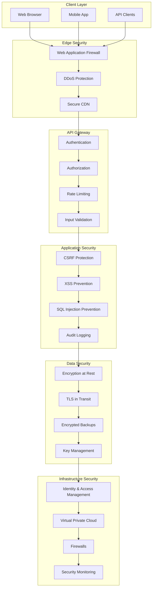

# EllaAI Security Documentation

This document provides comprehensive security implementation details, best practices, and configuration guidelines for the EllaAI platform.

## Table of Contents

- [Security Overview](#security-overview)
- [Security Architecture](#security-architecture)
- [Authentication & Authorization](#authentication--authorization)
- [Data Protection](#data-protection)
- [Network Security](#network-security)
- [Infrastructure Security](#infrastructure-security)
- [Application Security](#application-security)
- [Monitoring & Incident Response](#monitoring--incident-response)
- [Compliance & Auditing](#compliance--auditing)
- [Security Configuration](#security-configuration)
- [Best Practices](#best-practices)
- [Threat Model](#threat-model)

## Security Overview

EllaAI implements enterprise-grade security controls following industry best practices and compliance standards. The platform employs a defense-in-depth strategy with multiple layers of security controls.

### Security Principles

1. **Zero Trust Architecture** - Never trust, always verify
2. **Principle of Least Privilege** - Minimal necessary access
3. **Defense in Depth** - Multiple security layers
4. **Security by Design** - Built-in security from ground up
5. **Continuous Monitoring** - Real-time threat detection
6. **Data Minimization** - Collect only necessary data
7. **Encryption Everywhere** - Data protection at rest and in transit

### Security Certifications

- **SOC 2 Type II** - Security, availability, and confidentiality
- **ISO 27001** - Information security management
- **GDPR Compliant** - European data protection regulation
- **CCPA Compliant** - California consumer privacy act
- **FERPA Compliant** - Educational records privacy

## Security Architecture

### Multi-Layered Security Model



### Security Zones

**Public Zone:**
- Web application frontend
- Public API endpoints
- Content Delivery Network

**DMZ (Demilitarized Zone):**
- API Gateway
- Load balancers
- Web Application Firewall

**Application Zone:**
- Business logic services
- Application servers
- Middleware components

**Data Zone:**
- Database servers
- File storage systems
- Backup systems

## Authentication & Authorization

### Authentication Methods

#### 1. Firebase Authentication
Primary authentication provider with multiple sign-in methods:

```typescript
// Firebase Auth Configuration
const authConfig = {
  providers: [
    'password',      // Email/password
    'google.com',    // Google OAuth
    'microsoft.com', // Microsoft OAuth
    'saml',         // SAML SSO
  ],
  mfa: {
    enabled: true,
    methods: ['sms', 'totp', 'email']
  },
  sessionTimeout: 3600, // 1 hour
  passwordPolicy: {
    minLength: 12,
    requireUppercase: true,
    requireLowercase: true,
    requireNumbers: true,
    requireSymbols: true,
    preventReuse: 5
  }
};
```

#### 2. JWT Token Management
Secure token handling with custom claims:

```typescript
interface JWTClaims {
  uid: string;
  email: string;
  role: 'admin' | 'recruiter' | 'candidate';
  companyId?: string;
  permissions: string[];
  mfa: boolean;
  iat: number;
  exp: number;
  aud: string;
  iss: string;
}

// Token validation middleware
export async function validateToken(token: string): Promise<JWTClaims> {
  try {
    const decodedToken = await admin.auth().verifyIdToken(token, true);
    
    // Additional security checks
    if (!decodedToken.email_verified) {
      throw new Error('Email not verified');
    }
    
    if (Date.now() / 1000 - decodedToken.iat > 3600) {
      throw new Error('Token too old');
    }
    
    return decodedToken as JWTClaims;
  } catch (error) {
    throw new SecurityError('Invalid token', 'INVALID_TOKEN');
  }
}
```

### Role-Based Access Control (RBAC)

#### Role Definitions

```typescript
const roles = {
  admin: {
    name: 'System Administrator',
    permissions: [
      'user:*',
      'company:*',
      'assessment:*',
      'system:*',
      'audit:read'
    ]
  },
  recruiter: {
    name: 'Recruiter',
    permissions: [
      'assessment:create',
      'assessment:read:own',
      'assessment:update:own',
      'assessment:delete:own',
      'candidate:*:own',
      'company:read:own'
    ]
  },
  candidate: {
    name: 'Candidate',
    permissions: [
      'assessment:read:assigned',
      'assessment:take:assigned',
      'profile:update:own'
    ]
  }
};
```

#### Permission Checking

```typescript
export function hasPermission(
  user: JWTClaims,
  resource: string,
  action: string,
  context?: any
): boolean {
  const userRole = roles[user.role];
  if (!userRole) return false;
  
  // Check direct permissions
  const permission = `${resource}:${action}`;
  const wildcardResource = `${resource}:*`;
  const wildcardAll = '*';
  
  if (userRole.permissions.includes(permission) ||
      userRole.permissions.includes(wildcardResource) ||
      userRole.permissions.includes(wildcardAll)) {
    
    // Apply context-based restrictions
    return checkContextPermissions(user, resource, action, context);
  }
  
  return false;
}

function checkContextPermissions(
  user: JWTClaims,
  resource: string,
  action: string,
  context?: any
): boolean {
  // Company-scoped access
  if (resource === 'assessment' && context?.companyId) {
    return user.companyId === context.companyId;
  }
  
  // User-scoped access
  if (action.endsWith(':own')) {
    return user.uid === context?.userId;
  }
  
  return true;
}
```

### Multi-Factor Authentication

```typescript
// MFA Configuration
export class MFAService {
  async enableMFA(userId: string, method: 'sms' | 'totp' | 'email') {
    const user = await admin.auth().getUser(userId);
    
    switch (method) {
      case 'totp':
        return await this.setupTOTP(user);
      case 'sms':
        return await this.setupSMS(user);
      case 'email':
        return await this.setupEmail(user);
    }
  }
  
  async verifyMFA(userId: string, token: string, method: string): Promise<boolean> {
    // Implementation depends on method
    switch (method) {
      case 'totp':
        return this.verifyTOTP(userId, token);
      case 'sms':
        return this.verifySMS(userId, token);
      case 'email':
        return this.verifyEmail(userId, token);
      default:
        return false;
    }
  }
}
```

## Data Protection

### Encryption at Rest

All sensitive data is encrypted using AES-256-GCM:

```typescript
// Data encryption configuration
export class DataEncryption {
  private readonly algorithm = 'aes-256-gcm';
  
  encrypt(plaintext: string, key: string): EncryptedData {
    const iv = crypto.randomBytes(16);
    const cipher = crypto.createCipher(this.algorithm, key, iv);
    
    let encrypted = cipher.update(plaintext, 'utf8', 'hex');
    encrypted += cipher.final('hex');
    
    const authTag = cipher.getAuthTag();
    
    return {
      encrypted,
      iv: iv.toString('hex'),
      authTag: authTag.toString('hex')
    };
  }
  
  decrypt(encryptedData: EncryptedData, key: string): string {
    const decipher = crypto.createDecipher(
      this.algorithm,
      key,
      Buffer.from(encryptedData.iv, 'hex')
    );
    
    decipher.setAuthTag(Buffer.from(encryptedData.authTag, 'hex'));
    
    let decrypted = decipher.update(encryptedData.encrypted, 'hex', 'utf8');
    decrypted += decipher.final('utf8');
    
    return decrypted;
  }
}
```

### Data Classification

```typescript
enum DataClassification {
  PUBLIC = 'public',
  INTERNAL = 'internal',
  CONFIDENTIAL = 'confidential',
  RESTRICTED = 'restricted'
}

interface DataClassificationRules {
  [DataClassification.PUBLIC]: {
    encryption: false;
    accessControl: 'public';
    retention: '7 years';
  };
  [DataClassification.INTERNAL]: {
    encryption: true;
    accessControl: 'authenticated';
    retention: '5 years';
  };
  [DataClassification.CONFIDENTIAL]: {
    encryption: true;
    accessControl: 'role-based';
    retention: '3 years';
  };
  [DataClassification.RESTRICTED]: {
    encryption: true;
    accessControl: 'need-to-know';
    retention: '1 year';
    auditRequired: true;
  };
}
```

### Personal Data Protection

```typescript
// PII (Personally Identifiable Information) handling
export class PIIProtection {
  private static readonly piiFields = [
    'email',
    'phone',
    'firstName',
    'lastName',
    'address',
    'ssn',
    'dateOfBirth'
  ];
  
  static sanitizeForLogging(data: any): any {
    const sanitized = { ...data };
    
    this.piiFields.forEach(field => {
      if (sanitized[field]) {
        sanitized[field] = this.maskPII(sanitized[field], field);
      }
    });
    
    return sanitized;
  }
  
  private static maskPII(value: string, type: string): string {
    switch (type) {
      case 'email':
        return value.replace(/(.{2}).*@(.*)/, '$1***@$2');
      case 'phone':
        return value.replace(/(\d{3})\d{4}(\d{4})/, '$1****$2');
      default:
        return '***';
    }
  }
}
```

## Network Security

### TLS Configuration

```typescript
// TLS/SSL Configuration
export const tlsConfig = {
  minVersion: 'TLSv1.2',
  ciphers: [
    'ECDHE-RSA-AES256-GCM-SHA384',
    'ECDHE-RSA-AES128-GCM-SHA256',
    'DHE-RSA-AES256-GCM-SHA384',
    'DHE-RSA-AES128-GCM-SHA256'
  ].join(':'),
  honorCipherOrder: true,
  sessionTimeout: 300, // 5 minutes
  sessionTickets: false
};

// HSTS Configuration
export const hstsConfig = {
  maxAge: 31536000, // 1 year
  includeSubDomains: true,
  preload: true
};
```

### Content Security Policy

```typescript
// CSP Configuration
export const cspConfig = {
  'default-src': ["'self'"],
  'script-src': [
    "'self'",
    "'strict-dynamic'",
    "'nonce-{random}'"
  ],
  'style-src': [
    "'self'",
    "'unsafe-inline'",
    'https://fonts.googleapis.com'
  ],
  'img-src': [
    "'self'",
    'data:',
    'https:'
  ],
  'font-src': [
    "'self'",
    'https://fonts.gstatic.com'
  ],
  'connect-src': [
    "'self'",
    'https://api.ellaai.com'
  ],
  'frame-ancestors': ["'none'"],
  'base-uri': ["'self'"],
  'form-action': ["'self'"]
};
```

### API Security Headers

```typescript
export function securityHeaders(req: Request, res: Response, next: NextFunction) {
  // Security headers
  res.setHeader('Strict-Transport-Security', 'max-age=31536000; includeSubDomains; preload');
  res.setHeader('X-Frame-Options', 'DENY');
  res.setHeader('X-Content-Type-Options', 'nosniff');
  res.setHeader('X-XSS-Protection', '1; mode=block');
  res.setHeader('Referrer-Policy', 'strict-origin-when-cross-origin');
  res.setHeader('Permissions-Policy', 'camera=(), microphone=(), geolocation=()');
  
  // CSRF token
  const csrfToken = generateCSRFToken();
  res.setHeader('X-CSRF-Token', csrfToken);
  
  // Content Security Policy
  const nonce = crypto.randomBytes(16).toString('base64');
  const csp = buildCSP(cspConfig, nonce);
  res.setHeader('Content-Security-Policy', csp);
  
  next();
}
```

## Infrastructure Security

### Google Cloud Security

```yaml
# Cloud IAM Configuration
iam:
  roles:
    - name: "ellaai-developer"
      permissions:
        - "cloudfunctions.functions.invoke"
        - "firestore.documents.read"
        - "firestore.documents.write"
    
    - name: "ellaai-admin"
      permissions:
        - "resourcemanager.projects.get"
        - "iam.roles.list"
        - "logging.logs.list"

  bindings:
    - role: "roles/ellaai-developer"
      members:
        - "user:developer@ellaai.com"
    
    - role: "roles/ellaai-admin"
      members:
        - "user:admin@ellaai.com"
```

### Firestore Security Rules

```javascript
rules_version = '2';
service cloud.firestore {
  match /databases/{database}/documents {
    // Helper functions
    function isAuthenticated() {
      return request.auth != null;
    }
    
    function hasRole(role) {
      return isAuthenticated() && request.auth.token.role == role;
    }
    
    function isOwner(userId) {
      return isAuthenticated() && request.auth.uid == userId;
    }
    
    function belongsToCompany(companyId) {
      return isAuthenticated() && request.auth.token.companyId == companyId;
    }
    
    function isValidEmail() {
      return request.auth.token.email_verified == true;
    }
    
    // User documents
    match /users/{userId} {
      allow read, write: if isOwner(userId) && isValidEmail();
      allow read: if hasRole('admin');
    }
    
    // Company documents
    match /companies/{companyId} {
      allow read, write: if belongsToCompany(companyId) 
        && hasRole('admin') || hasRole('recruiter');
      allow read: if hasRole('admin');
    }
    
    // Assessment documents
    match /assessments/{assessmentId} {
      allow read: if belongsToCompany(getAssessmentCompany(assessmentId))
        || isCandidateAssessment(assessmentId);
      allow write: if belongsToCompany(getAssessmentCompany(assessmentId))
        && (hasRole('admin') || hasRole('recruiter'));
    }
    
    // Candidate documents
    match /candidates/{candidateId} {
      allow read, write: if belongsToCompany(getCandidateCompany(candidateId))
        && (hasRole('admin') || hasRole('recruiter'));
      allow read: if isOwner(candidateId);
    }
    
    // Admin-only collections
    match /admin/{document=**} {
      allow read, write: if hasRole('admin');
    }
    
    // Audit logs - read-only for admins
    match /audit_logs/{logId} {
      allow read: if hasRole('admin');
      allow write: if false; // Only server can write
    }
  }
  
  function getAssessmentCompany(assessmentId) {
    return get(/databases/$(database)/documents/assessments/$(assessmentId)).data.companyId;
  }
  
  function getCandidateCompany(candidateId) {
    return get(/databases/$(database)/documents/candidates/$(candidateId)).data.companyId;
  }
  
  function isCandidateAssessment(assessmentId) {
    let assessment = get(/databases/$(database)/documents/assessments/$(assessmentId)).data;
    return request.auth.uid in assessment.candidates;
  }
}
```

### Secrets Management

```typescript
// Google Secret Manager integration
import { SecretManagerServiceClient } from '@google-cloud/secret-manager';

export class SecretsManager {
  private client = new SecretManagerServiceClient();
  
  async getSecret(secretName: string): Promise<string> {
    try {
      const [version] = await this.client.accessSecretVersion({
        name: `projects/${process.env.GOOGLE_CLOUD_PROJECT}/secrets/${secretName}/versions/latest`,
      });
      
      return version.payload?.data?.toString() || '';
    } catch (error) {
      throw new SecurityError(`Failed to retrieve secret: ${secretName}`, 'SECRET_ACCESS_ERROR');
    }
  }
  
  async createSecret(name: string, value: string): Promise<void> {
    // Create secret
    await this.client.createSecret({
      parent: `projects/${process.env.GOOGLE_CLOUD_PROJECT}`,
      secretId: name,
      secret: {
        replication: {
          automatic: {},
        },
      },
    });
    
    // Add secret version
    await this.client.addSecretVersion({
      parent: `projects/${process.env.GOOGLE_CLOUD_PROJECT}/secrets/${name}`,
      payload: {
        data: Buffer.from(value, 'utf8'),
      },
    });
  }
  
  async rotateSecret(secretName: string, newValue: string): Promise<void> {
    // Add new version
    await this.client.addSecretVersion({
      parent: `projects/${process.env.GOOGLE_CLOUD_PROJECT}/secrets/${secretName}`,
      payload: {
        data: Buffer.from(newValue, 'utf8'),
      },
    });
    
    // Schedule old version destruction
    const [versions] = await this.client.listSecretVersions({
      parent: `projects/${process.env.GOOGLE_CLOUD_PROJECT}/secrets/${secretName}`,
    });
    
    // Destroy all but the latest version
    for (let i = 0; i < versions.length - 1; i++) {
      await this.client.destroySecretVersion({
        name: versions[i].name!,
      });
    }
  }
}
```

## Application Security

### Input Validation

```typescript
import Joi from 'joi';

// Validation schemas
export const validationSchemas = {
  email: Joi.string().email().required(),
  password: Joi.string()
    .min(12)
    .pattern(/^(?=.*[a-z])(?=.*[A-Z])(?=.*\d)(?=.*[@$!%*?&])[A-Za-z\d@$!%*?&]/)
    .required(),
  assessment: Joi.object({
    title: Joi.string().min(1).max(200).required(),
    description: Joi.string().max(1000).optional(),
    companyId: Joi.string().uuid().required(),
    questions: Joi.array().items(Joi.string().uuid()).min(1).required(),
    timeLimit: Joi.number().integer().min(1).max(480).required()
  })
};

// Input sanitization
export function sanitizeInput(input: any): any {
  if (typeof input === 'string') {
    return input
      .trim()
      .replace(/<script\b[^<]*(?:(?!<\/script>)<[^<]*)*<\/script>/gi, '')
      .replace(/javascript:/gi, '')
      .replace(/on\w+\s*=/gi, '');
  }
  
  if (Array.isArray(input)) {
    return input.map(sanitizeInput);
  }
  
  if (typeof input === 'object' && input !== null) {
    const sanitized: any = {};
    for (const [key, value] of Object.entries(input)) {
      sanitized[key] = sanitizeInput(value);
    }
    return sanitized;
  }
  
  return input;
}

// Request validation middleware
export function validateRequest(schema: Joi.ObjectSchema) {
  return (req: Request, res: Response, next: NextFunction) => {
    // Sanitize input
    req.body = sanitizeInput(req.body);
    
    // Validate against schema
    const { error, value } = schema.validate(req.body);
    
    if (error) {
      return res.status(422).json({
        success: false,
        error: {
          code: 'VALIDATION_ERROR',
          message: 'Request validation failed',
          details: error.details.map(detail => ({
            field: detail.path.join('.'),
            message: detail.message,
            value: detail.context?.value
          }))
        }
      });
    }
    
    req.body = value;
    next();
  };
}
```

### SQL Injection Prevention

```typescript
// Parameterized queries for external databases
export class SecureDatabase {
  async executeQuery(query: string, params: any[] = []): Promise<any[]> {
    // Validate query doesn't contain direct string concatenation
    if (this.containsStringConcatenation(query)) {
      throw new SecurityError('Query contains potential SQL injection', 'UNSAFE_QUERY');
    }
    
    // Use parameterized queries only
    return this.db.query(query, params);
  }
  
  private containsStringConcatenation(query: string): boolean {
    // Check for common SQL injection patterns
    const dangerousPatterns = [
      /['"]\s*\+\s*['"]/,  // String concatenation
      /\$\{.*\}/,          // Template literals
      /UNION\s+SELECT/i,   // Union-based injection
      /OR\s+1\s*=\s*1/i,   // Boolean-based injection
      /;\s*DROP/i,         // Command injection
      /;\s*DELETE/i,       // Command injection
      /;\s*UPDATE/i        // Command injection
    ];
    
    return dangerousPatterns.some(pattern => pattern.test(query));
  }
}
```

### CSRF Protection

```typescript
// CSRF token management
export class CSRFProtection {
  private static readonly TOKEN_LENGTH = 32;
  
  static generateToken(): string {
    return crypto.randomBytes(this.TOKEN_LENGTH).toString('hex');
  }
  
  static validateToken(sessionToken: string, requestToken: string): boolean {
    if (!sessionToken || !requestToken) {
      return false;
    }
    
    // Timing-safe comparison to prevent timing attacks
    return crypto.timingSafeEqual(
      Buffer.from(sessionToken, 'hex'),
      Buffer.from(requestToken, 'hex')
    );
  }
}

// CSRF middleware
export function csrfProtection(req: Request, res: Response, next: NextFunction) {
  // Skip for safe methods
  if (['GET', 'HEAD', 'OPTIONS'].includes(req.method)) {
    return next();
  }
  
  const sessionToken = req.session?.csrfToken;
  const requestToken = req.headers['x-csrf-token'] as string;
  
  if (!CSRFProtection.validateToken(sessionToken, requestToken)) {
    return res.status(403).json({
      success: false,
      error: {
        code: 'CSRF_TOKEN_INVALID',
        message: 'Invalid CSRF token'
      }
    });
  }
  
  next();
}
```

## Monitoring & Incident Response

### Security Event Logging

```typescript
// Security event logging
export class SecurityLogger {
  private logger = winston.createLogger({
    level: 'info',
    format: winston.format.combine(
      winston.format.timestamp(),
      winston.format.json()
    ),
    transports: [
      new winston.transports.File({ filename: 'security.log' }),
      new winston.transports.Console()
    ]
  });
  
  logSecurityEvent(event: SecurityEvent): void {
    const logEntry = {
      timestamp: new Date().toISOString(),
      type: 'security_event',
      severity: event.severity,
      category: event.category,
      message: event.message,
      userId: event.userId,
      ipAddress: event.ipAddress,
      userAgent: event.userAgent,
      resource: event.resource,
      action: event.action,
      result: event.result,
      metadata: event.metadata
    };
    
    this.logger.log(event.severity, logEntry);
    
    // Send to SIEM if critical
    if (event.severity === 'critical' || event.severity === 'high') {
      this.sendToSIEM(logEntry);
    }
  }
  
  private async sendToSIEM(event: any): Promise<void> {
    // Implementation depends on SIEM solution
    // Could be Splunk, ELK Stack, etc.
  }
}

interface SecurityEvent {
  severity: 'low' | 'medium' | 'high' | 'critical';
  category: 'authentication' | 'authorization' | 'data_access' | 'system';
  message: string;
  userId?: string;
  ipAddress?: string;
  userAgent?: string;
  resource?: string;
  action?: string;
  result: 'success' | 'failure' | 'blocked';
  metadata?: Record<string, any>;
}
```

### Intrusion Detection

```typescript
// Anomaly detection
export class IntrusionDetection {
  private suspiciousActivities = new Map<string, ActivityPattern[]>();
  
  async detectAnomalies(userId: string, activity: UserActivity): Promise<SecurityThreat[]> {
    const threats: SecurityThreat[] = [];
    
    // Check for brute force attempts
    if (this.isBruteForceAttempt(userId, activity)) {
      threats.push({
        type: 'brute_force',
        severity: 'high',
        description: 'Multiple failed login attempts detected'
      });
    }
    
    // Check for impossible travel
    if (await this.isImpossibleTravel(userId, activity)) {
      threats.push({
        type: 'impossible_travel',
        severity: 'critical',
        description: 'Login from impossible geographical location'
      });
    }
    
    // Check for suspicious API usage
    if (this.isSuspiciousAPIUsage(userId, activity)) {
      threats.push({
        type: 'api_abuse',
        severity: 'medium',
        description: 'Unusual API access pattern detected'
      });
    }
    
    return threats;
  }
  
  private isBruteForceAttempt(userId: string, activity: UserActivity): boolean {
    const recentFailures = this.getRecentFailedAttempts(userId, 15 * 60 * 1000); // 15 minutes
    return recentFailures.length >= 5;
  }
  
  private async isImpossibleTravel(userId: string, activity: UserActivity): Promise<boolean> {
    const lastActivity = await this.getLastActivity(userId);
    if (!lastActivity) return false;
    
    const distance = this.calculateDistance(
      lastActivity.location,
      activity.location
    );
    
    const timeDiff = activity.timestamp - lastActivity.timestamp;
    const maxPossibleDistance = (timeDiff / 1000 / 3600) * 1000; // Max 1000 km/h
    
    return distance > maxPossibleDistance;
  }
}
```

### Incident Response

```typescript
// Automated incident response
export class IncidentResponse {
  private alerting = new AlertingService();
  private userManagement = new UserManagementService();
  
  async handleSecurityIncident(incident: SecurityIncident): Promise<void> {
    // Log the incident
    this.logIncident(incident);
    
    // Assess severity and respond accordingly
    switch (incident.severity) {
      case 'critical':
        await this.handleCriticalIncident(incident);
        break;
      case 'high':
        await this.handleHighSeverityIncident(incident);
        break;
      case 'medium':
        await this.handleMediumSeverityIncident(incident);
        break;
      default:
        await this.handleLowSeverityIncident(incident);
    }
  }
  
  private async handleCriticalIncident(incident: SecurityIncident): Promise<void> {
    // Immediate actions for critical incidents
    await Promise.all([
      this.suspendUser(incident.userId),
      this.revokeAllSessions(incident.userId),
      this.alertSecurityTeam(incident),
      this.enableEnhancedLogging(),
      this.notifyCompliance(incident)
    ]);
  }
  
  private async suspendUser(userId: string): Promise<void> {
    await this.userManagement.suspendUser(userId, 'Security incident');
    
    // Log the action
    await this.logSecurityAction({
      action: 'user_suspended',
      userId,
      reason: 'Security incident response',
      timestamp: new Date()
    });
  }
}
```

## Compliance & Auditing

### Audit Trail

```typescript
// Comprehensive audit logging
export class AuditService {
  async logAuditEvent(event: AuditEvent): Promise<void> {
    const auditRecord = {
      id: this.generateAuditId(),
      timestamp: new Date().toISOString(),
      userId: event.userId,
      action: event.action,
      resource: event.resource,
      resourceId: event.resourceId,
      result: event.result,
      ipAddress: event.ipAddress,
      userAgent: event.userAgent,
      sessionId: event.sessionId,
      changes: event.changes,
      metadata: event.metadata,
      companyId: event.companyId
    };
    
    // Store in secure audit log
    await this.storeAuditRecord(auditRecord);
    
    // Send to external audit system if required
    if (this.requiresExternalAudit(event)) {
      await this.sendToExternalAuditSystem(auditRecord);
    }
  }
  
  async generateComplianceReport(
    startDate: Date,
    endDate: Date,
    companyId?: string
  ): Promise<ComplianceReport> {
    const auditRecords = await this.getAuditRecords({
      startDate,
      endDate,
      companyId
    });
    
    return {
      period: { startDate, endDate },
      totalEvents: auditRecords.length,
      eventsByType: this.groupByType(auditRecords),
      securityEvents: this.filterSecurityEvents(auditRecords),
      dataAccessEvents: this.filterDataAccessEvents(auditRecords),
      adminActions: this.filterAdminActions(auditRecords),
      failedAttempts: this.filterFailedAttempts(auditRecords)
    };
  }
}
```

### Data Retention Policy

```typescript
// Automated data retention
export class DataRetentionService {
  private retentionPolicies = {
    'audit_logs': { years: 7, classification: 'restricted' },
    'user_data': { years: 5, classification: 'confidential' },
    'assessment_results': { years: 3, classification: 'internal' },
    'session_logs': { days: 90, classification: 'internal' },
    'security_logs': { years: 2, classification: 'restricted' }
  };
  
  async enforceRetention(): Promise<void> {
    for (const [dataType, policy] of Object.entries(this.retentionPolicies)) {
      await this.purgeExpiredData(dataType, policy);
    }
  }
  
  private async purgeExpiredData(dataType: string, policy: RetentionPolicy): Promise<void> {
    const cutoffDate = this.calculateCutoffDate(policy);
    const expiredRecords = await this.findExpiredRecords(dataType, cutoffDate);
    
    for (const record of expiredRecords) {
      if (policy.classification === 'restricted') {
        // Secure deletion for restricted data
        await this.secureDelete(record);
      } else {
        // Regular deletion
        await this.delete(record);
      }
      
      // Log deletion for audit
      await this.logDeletion(record, 'retention_policy');
    }
  }
}
```

## Security Configuration

### Environment-Specific Security

```typescript
// Production security configuration
export const productionSecurityConfig = {
  authentication: {
    sessionTimeout: 3600, // 1 hour
    mfaRequired: true,
    passwordPolicy: {
      minLength: 14,
      requireSpecialChars: true,
      preventCommonPasswords: true,
      maxAge: 90 // days
    }
  },
  
  network: {
    tlsVersion: 'TLSv1.3',
    hstsMaxAge: 31536000,
    enableCertificatePinning: true,
    allowedOrigins: ['https://app.ellaai.com'],
    rateLimiting: {
      windowMs: 15 * 60 * 1000, // 15 minutes
      maxRequests: 100
    }
  },
  
  encryption: {
    algorithm: 'aes-256-gcm',
    keyRotationDays: 90,
    enableKeyEscrow: true
  },
  
  logging: {
    level: 'warn',
    enableAuditLogging: true,
    enableSecurityEventLogging: true,
    logRetentionDays: 2555 // 7 years
  },
  
  monitoring: {
    enableIntrusionDetection: true,
    enableAnomalyDetection: true,
    alertThresholds: {
      failedLogins: 5,
      apiAbuseRequests: 1000,
      suspiciousPatterns: 3
    }
  }
};
```

### Security Hardening Checklist

```typescript
// Security hardening checklist
export const securityHardeningChecklist = {
  infrastructure: [
    'Enable Google Cloud Security Command Center',
    'Configure VPC firewall rules',
    'Enable Cloud Audit Logs',
    'Set up Cloud KMS for key management',
    'Configure IAM with least privilege',
    'Enable DDoS protection',
    'Set up WAF rules'
  ],
  
  application: [
    'Implement Content Security Policy',
    'Enable CSRF protection',
    'Configure secure session management',
    'Implement input validation',
    'Enable security headers',
    'Set up rate limiting',
    'Implement audit logging'
  ],
  
  database: [
    'Configure Firestore security rules',
    'Enable encryption at rest',
    'Set up backup encryption',
    'Implement query monitoring',
    'Configure access logging',
    'Enable point-in-time recovery'
  ],
  
  monitoring: [
    'Set up security alerting',
    'Configure anomaly detection',
    'Enable intrusion detection',
    'Set up compliance reporting',
    'Configure incident response',
    'Enable threat intelligence feeds'
  ]
};
```

## Best Practices

### Development Security

1. **Secure Coding Standards**
   - Input validation on all user inputs
   - Output encoding for XSS prevention
   - Parameterized queries for SQL injection prevention
   - Proper error handling without information disclosure

2. **Code Review Security**
   - Security-focused code reviews
   - Automated security scanning in CI/CD
   - Dependency vulnerability scanning
   - Secret detection in commits

3. **Testing Security**
   - Security unit tests
   - Integration security tests
   - Penetration testing
   - Vulnerability assessments

### Operational Security

1. **Access Management**
   - Regular access reviews
   - Automated deprovisioning
   - Privileged access management
   - Just-in-time access

2. **Monitoring & Response**
   - 24/7 security monitoring
   - Automated incident response
   - Regular security assessments
   - Threat intelligence integration

3. **Data Protection**
   - Data classification and labeling
   - Encryption key management
   - Secure data disposal
   - Privacy impact assessments

## Threat Model

### Threat Categories

1. **External Threats**
   - Cyber attacks and malware
   - Data breaches and theft
   - Denial of service attacks
   - Social engineering

2. **Internal Threats**
   - Malicious insiders
   - Accidental data exposure
   - Privilege abuse
   - Weak security practices

3. **Third-Party Threats**
   - Supply chain attacks
   - Vendor security failures
   - API vulnerabilities
   - Cloud service breaches

### Risk Assessment Matrix

| Threat | Likelihood | Impact | Risk Level | Mitigation |
|--------|------------|---------|-----------|------------|
| Data breach | Medium | High | High | Encryption, access controls |
| Account takeover | Medium | Medium | Medium | MFA, monitoring |
| DDoS attack | High | Low | Medium | CDN, rate limiting |
| Insider threat | Low | High | Medium | Access controls, monitoring |
| Supply chain attack | Low | High | Medium | Vendor assessment, monitoring |

---

This security documentation provides comprehensive coverage of the EllaAI platform's security implementation. For specific security incidents or questions, contact the security team at security@ellaai.com.