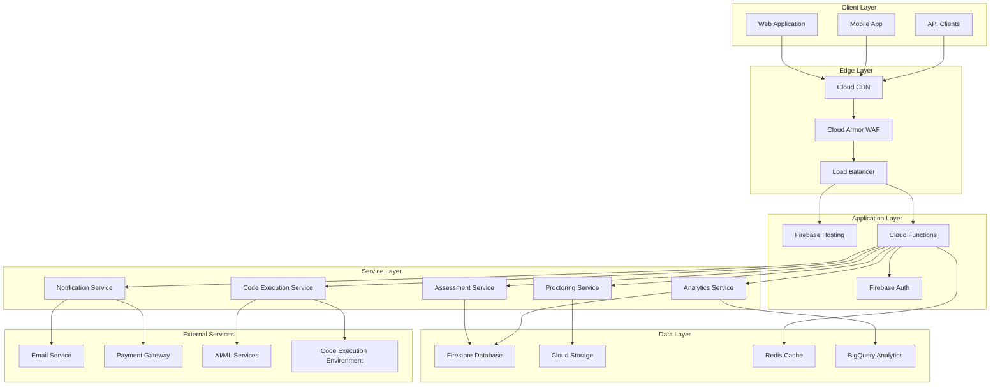

# EllaAI System Architecture Documentation

## Table of Contents

- [Executive Summary](#executive-summary)
- [System Overview](#system-overview)
- [Architecture Principles](#architecture-principles)
- [High-Level Architecture](#high-level-architecture)
- [Component Architecture](#component-architecture)
- [Data Architecture](#data-architecture)
- [Security Architecture](#security-architecture)
- [Integration Architecture](#integration-architecture)
- [Scalability and Performance](#scalability-and-performance)
- [Operational Architecture](#operational-architecture)
- [Future Architecture Considerations](#future-architecture-considerations)

## Executive Summary

The EllaAI technical assessment platform is built on a modern, cloud-native architecture leveraging Firebase and Google Cloud Platform services. The system follows microservices principles with serverless computing, ensuring high scalability, security, and cost efficiency.

### Key Architectural Highlights

- **Serverless-First**: Zero server management overhead
- **Multi-Tenant**: Secure data isolation between organizations
- **Real-Time**: Live assessment monitoring and collaboration
- **Global Scale**: CDN-powered global content delivery
- **Enterprise Security**: Zero-trust security model with comprehensive audit trails
- **Cost Optimized**: Pay-per-use pricing model

## System Overview

### Technology Stack

```
Frontend:
├── React 18 (TypeScript)
├── Material-UI (MUI)
├── Vite (Build Tool)
├── Zustand (State Management)
└── React Router (Navigation)

Backend:
├── Node.js 18 LTS
├── Express.js Framework
├── Firebase Cloud Functions
├── TypeScript
└── Firebase Admin SDK

Database & Storage:
├── Firestore (Primary Database)
├── Cloud Storage (File Storage)
├── Redis Cache (Optional)
└── BigQuery (Analytics)

Infrastructure:
├── Firebase Hosting
├── Cloud CDN
├── Cloud Load Balancer
├── Cloud Armor (Security)
└── Cloud Monitoring
```

### System Capabilities

- **Assessment Management**: Create, configure, and deploy technical assessments
- **Code Execution**: Secure sandboxed code execution environment
- **Proctoring**: AI-powered assessment monitoring and integrity verification
- **Analytics**: Comprehensive candidate performance analytics
- **Multi-Tenancy**: Secure organization data isolation
- **Real-Time Collaboration**: Live coding and monitoring capabilities

## Architecture Principles

### 1. Cloud-Native Design

**Serverless Computing**
- No server provisioning or management
- Automatic scaling based on demand
- Pay only for actual usage
- Built-in high availability

**Managed Services**
- Leverage Google Cloud managed services
- Reduce operational overhead
- Focus on business logic, not infrastructure
- Automatic updates and security patches

### 2. Security by Design

**Zero-Trust Model**
- Every request authenticated and authorized
- Principle of least privilege
- Network segmentation and isolation
- Comprehensive audit logging

**Defense in Depth**
- Multiple layers of security controls
- Input validation at all layers
- Encryption at rest and in transit
- Regular security assessments

### 3. Scalability and Performance

**Horizontal Scaling**
- Auto-scaling based on demand
- Load distribution across regions
- Database sharding strategies
- CDN for global performance

**Performance Optimization**
- Multi-level caching strategies
- Database query optimization
- Code splitting and lazy loading
- Image and asset optimization

### 4. Observability

**Monitoring and Alerting**
- Real-time system health monitoring
- Performance metrics tracking
- Automated alerting and escalation
- Custom business metrics

**Logging and Tracing**
- Centralized logging infrastructure
- Distributed tracing for debugging
- Audit trails for compliance
- Log aggregation and analysis

## High-Level Architecture



## Component Architecture

### Frontend Architecture

```
src/
├── components/
│   ├── common/              # Reusable UI components
│   │   ├── Button/
│   │   ├── Input/
│   │   ├── Modal/
│   │   └── Table/
│   ├── assessment/          # Assessment-specific components
│   │   ├── CodeEditor/
│   │   ├── QuestionRenderer/
│   │   ├── TimerDisplay/
│   │   └── SubmissionPanel/
│   ├── admin/               # Admin interface components
│   │   ├── UserManagement/
│   │   ├── CompanySettings/
│   │   └── SystemHealth/
│   └── analytics/           # Analytics and reporting
│       ├── ChartComponents/
│       ├── ReportGenerator/
│       └── Dashboard/
├── pages/                   # Route components
│   ├── assessment/
│   ├── dashboard/
│   ├── admin/
│   └── auth/
├── services/               # API integration layer
│   ├── api/
│   ├── auth/
│   └── utils/
├── hooks/                  # Custom React hooks
├── contexts/               # React contexts
├── store/                  # State management
└── utils/                  # Helper functions
```

### Backend Architecture

```
functions/src/
├── routes/                 # API route handlers
│   ├── auth.ts            # Authentication endpoints
│   ├── assessments.ts     # Assessment management
│   ├── candidates.ts      # Candidate operations
│   ├── execution.ts       # Code execution
│   ├── proctor.ts         # Proctoring services
│   ├── analytics.ts       # Analytics and reporting
│   └── admin.ts           # Administrative operations
├── services/              # Business logic services
│   ├── AssessmentService.ts
│   ├── ExecutionService.ts
│   ├── ProctoringService.ts
│   ├── AnalyticsService.ts
│   └── NotificationService.ts
├── middleware/            # Express middleware
│   ├── auth.ts           # Authentication middleware
│   ├── validation.ts     # Request validation
│   ├── rateLimit.ts     # Rate limiting
│   ├── security.ts      # Security headers
│   └── audit.ts         # Audit logging
├── utils/                # Utility functions
│   ├── errors.ts        # Error handling
│   ├── logger.ts        # Logging utilities
│   └── validators.ts    # Data validation
└── types/                # TypeScript definitions
    ├── assessment.ts
    ├── candidate.ts
    └── user.ts
```

### Service Architecture Patterns

#### 1. Repository Pattern

```typescript
// Service layer abstraction
export class AssessmentService {
  constructor(
    private repository: AssessmentRepository,
    private cache: CacheService,
    private logger: LoggerService
  ) {}

  async createAssessment(data: CreateAssessmentData): Promise<Assessment> {
    // Validation
    const validatedData = await this.validateAssessmentData(data);
    
    // Business logic
    const assessment = await this.buildAssessment(validatedData);
    
    // Persistence
    const result = await this.repository.create(assessment);
    
    // Cache invalidation
    await this.cache.invalidate(`assessments:${result.companyId}`);
    
    // Audit logging
    this.logger.info('Assessment created', { assessmentId: result.id });
    
    return result;
  }
}
```

#### 2. Command Query Responsibility Segregation (CQRS)

```typescript
// Separate read and write operations
export class AssessmentCommandService {
  async createAssessment(command: CreateAssessmentCommand): Promise<void> {
    // Handle write operations
    await this.repository.save(command.data);
    await this.eventBus.publish(new AssessmentCreatedEvent(command.data));
  }
}

export class AssessmentQueryService {
  async getAssessment(query: GetAssessmentQuery): Promise<Assessment> {
    // Handle read operations with optimized queries
    return this.readOnlyRepository.findById(query.id);
  }
}
```

#### 3. Event-Driven Architecture

```typescript
// Event handling for async operations
export class AssessmentEventHandler {
  @EventHandler(AssessmentSubmittedEvent)
  async handleAssessmentSubmitted(event: AssessmentSubmittedEvent) {
    // Trigger scoring
    await this.scoringService.scoreAssessment(event.assessmentId);
    
    // Send notifications
    await this.notificationService.notifyRecruiter(event.candidateId);
    
    // Update analytics
    await this.analyticsService.updateCompletionMetrics(event.companyId);
  }
}
```

## Data Architecture

### Database Design

#### Firestore Collections Structure

```typescript
// Database schema
interface DatabaseSchema {
  // User management
  users: {
    [userId: string]: {
      uid: string;
      email: string;
      role: 'admin' | 'recruiter' | 'candidate';
      companyId?: string;
      profile: UserProfile;
      createdAt: Timestamp;
      lastLoginAt: Timestamp;
    };
  };
  
  // Company management
  companies: {
    [companyId: string]: {
      name: string;
      settings: CompanySettings;
      subscription: SubscriptionInfo;
      members: { [userId: string]: UserRole };
      createdAt: Timestamp;
    };
  };
  
  // Assessment data
  assessments: {
    [assessmentId: string]: {
      title: string;
      companyId: string;
      questions: QuestionReference[];
      settings: AssessmentSettings;
      analytics: AssessmentAnalytics;
      status: 'draft' | 'active' | 'archived';
      createdAt: Timestamp;
    };
  };
  
  // Candidate responses
  assessment_attempts: {
    [attemptId: string]: {
      assessmentId: string;
      candidateId: string;
      answers: Answer[];
      score: ScoreBreakdown;
      startedAt: Timestamp;
      completedAt: Timestamp;
      status: 'in_progress' | 'completed' | 'expired';
    };
  };
  
  // Audit logging
  audit_logs: {
    [logId: string]: {
      userId: string;
      action: string;
      resource: string;
      details: any;
      timestamp: Timestamp;
      ipAddress: string;
    };
  };
}
```

#### Data Access Patterns

```typescript
// Optimized query patterns
export class DataAccessLayer {
  // Compound queries with proper indexing
  async getActiveAssessmentsByCompany(companyId: string): Promise<Assessment[]> {
    return this.db
      .collection('assessments')
      .where('companyId', '==', companyId)
      .where('status', '==', 'active')
      .orderBy('createdAt', 'desc')
      .get();
  }

  // Pagination with cursor-based approach
  async getPaginatedResults<T>(
    collection: string,
    pageSize: number,
    cursor?: DocumentSnapshot
  ): Promise<PaginatedResult<T>> {
    let query = this.db.collection(collection).limit(pageSize);
    
    if (cursor) {
      query = query.startAfter(cursor);
    }
    
    const snapshot = await query.get();
    
    return {
      data: snapshot.docs.map(doc => ({ id: doc.id, ...doc.data() } as T)),
      hasMore: snapshot.docs.length === pageSize,
      lastDoc: snapshot.docs[snapshot.docs.length - 1]
    };
  }
}
```

#### Database Optimization

```javascript
// Firestore indexes for optimal performance
{
  "indexes": [
    {
      "collectionGroup": "assessments",
      "queryScope": "COLLECTION",
      "fields": [
        {"fieldPath": "companyId", "order": "ASCENDING"},
        {"fieldPath": "status", "order": "ASCENDING"},
        {"fieldPath": "createdAt", "order": "DESCENDING"}
      ]
    },
    {
      "collectionGroup": "assessment_attempts",
      "queryScope": "COLLECTION",
      "fields": [
        {"fieldPath": "assessmentId", "order": "ASCENDING"},
        {"fieldPath": "completedAt", "order": "DESCENDING"}
      ]
    },
    {
      "collectionGroup": "audit_logs",
      "queryScope": "COLLECTION",
      "fields": [
        {"fieldPath": "userId", "order": "ASCENDING"},
        {"fieldPath": "timestamp", "order": "DESCENDING"}
      ]
    }
  ]
}
```

### Caching Strategy

```typescript
// Multi-level caching implementation
export class CacheManager {
  constructor(
    private memoryCache: Map<string, any>,
    private redisCache: Redis,
    private firestoreCache: Firestore
  ) {}

  async get<T>(key: string): Promise<T | null> {
    // L1: Memory cache
    if (this.memoryCache.has(key)) {
      return this.memoryCache.get(key);
    }
    
    // L2: Redis cache
    const redisValue = await this.redisCache.get(key);
    if (redisValue) {
      const parsed = JSON.parse(redisValue);
      this.memoryCache.set(key, parsed);
      return parsed;
    }
    
    // L3: Database cache
    return null;
  }

  async set<T>(key: string, value: T, ttl: number = 3600): Promise<void> {
    // Set in all cache levels
    this.memoryCache.set(key, value);
    await this.redisCache.setex(key, ttl, JSON.stringify(value));
  }
}
```

## Security Architecture

### Authentication and Authorization

```typescript
// JWT-based authentication with custom claims
export class AuthenticationService {
  async verifyToken(token: string): Promise<DecodedToken> {
    try {
      const decodedToken = await admin.auth().verifyIdToken(token);
      
      // Add custom claims
      const user = await this.getUserWithPermissions(decodedToken.uid);
      
      return {
        ...decodedToken,
        permissions: user.permissions,
        companyAccess: user.companyAccess
      };
    } catch (error) {
      throw new AuthenticationError('Invalid token');
    }
  }

  async setCustomClaims(uid: string, claims: CustomClaims): Promise<void> {
    await admin.auth().setCustomUserClaims(uid, claims);
  }
}
```

### Role-Based Access Control (RBAC)

```typescript
// Comprehensive permission system
interface Permission {
  resource: string;
  action: 'create' | 'read' | 'update' | 'delete';
  conditions?: PermissionCondition[];
}

const rolePermissions: Record<UserRole, Permission[]> = {
  admin: [
    { resource: '*', action: 'create' },
    { resource: '*', action: 'read' },
    { resource: '*', action: 'update' },
    { resource: '*', action: 'delete' }
  ],
  recruiter: [
    { resource: 'assessments', action: 'create', conditions: [{ type: 'company_match' }] },
    { resource: 'candidates', action: 'read', conditions: [{ type: 'company_match' }] },
    { resource: 'results', action: 'read', conditions: [{ type: 'company_match' }] }
  ],
  candidate: [
    { resource: 'assessments', action: 'read', conditions: [{ type: 'assigned_to_user' }] },
    { resource: 'profile', action: 'update', conditions: [{ type: 'own_resource' }] }
  ]
};
```

### Data Security

```typescript
// Firestore security rules with company isolation
rules_version = '2';
service cloud.firestore {
  match /databases/{database}/documents {
    // Company data isolation
    match /companies/{companyId} {
      allow read, write: if request.auth != null
        && (request.auth.token.companyId == companyId
            || request.auth.token.role == 'admin');
    }
    
    // Assessment access control
    match /assessments/{assessmentId} {
      allow read: if request.auth != null
        && (isCompanyMember(assessmentId) 
            || isCandidateAssessment(assessmentId));
      allow write: if request.auth != null
        && isCompanyMember(assessmentId)
        && hasRole(['admin', 'recruiter']);
    }
  }
}
```

### Encryption and Data Protection

```typescript
// Data encryption at rest and in transit
export class EncryptionService {
  private readonly algorithm = 'aes-256-gcm';
  private readonly keyLength = 32;

  encrypt(data: string, key: Buffer): EncryptedData {
    const iv = crypto.randomBytes(16);
    const cipher = crypto.createCipher(this.algorithm, key);
    
    let encrypted = cipher.update(data, 'utf8', 'hex');
    encrypted += cipher.final('hex');
    
    const authTag = cipher.getAuthTag();
    
    return {
      encrypted,
      iv: iv.toString('hex'),
      authTag: authTag.toString('hex')
    };
  }

  decrypt(encryptedData: EncryptedData, key: Buffer): string {
    const decipher = crypto.createDecipher(this.algorithm, key);
    decipher.setAuthTag(Buffer.from(encryptedData.authTag, 'hex'));
    
    let decrypted = decipher.update(encryptedData.encrypted, 'hex', 'utf8');
    decrypted += decipher.final('utf8');
    
    return decrypted;
  }
}
```

## Integration Architecture

### External Service Integration

```typescript
// Service integration with circuit breaker pattern
export class ExternalServiceClient {
  private circuitBreaker: CircuitBreaker;

  constructor(private config: ServiceConfig) {
    this.circuitBreaker = new CircuitBreaker(this.makeRequest.bind(this), {
      timeout: config.timeout,
      errorThresholdPercentage: 50,
      resetTimeout: 30000
    });
  }

  async makeRequest<T>(endpoint: string, options: RequestOptions): Promise<T> {
    const url = `${this.config.baseUrl}${endpoint}`;
    
    const response = await fetch(url, {
      ...options,
      headers: {
        ...options.headers,
        'Authorization': `Bearer ${await this.getAccessToken()}`,
        'Content-Type': 'application/json'
      }
    });

    if (!response.ok) {
      throw new ServiceError(`HTTP ${response.status}: ${response.statusText}`);
    }

    return response.json();
  }
}
```

### Event-Driven Integration

```typescript
// Pub/Sub integration for event processing
export class EventProcessor {
  constructor(private pubsub: PubSub) {}

  async publishEvent(topic: string, event: DomainEvent): Promise<void> {
    const message = {
      data: Buffer.from(JSON.stringify(event)),
      attributes: {
        eventType: event.type,
        aggregateId: event.aggregateId,
        version: event.version.toString()
      }
    };

    await this.pubsub.topic(topic).publish(message);
  }

  async subscribeToEvents(subscription: string, handler: EventHandler): Promise<void> {
    this.pubsub.subscription(subscription).on('message', async (message) => {
      try {
        const event = JSON.parse(message.data.toString());
        await handler(event);
        message.ack();
      } catch (error) {
        console.error('Event processing error:', error);
        message.nack();
      }
    });
  }
}
```

## Scalability and Performance

### Auto-Scaling Configuration

```typescript
// Cloud Functions auto-scaling configuration
export const functionConfig: RuntimeOptions = {
  timeoutSeconds: 300,
  memory: '1GB',
  maxInstances: 100,
  minInstances: 2,
  concurrency: 100,
  vpcConnector: 'projects/ellaai/locations/us-central1/connectors/default'
};

// Load balancing configuration
const loadBalancerConfig = {
  healthCheck: {
    path: '/health',
    interval: 30,
    timeout: 10,
    retries: 3
  },
  backendServices: [
    {
      name: 'api-service',
      maxConnections: 1000,
      maxRequestsPerConnection: 100
    }
  ]
};
```

### Performance Optimization

```typescript
// Database query optimization
export class OptimizedQueries {
  // Batch operations for better performance
  async batchGetDocuments<T>(refs: DocumentReference[]): Promise<T[]> {
    const chunks = this.chunkArray(refs, 10); // Firestore limit
    const promises = chunks.map(chunk => this.db.getAll(...chunk));
    const snapshots = await Promise.all(promises);
    
    return snapshots.flat()
      .filter(snap => snap.exists)
      .map(snap => ({ id: snap.id, ...snap.data() } as T));
  }

  // Pagination with cursor
  async getPaginatedResults<T>(
    query: Query,
    pageSize: number,
    cursor?: DocumentSnapshot
  ): Promise<PaginatedResult<T>> {
    let paginatedQuery = query.limit(pageSize);
    
    if (cursor) {
      paginatedQuery = paginatedQuery.startAfter(cursor);
    }
    
    const snapshot = await paginatedQuery.get();
    
    return {
      data: snapshot.docs.map(doc => ({ id: doc.id, ...doc.data() } as T)),
      hasMore: snapshot.docs.length === pageSize,
      nextCursor: snapshot.docs[snapshot.docs.length - 1]
    };
  }
}
```

### Content Delivery Network (CDN)

```yaml
# Cloud CDN configuration
name: ellaai-cdn
description: "EllaAI Global CDN"
backend_service: ellaai-backend-service
enable_cdn: true
cache_mode: CACHE_ALL_STATIC
default_ttl: 3600
max_ttl: 86400
client_ttl: 3600
negative_caching: true
negative_caching_policy:
  - code: 404
    ttl: 60
  - code: 500
    ttl: 30
compression_mode: AUTOMATIC
```

## Operational Architecture

### Monitoring and Observability

```typescript
// Comprehensive monitoring setup
export class MonitoringService {
  private metrics: Map<string, Metric> = new Map();

  recordMetric(name: string, value: number, labels: Labels = {}): void {
    const metric = this.metrics.get(name) || this.createMetric(name);
    metric.record(value, labels);
  }

  async healthCheck(): Promise<HealthStatus> {
    const checks = await Promise.allSettled([
      this.checkDatabase(),
      this.checkExternalServices(),
      this.checkMemoryUsage(),
      this.checkResponseTimes()
    ]);

    const healthStatus = checks.every(check => check.status === 'fulfilled')
      ? 'healthy' : 'unhealthy';

    return {
      status: healthStatus,
      checks: this.formatHealthChecks(checks),
      timestamp: new Date().toISOString()
    };
  }

  private async checkDatabase(): Promise<boolean> {
    try {
      await this.db.collection('health').doc('check').get();
      return true;
    } catch (error) {
      this.recordMetric('database_health_check_failed', 1);
      return false;
    }
  }
}
```

### Logging and Audit

```typescript
// Structured logging with correlation IDs
export class Logger {
  constructor(private correlationId: string) {}

  info(message: string, metadata: any = {}): void {
    console.log(JSON.stringify({
      level: 'info',
      message,
      correlationId: this.correlationId,
      timestamp: new Date().toISOString(),
      metadata
    }));
  }

  error(message: string, error: Error, metadata: any = {}): void {
    console.error(JSON.stringify({
      level: 'error',
      message,
      correlationId: this.correlationId,
      timestamp: new Date().toISOString(),
      error: {
        name: error.name,
        message: error.message,
        stack: error.stack
      },
      metadata
    }));
  }
}

// Audit logging for compliance
export class AuditLogger {
  async logEvent(event: AuditEvent): Promise<void> {
    const auditEntry = {
      userId: event.userId,
      action: event.action,
      resource: event.resource,
      details: event.details,
      timestamp: admin.firestore.FieldValue.serverTimestamp(),
      ipAddress: event.ipAddress,
      userAgent: event.userAgent
    };

    await this.db.collection('audit_logs').add(auditEntry);
  }
}
```

### Error Handling and Recovery

```typescript
// Centralized error handling
export class ErrorHandler {
  handle(error: Error, context: ErrorContext): ErrorResponse {
    if (error instanceof ValidationError) {
      return {
        status: 400,
        code: 'VALIDATION_ERROR',
        message: error.message,
        details: error.details
      };
    }

    if (error instanceof AuthenticationError) {
      return {
        status: 401,
        code: 'AUTHENTICATION_ERROR',
        message: 'Authentication failed'
      };
    }

    if (error instanceof AuthorizationError) {
      return {
        status: 403,
        code: 'AUTHORIZATION_ERROR',
        message: 'Insufficient permissions'
      };
    }

    // Log unexpected errors
    this.logger.error('Unhandled error', error, context);

    return {
      status: 500,
      code: 'INTERNAL_ERROR',
      message: 'An unexpected error occurred'
    };
  }
}
```

## Future Architecture Considerations

### Microservices Evolution

```typescript
// Future microservices decomposition
interface MicroserviceArchitecture {
  services: {
    userService: {
      responsibilities: ['user management', 'authentication', 'authorization'];
      database: 'users_db';
      dependencies: ['notificationService'];
    };
    assessmentService: {
      responsibilities: ['assessment management', 'question bank'];
      database: 'assessments_db';
      dependencies: ['userService', 'executionService'];
    };
    executionService: {
      responsibilities: ['code execution', 'testing', 'scoring'];
      database: 'execution_db';
      dependencies: ['containerOrchestration'];
    };
    analyticsService: {
      responsibilities: ['reporting', 'metrics', 'insights'];
      database: 'analytics_db';
      dependencies: ['assessmentService', 'userService'];
    };
  };
}
```

### Container Orchestration

```yaml
# Kubernetes deployment configuration
apiVersion: apps/v1
kind: Deployment
metadata:
  name: ellaai-api
spec:
  replicas: 3
  selector:
    matchLabels:
      app: ellaai-api
  template:
    metadata:
      labels:
        app: ellaai-api
    spec:
      containers:
      - name: api
        image: gcr.io/ellaai/api:latest
        ports:
        - containerPort: 8080
        env:
        - name: NODE_ENV
          value: "production"
        resources:
          requests:
            memory: "256Mi"
            cpu: "250m"
          limits:
            memory: "512Mi"
            cpu: "500m"
        livenessProbe:
          httpGet:
            path: /health
            port: 8080
          initialDelaySeconds: 30
          periodSeconds: 10
```

### Machine Learning Integration

```typescript
// ML pipeline integration
export class MLService {
  async analyzeCodeQuality(code: string, language: string): Promise<CodeAnalysis> {
    const model = await this.loadModel('code-quality-analyzer');
    
    const features = await this.extractFeatures(code, language);
    const prediction = await model.predict(features);
    
    return {
      quality_score: prediction.quality_score,
      complexity: prediction.complexity,
      maintainability: prediction.maintainability,
      suggestions: prediction.suggestions
    };
  }

  async detectCheating(submission: AssessmentSubmission): Promise<CheatingAnalysis> {
    const behaviorModel = await this.loadModel('behavior-analyzer');
    const codeModel = await this.loadModel('code-similarity');
    
    const behaviorScore = await behaviorModel.analyze(submission.behavior_data);
    const similarityScore = await codeModel.checkSimilarity(submission.code);
    
    return {
      risk_level: this.calculateRiskLevel(behaviorScore, similarityScore),
      confidence: this.calculateConfidence(behaviorScore, similarityScore),
      indicators: this.getIndicators(behaviorScore, similarityScore)
    };
  }
}
```

### Advanced Analytics

```typescript
// Real-time analytics pipeline
export class AnalyticsPipeline {
  async processEvent(event: AnalyticsEvent): Promise<void> {
    // Stream to BigQuery for batch analytics
    await this.bigQueryStreamer.insert(event);
    
    // Update real-time aggregations
    await this.updateRealTimeMetrics(event);
    
    // Trigger ML pipelines if needed
    if (this.shouldTriggerML(event)) {
      await this.triggerMLPipeline(event);
    }
  }

  async generateInsights(companyId: string): Promise<CompanyInsights> {
    const [
      assessmentMetrics,
      candidateMetrics,
      performanceMetrics
    ] = await Promise.all([
      this.getAssessmentMetrics(companyId),
      this.getCandidateMetrics(companyId),
      this.getPerformanceMetrics(companyId)
    ]);

    return {
      assessment_effectiveness: this.calculateEffectiveness(assessmentMetrics),
      candidate_quality: this.analyzeCandidateQuality(candidateMetrics),
      hiring_velocity: this.calculateHiringVelocity(performanceMetrics),
      recommendations: await this.generateRecommendations(companyId)
    };
  }
}
```

---

This system architecture documentation provides a comprehensive view of the EllaAI platform's technical design, implementation patterns, and future evolution path. The architecture emphasizes scalability, security, and maintainability while leveraging modern cloud-native technologies and best practices.