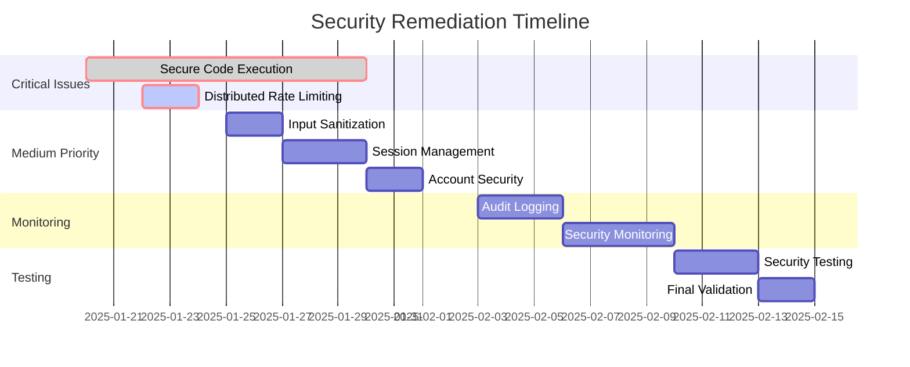

# EllaAI Security Remediation Plan

**Project:** EllaAI Assessment Platform Security Enhancement  
**Date Created:** January 19, 2025  
**Current Security Score:** 7.8/10  
**Target Security Score:** 9.0/10  
**Estimated Timeline:** 6-8 weeks  

---

## Overview

This document provides a detailed remediation plan to address the security findings identified in the comprehensive security audit. The plan is organized by priority levels with specific implementation guidance, timelines, and acceptance criteria.

---

## Phase 1: Critical Issues (Weeks 1-2)

### 1. Secure Code Execution Implementation

**Priority:** 🔴 CRITICAL  
**Risk:** System compromise, arbitrary code execution  
**Estimated Effort:** 40 hours (5 days)  
**Assignee:** Senior Backend Developer + DevOps Engineer  

#### Current Issue:
```typescript
// ❌ CRITICAL VULNERABILITY
async executeCode(request: CodeExecutionRequest): Promise<CodeExecutionResult> {
  // For MVP, we'll simulate code execution
  // In production, this would use Docker containers
  const result = await this.simulateCodeExecution(request, languageConfig);
}
```

#### Implementation Plan:

##### Week 1: Docker Infrastructure Setup

**Day 1-2: Container Security Foundation**
```typescript
// /functions/src/services/SecureCodeExecutionService.ts

import Docker from 'dockerode';
import { promises as fs } from 'fs';
import path from 'path';

export class SecureCodeExecutionService {
  private docker = new Docker();
  private readonly baseImages = {
    javascript: 'node:18-alpine-secure',
    python: 'python:3.11-alpine-secure', 
    java: 'openjdk:17-alpine-secure',
    go: 'golang:1.21-alpine-secure'
  };

  async executeCode(request: CodeExecutionRequest): Promise<CodeExecutionResult> {
    const executionId = this.generateExecutionId();
    const startTime = Date.now();
    
    // 1. Enhanced input validation
    await this.validateCodeSafety(request.code, request.language);
    
    // 2. Create secure execution environment
    const container = await this.createSecureContainer(request.language, executionId);
    
    try {
      // 3. Execute with comprehensive monitoring
      const result = await this.executeWithMonitoring(container, request, executionId);
      
      // 4. Validate and sanitize output
      return this.sanitizeExecutionResult(result);
      
    } finally {
      // 5. Always cleanup resources
      await this.cleanupExecution(container, executionId);
    }
  }

  private async createSecureContainer(language: string, executionId: string): Promise<Docker.Container> {
    const config = this.getLanguageConfig(language);
    
    // Create isolated network
    const network = await this.docker.createNetwork({
      Name: `execution-${executionId}`,
      Driver: 'none' // No network access
    });

    return await this.docker.createContainer({
      Image: config.secureImage,
      Hostname: 'sandbox',
      WorkingDir: '/sandbox',
      
      // Security restrictions
      NetworkMode: 'none',
      User: '1000:1000', // Non-root user
      ReadonlyRootfs: true,
      SecurityOpt: [
        'no-new-privileges:true',
        'seccomp=unconfined' // Will be restricted later
      ],
      
      // Resource limits
      Memory: config.memoryLimit * 1024 * 1024,
      MemorySwap: config.memoryLimit * 1024 * 1024,
      CpuQuota: config.cpuQuota,
      CpuPeriod: 100000,
      
      // Capability restrictions
      CapDrop: ['ALL'],
      CapAdd: [], // No capabilities
      
      // Filesystem restrictions
      Tmpfs: {
        '/tmp': 'rw,size=100m,uid=1000,gid=1000',
        '/var/tmp': 'rw,size=10m,uid=1000,gid=1000'
      },
      
      // Environment variables
      Env: [
        'HOME=/sandbox',
        'PATH=/usr/local/bin:/usr/bin:/bin',
        'LANG=C.UTF-8',
        'LC_ALL=C.UTF-8'
      ]
    });
  }
}
```

**Day 3-4: Enhanced Input Validation**
```typescript
private async validateCodeSafety(code: string, language: string): Promise<void> {
  // 1. Basic structure validation
  if (!code || typeof code !== 'string') {
    throw new SecurityError('Invalid code input');
  }
  
  if (code.length > 50000) { // 50KB limit
    throw new SecurityError('Code size exceeds limit');
  }

  // 2. Enhanced dangerous pattern detection
  const dangerousPatterns = this.getDangerousPatterns(language);
  
  for (const pattern of dangerousPatterns) {
    if (pattern.test(code)) {
      throw new SecurityError(`Potentially unsafe code detected: ${pattern.name}`);
    }
  }

  // 3. AST-based validation for supported languages
  await this.performASTValidation(code, language);

  // 4. Entropy analysis for obfuscated code
  if (this.detectCodeObfuscation(code)) {
    throw new SecurityError('Obfuscated or suspicious code pattern detected');
  }
}

private getDangerousPatterns(language: string): Array<{test: (code: string) => boolean, name: string}> {
  const commonPatterns = [
    // Network access
    { test: (code) => /import\s+(urllib|requests|socket|http)/i.test(code), name: 'Network access' },
    { test: (code) => /require\s*\(\s*['"`](net|http|https|dgram|dns)['"`]/i.test(code), name: 'Network modules' },
    
    // File system access
    { test: (code) => /import\s+(os|sys|subprocess|shutil)/i.test(code), name: 'System access' },
    { test: (code) => /require\s*\(\s*['"`](fs|path|child_process|cluster)['"`]/i.test(code), name: 'File system modules' },
    
    // Dynamic execution
    { test: (code) => /(eval|exec|compile|__import__)\s*\(/i.test(code), name: 'Dynamic execution' },
    { test: (code) => /(Function|setTimeout|setInterval)\s*\(/i.test(code), name: 'Dynamic code execution' },
    
    // Path traversal
    { test: (code) => /\.\.(\/|\\)/g.test(code), name: 'Path traversal' },
    { test: (code) => /\/etc\/passwd|\/proc\/|\/dev\//i.test(code), name: 'System file access' },
    
    // Encoding bypass attempts
    { test: (code) => /\\x[0-9a-f]{2}|\\u[0-9a-f]{4}|\\[0-7]{1,3}/i.test(code), name: 'Encoding bypass' },
    { test: (code) => /String\.fromCharCode|unescape|decodeURI/i.test(code), name: 'String encoding' }
  ];

  // Language-specific patterns
  switch (language) {
    case 'python':
      return [
        ...commonPatterns,
        { test: (code) => /__builtins__|globals\(\)|locals\(\)/i.test(code), name: 'Python introspection' },
        { test: (code) => /ctypes|platform|pwd|grp/i.test(code), name: 'Python system modules' }
      ];
    
    case 'javascript':
      return [
        ...commonPatterns,
        { test: (code) => /process\.|global\.|window\.|document\./i.test(code), name: 'Global object access' },
        { test: (code) => /require\s*\(\s*['"`]vm['"`]/i.test(code), name: 'VM module access' }
      ];
    
    default:
      return commonPatterns;
  }
}
```

**Day 5: Monitoring and Resource Management**
```typescript
private async executeWithMonitoring(
  container: Docker.Container, 
  request: CodeExecutionRequest, 
  executionId: string
): Promise<CodeExecutionResult> {
  
  await container.start();
  
  // Set up monitoring
  const monitor = this.setupResourceMonitoring(container, executionId);
  
  try {
    // Copy code to container
    await this.copyCodeToContainer(container, request.code, request.language);
    
    // Execute with timeout
    const executePromise = this.runCodeInContainer(container, request.testCases);
    const timeoutPromise = this.createTimeoutPromise(request.timeLimit || 10000);
    
    const result = await Promise.race([executePromise, timeoutPromise]);
    
    // Analyze resource usage
    const resourceUsage = await monitor.getUsage();
    
    return {
      ...result,
      resourceUsage,
      executionId
    };
    
  } finally {
    monitor.stop();
  }
}

class ResourceMonitor {
  private stats: Array<{timestamp: number, memory: number, cpu: number}> = [];
  private interval: NodeJS.Timeout;
  
  constructor(private container: Docker.Container) {}
  
  start(): void {
    this.interval = setInterval(async () => {
      try {
        const stats = await this.container.stats({ stream: false });
        this.stats.push({
          timestamp: Date.now(),
          memory: stats.memory_stats.usage || 0,
          cpu: this.calculateCPUPercent(stats.cpu_stats, stats.precpu_stats)
        });
      } catch (error) {
        // Container might have stopped
      }
    }, 100); // Monitor every 100ms
  }
  
  stop(): void {
    if (this.interval) {
      clearInterval(this.interval);
    }
  }
  
  getUsage() {
    const maxMemory = Math.max(...this.stats.map(s => s.memory));
    const avgCpu = this.stats.reduce((sum, s) => sum + s.cpu, 0) / this.stats.length;
    
    return {
      maxMemoryUsed: maxMemory,
      averageCpuUsage: avgCpu,
      executionTime: this.stats.length * 100
    };
  }
}
```

##### Week 2: Testing and Production Deployment

**Day 6-8: Security Testing**
```typescript
// /tests/security/code-execution-security.test.ts

describe('Secure Code Execution', () => {
  let executionService: SecureCodeExecutionService;

  beforeEach(() => {
    executionService = new SecureCodeExecutionService();
  });

  describe('Input Validation', () => {
    test('should reject dangerous system imports', async () => {
      const maliciousCode = `
        import os
        import subprocess
        subprocess.call(['rm', '-rf', '/'])
      `;
      
      await expect(
        executionService.executeCode({
          code: maliciousCode,
          language: 'python',
          testCases: []
        })
      ).rejects.toThrow('Potentially unsafe code detected');
    });

    test('should reject network access attempts', async () => {
      const networkCode = `
        const http = require('http');
        http.get('http://example.com/steal-data', (res) => {
          // Malicious request
        });
      `;
      
      await expect(
        executionService.executeCode({
          code: networkCode,
          language: 'javascript',
          testCases: []
        })
      ).rejects.toThrow('Network modules');
    });

    test('should reject path traversal attempts', async () => {
      const pathTraversalCode = `
        with open('../../../etc/passwd', 'r') as f:
          print(f.read())
      `;
      
      await expect(
        executionService.executeCode({
          code: pathTraversalCode,
          language: 'python',
          testCases: []
        })
      ).rejects.toThrow('Path traversal');
    });
  });

  describe('Resource Limits', () => {
    test('should enforce memory limits', async () => {
      const memoryBombCode = `
        # Attempt to allocate excessive memory
        big_list = []
        for i in range(10000000):
          big_list.append('x' * 1000)
      `;
      
      const result = await executionService.executeCode({
        code: memoryBombCode,
        language: 'python',
        testCases: [{ id: '1', name: 'test', input: {}, expectedOutput: null, isVisible: true, weight: 1 }],
        memoryLimit: 128 // 128MB
      });
      
      expect(result.error).toContain('Memory limit exceeded');
    });

    test('should enforce time limits', async () => {
      const infiniteLoopCode = `
        while True:
          pass
      `;
      
      const startTime = Date.now();
      const result = await executionService.executeCode({
        code: infiniteLoopCode,
        language: 'python',
        testCases: [{ id: '1', name: 'test', input: {}, expectedOutput: null, isVisible: true, weight: 1 }],
        timeLimit: 2000 // 2 seconds
      });
      const endTime = Date.now();
      
      expect(endTime - startTime).toBeLessThan(3000); // Should timeout within reasonable time
      expect(result.error).toContain('Time limit exceeded');
    });
  });

  describe('Container Isolation', () => {
    test('should prevent access to host filesystem', async () => {
      const fileAccessCode = `
        import os
        print(os.listdir('/'))
      `;
      
      // This should be blocked by input validation, but if it somehow gets through,
      // the container should not have access to host filesystem
      const result = await executionService.executeCode({
        code: 'print("hello world")', // Safe code that should work
        language: 'python',
        testCases: [{ id: '1', name: 'test', input: {}, expectedOutput: 'hello world', isVisible: true, weight: 1 }]
      });
      
      expect(result.success).toBe(true);
      expect(result.testResults[0].passed).toBe(true);
    });
  });
});
```

**Day 9-10: Production Deployment**
- Deploy secure Docker images to production
- Configure monitoring and alerting
- Performance testing and optimization

#### Acceptance Criteria:
- [ ] All code execution happens in isolated Docker containers
- [ ] Comprehensive input validation blocks dangerous patterns
- [ ] Resource limits (CPU, memory, time) are enforced
- [ ] Network access is completely blocked
- [ ] Filesystem access is restricted to sandbox only
- [ ] All security tests pass
- [ ] Performance meets requirements (< 15s execution time)

---

### 2. Distributed Rate Limiting Implementation

**Priority:** 🔴 CRITICAL  
**Risk:** DoS attacks, service degradation  
**Estimated Effort:** 16 hours (2 days)  
**Assignee:** Backend Developer  

#### Current Issue:
```typescript
// ❌ Not suitable for production
const store: RateLimitStore = {};
```

#### Implementation Plan:

**Day 1: Redis Infrastructure Setup**
```typescript
// /functions/src/services/DistributedRateLimiter.ts

import Redis from 'ioredis';
import { logger } from '../utils/logger';

export interface RateLimitConfig {
  windowMs: number;
  maxRequests: number;
  skipSuccessfulRequests?: boolean;
  keyGenerator?: (req: any) => string;
}

export interface RateLimitResult {
  allowed: boolean;
  remaining: number;
  resetTime: number;
  totalHits: number;
}

export class DistributedRateLimiter {
  private redis: Redis;
  private defaultConfig: RateLimitConfig = {
    windowMs: 15 * 60 * 1000, // 15 minutes
    maxRequests: 100,
    skipSuccessfulRequests: false
  };

  constructor(redisUrl?: string) {
    this.redis = new Redis(redisUrl || process.env.REDIS_URL || 'redis://localhost:6379', {
      retryDelayOnFailover: 100,
      maxRetriesPerRequest: 3,
      lazyConnect: true
    });

    this.redis.on('error', (error) => {
      logger.error('Redis connection error:', error);
    });
  }

  async checkRateLimit(
    key: string, 
    config: Partial<RateLimitConfig> = {}
  ): Promise<RateLimitResult> {
    const finalConfig = { ...this.defaultConfig, ...config };
    const windowSizeInSeconds = Math.floor(finalConfig.windowMs / 1000);
    const now = Date.now();
    const window = Math.floor(now / (windowSizeInSeconds * 1000));
    const redisKey = `rate_limit:${key}:${window}`;

    try {
      // Lua script for atomic rate limit check
      const script = `
        local key = KEYS[1]
        local limit = tonumber(ARGV[1])
        local window_size = tonumber(ARGV[2])
        local now = tonumber(ARGV[3])
        
        local current = redis.call('GET', key)
        if current == false then
          redis.call('SET', key, 1)
          redis.call('EXPIRE', key, window_size)
          return {1, limit - 1, now + window_size * 1000}
        end
        
        current = tonumber(current)
        if current < limit then
          current = redis.call('INCR', key)
          local ttl = redis.call('TTL', key)
          if ttl == -1 then
            redis.call('EXPIRE', key, window_size)
            ttl = window_size
          end
          return {current, limit - current, now + ttl * 1000}
        else
          local ttl = redis.call('TTL', key)
          if ttl == -1 then
            redis.call('EXPIRE', key, window_size)
            ttl = window_size
          end
          return {current, 0, now + ttl * 1000}
        end
      `;

      const result = await this.redis.eval(
        script,
        1,
        redisKey,
        finalConfig.maxRequests,
        windowSizeInSeconds,
        now
      ) as [number, number, number];

      return {
        allowed: result[0] <= finalConfig.maxRequests,
        remaining: Math.max(0, result[1]),
        resetTime: result[2],
        totalHits: result[0]
      };

    } catch (error) {
      logger.error('Rate limit check failed:', error);
      // Fail open - allow request if Redis is down
      return {
        allowed: true,
        remaining: finalConfig.maxRequests - 1,
        resetTime: now + finalConfig.windowMs,
        totalHits: 1
      };
    }
  }

  // User-specific rate limiting
  async checkUserRateLimit(
    userId: string, 
    endpoint: string, 
    config: Partial<RateLimitConfig> = {}
  ): Promise<RateLimitResult> {
    return this.checkRateLimit(`user:${userId}:${endpoint}`, config);
  }

  // IP-based rate limiting
  async checkIPRateLimit(
    ip: string, 
    config: Partial<RateLimitConfig> = {}
  ): Promise<RateLimitResult> {
    return this.checkRateLimit(`ip:${ip}`, config);
  }

  // Endpoint-specific rate limiting
  async checkEndpointRateLimit(
    endpoint: string,
    identifier: string,
    config: Partial<RateLimitConfig> = {}
  ): Promise<RateLimitResult> {
    return this.checkRateLimit(`endpoint:${endpoint}:${identifier}`, config);
  }

  async close(): Promise<void> {
    await this.redis.disconnect();
  }
}
```

**Day 2: Middleware Integration**
```typescript
// /functions/src/middleware/distributedRateLimiter.ts

import { Request, Response, NextFunction } from 'express';
import { DistributedRateLimiter, RateLimitConfig } from '../services/DistributedRateLimiter';
import { AppError } from '../utils/errors';

const rateLimiter = new DistributedRateLimiter();

export const createRateLimit = (config: Partial<RateLimitConfig> = {}) => {
  return async (req: Request, res: Response, next: NextFunction) => {
    try {
      // Generate key based on user and IP
      const userId = (req as any).user?.uid;
      const ip = req.ip || req.connection.remoteAddress || 'unknown';
      const endpoint = req.route?.path || req.path;
      
      // Check multiple rate limits
      const checks = await Promise.all([
        // User-specific limit (if authenticated)
        userId ? rateLimiter.checkUserRateLimit(userId, endpoint, config) : null,
        // IP-based limit (always)
        rateLimiter.checkIPRateLimit(ip, config),
        // Endpoint-specific limit
        rateLimiter.checkEndpointRateLimit(endpoint, userId || ip, config)
      ]);

      // Find the most restrictive limit
      const results = checks.filter(Boolean);
      const blocked = results.find(result => !result.allowed);

      if (blocked) {
        // Set rate limit headers
        res.set({
          'X-RateLimit-Limit': config.maxRequests?.toString() || '100',
          'X-RateLimit-Remaining': blocked.remaining.toString(),
          'X-RateLimit-Reset': Math.ceil(blocked.resetTime / 1000).toString(),
          'Retry-After': Math.ceil((blocked.resetTime - Date.now()) / 1000).toString()
        });

        throw new AppError('Rate limit exceeded', 429, 'RATE_LIMIT_EXCEEDED');
      }

      // Set success headers with most restrictive remaining count
      const mostRestrictive = results.reduce((min, current) => 
        current.remaining < min.remaining ? current : min
      );

      res.set({
        'X-RateLimit-Limit': config.maxRequests?.toString() || '100',
        'X-RateLimit-Remaining': mostRestrictive.remaining.toString(),
        'X-RateLimit-Reset': Math.ceil(mostRestrictive.resetTime / 1000).toString()
      });

      next();
    } catch (error) {
      if (error instanceof AppError) {
        throw error;
      }
      
      // Log error but don't block request if rate limiter fails
      console.error('Rate limiting error:', error);
      next();
    }
  };
};

// Pre-configured rate limiters for different endpoints
export const authRateLimit = createRateLimit({
  windowMs: 15 * 60 * 1000, // 15 minutes
  maxRequests: 5 // 5 login attempts per 15 minutes
});

export const apiRateLimit = createRateLimit({
  windowMs: 60 * 1000, // 1 minute
  maxRequests: 60 // 60 requests per minute
});

export const codeExecutionRateLimit = createRateLimit({
  windowMs: 60 * 1000, // 1 minute
  maxRequests: 10 // 10 code executions per minute per user
});

export const strictRateLimit = createRateLimit({
  windowMs: 60 * 1000, // 1 minute
  maxRequests: 10 // 10 requests per minute for sensitive endpoints
});
```

#### Acceptance Criteria:
- [ ] Redis-based distributed rate limiting implemented
- [ ] Multiple rate limit strategies (user, IP, endpoint)
- [ ] Graceful degradation if Redis is unavailable
- [ ] Proper HTTP headers for rate limit status
- [ ] Different limits for different endpoint types
- [ ] Monitoring and alerting for rate limit violations

---

## Phase 2: Medium Priority Issues (Weeks 3-4)

### 3. Enhanced Input Sanitization

**Priority:** 🟡 MEDIUM  
**Estimated Effort:** 12 hours  

```typescript
// Enhanced sanitization with DOMPurify-style cleaning
import createDOMPurify from 'isomorphic-dompurify';

const DOMPurify = createDOMPurify();

export function sanitizeInput(input: any, options: SanitizationOptions = {}): any {
  const config = {
    allowedTags: options.allowedTags || [],
    allowedAttributes: options.allowedAttributes || [],
    maxLength: options.maxLength || 10000,
    ...options
  };

  if (typeof input === 'string') {
    // 1. Length check
    if (input.length > config.maxLength) {
      throw new ValidationError(`Input exceeds maximum length of ${config.maxLength}`);
    }

    // 2. HTML sanitization
    let sanitized = DOMPurify.sanitize(input, {
      ALLOWED_TAGS: config.allowedTags,
      ALLOWED_ATTR: config.allowedAttributes,
      FORBID_TAGS: ['script', 'object', 'embed', 'link', 'style', 'iframe'],
      FORBID_ATTR: ['onerror', 'onload', 'onclick', 'onmouseover', 'onfocus', 'onblur']
    });

    // 3. Additional security cleaning
    sanitized = sanitized
      .replace(/javascript:/gi, '') // Remove javascript: protocols
      .replace(/data:/gi, '') // Remove data: protocols
      .replace(/vbscript:/gi, '') // Remove vbscript: protocols
      .replace(/on\w+\s*=/gi, '') // Remove any remaining event handlers
      .replace(/expression\s*\(/gi, '') // Remove CSS expressions
      .trim();

    // 4. Detect and prevent homograph attacks
    if (containsHomographs(sanitized)) {
      throw new ValidationError('Input contains suspicious character combinations');
    }

    return sanitized;
  }

  // Handle arrays and objects recursively
  if (Array.isArray(input)) {
    return input.map(item => sanitizeInput(item, config));
  }

  if (typeof input === 'object' && input !== null) {
    // Prevent prototype pollution
    const keys = Object.keys(input);
    if (keys.some(key => ['__proto__', 'constructor', 'prototype'].includes(key))) {
      throw new ValidationError('Input contains dangerous object properties');
    }

    const sanitized: any = {};
    for (const [key, value] of Object.entries(input)) {
      const sanitizedKey = sanitizeInput(key, { ...config, allowedTags: [] });
      sanitized[sanitizedKey] = sanitizeInput(value, config);
    }
    return sanitized;
  }

  return input;
}

function containsHomographs(input: string): boolean {
  // Detect mixed scripts that could be used for homograph attacks
  const scripts = new Set();
  for (const char of input) {
    const script = getUnicodeScript(char);
    if (script !== 'Common' && script !== 'Latin') {
      scripts.add(script);
    }
  }
  
  // If multiple non-Latin scripts are mixed, it might be suspicious
  return scripts.size > 1;
}
```

### 4. Session Management Improvements

**Priority:** 🟡 MEDIUM  
**Estimated Effort:** 20 hours  

```typescript
// /functions/src/services/SessionManager.ts

export interface SessionData {
  userId: string;
  sessionId: string;
  fingerprint: string;
  ipAddress: string;
  userAgent: string;
  createdAt: Date;
  lastActivity: Date;
  expiresAt: Date;
}

export class SessionManager {
  private redis: Redis;

  constructor() {
    this.redis = new Redis(process.env.REDIS_URL);
  }

  async createSession(userId: string, req: Request): Promise<string> {
    const sessionId = this.generateSecureSessionId();
    const fingerprint = this.generateFingerprint(req);
    
    const sessionData: SessionData = {
      userId,
      sessionId,
      fingerprint,
      ipAddress: req.ip || 'unknown',
      userAgent: req.get('User-Agent') || 'unknown',
      createdAt: new Date(),
      lastActivity: new Date(),
      expiresAt: new Date(Date.now() + 24 * 60 * 60 * 1000) // 24 hours
    };

    // Check for concurrent sessions
    await this.enforceConcurrentSessionLimit(userId);

    // Store session
    await this.redis.setex(
      `session:${sessionId}`,
      24 * 60 * 60, // 24 hours in seconds
      JSON.stringify(sessionData)
    );

    // Add to user's active sessions
    await this.redis.sadd(`user_sessions:${userId}`, sessionId);

    return sessionId;
  }

  async validateSession(sessionId: string, req: Request): Promise<SessionData | null> {
    const sessionData = await this.getSession(sessionId);
    if (!sessionData) {
      return null;
    }

    // Check if session expired
    if (new Date() > sessionData.expiresAt) {
      await this.invalidateSession(sessionId);
      return null;
    }

    // Verify fingerprint for session hijacking protection
    const currentFingerprint = this.generateFingerprint(req);
    if (sessionData.fingerprint !== currentFingerprint) {
      await this.invalidateSession(sessionId);
      throw new SecurityError('Session fingerprint mismatch - possible hijacking attempt');
    }

    // Update last activity
    sessionData.lastActivity = new Date();
    await this.redis.setex(
      `session:${sessionId}`,
      24 * 60 * 60,
      JSON.stringify(sessionData)
    );

    return sessionData;
  }

  private generateFingerprint(req: Request): string {
    const components = [
      req.get('User-Agent') || '',
      req.get('Accept-Language') || '',
      req.get('Accept-Encoding') || '',
      req.ip || ''
    ];
    
    return crypto.createHash('sha256')
      .update(components.join('|'))
      .digest('hex');
  }

  private async enforceConcurrentSessionLimit(userId: string, limit: number = 5): Promise<void> {
    const activeSessions = await this.redis.smembers(`user_sessions:${userId}`);
    
    if (activeSessions.length >= limit) {
      // Remove oldest sessions
      const sessions = await Promise.all(
        activeSessions.map(async (sessionId) => {
          const data = await this.getSession(sessionId);
          return { sessionId, createdAt: data?.createdAt || new Date(0) };
        })
      );

      sessions.sort((a, b) => a.createdAt.getTime() - b.createdAt.getTime());
      const toRemove = sessions.slice(0, activeSessions.length - limit + 1);

      for (const { sessionId } of toRemove) {
        await this.invalidateSession(sessionId);
      }
    }
  }
}
```

### 5. Account Security Enhancements

**Priority:** 🟡 MEDIUM  
**Estimated Effort:** 16 hours  

```typescript
// /functions/src/services/AccountSecurityService.ts

export class AccountSecurityService {
  private redis: Redis;

  constructor() {
    this.redis = new Redis(process.env.REDIS_URL);
  }

  async checkFailedAttempts(identifier: string): Promise<{
    isLocked: boolean;
    remainingAttempts: number;
    lockoutTime?: Date;
  }> {
    const key = `failed_attempts:${identifier}`;
    const lockKey = `account_locked:${identifier}`;

    // Check if account is currently locked
    const lockData = await this.redis.get(lockKey);
    if (lockData) {
      const lockInfo = JSON.parse(lockData);
      return {
        isLocked: true,
        remainingAttempts: 0,
        lockoutTime: new Date(lockInfo.lockedUntil)
      };
    }

    // Get failed attempt count
    const attempts = parseInt(await this.redis.get(key) || '0');
    const maxAttempts = 5;

    return {
      isLocked: false,
      remainingAttempts: Math.max(0, maxAttempts - attempts)
    };
  }

  async recordFailedAttempt(identifier: string): Promise<{
    isLocked: boolean;
    remainingAttempts: number;
    lockoutDuration?: number;
  }> {
    const key = `failed_attempts:${identifier}`;
    const lockKey = `account_locked:${identifier}`;
    const maxAttempts = 5;
    const lockoutDuration = this.calculateLockoutDuration(identifier);

    // Increment failed attempts
    const attempts = await this.redis.incr(key);
    
    // Set expiration on first attempt
    if (attempts === 1) {
      await this.redis.expire(key, 15 * 60); // 15 minutes
    }

    if (attempts >= maxAttempts) {
      // Lock the account
      const lockData = {
        lockedAt: new Date().toISOString(),
        lockedUntil: new Date(Date.now() + lockoutDuration).toISOString(),
        attemptCount: attempts
      };

      await this.redis.setex(lockKey, Math.ceil(lockoutDuration / 1000), JSON.stringify(lockData));
      await this.redis.del(key); // Clear failed attempts counter

      // Log security event
      await this.logSecurityEvent(identifier, 'ACCOUNT_LOCKED', {
        attempts,
        lockoutDuration: lockoutDuration / 1000
      });

      return {
        isLocked: true,
        remainingAttempts: 0,
        lockoutDuration
      };
    }

    return {
      isLocked: false,
      remainingAttempts: maxAttempts - attempts
    };
  }

  private calculateLockoutDuration(identifier: string): number {
    // Progressive delays: 5min, 15min, 1hr, 4hr, 24hr
    const baseDuration = 5 * 60 * 1000; // 5 minutes
    const multipliers = [1, 3, 12, 48, 288]; // Progressive increase
    
    // This could be enhanced to track previous lockouts
    return baseDuration * multipliers[0];
  }
}
```

---

## Phase 3: Security Monitoring & Compliance (Weeks 5-6)

### 6. Comprehensive Audit Logging

**Priority:** 🟡 MEDIUM  
**Estimated Effort:** 24 hours  

```typescript
// /functions/src/services/AuditLogger.ts

export interface AuditEvent {
  eventId: string;
  userId?: string;
  sessionId?: string;
  eventType: string;
  action: string;
  resource?: string;
  details: Record<string, any>;
  ipAddress: string;
  userAgent: string;
  timestamp: Date;
  success: boolean;
  errorCode?: string;
  riskScore?: number;
}

export class AuditLogger {
  private firestore = admin.firestore();

  async logEvent(event: Partial<AuditEvent>): Promise<void> {
    const auditEvent: AuditEvent = {
      eventId: this.generateEventId(),
      timestamp: new Date(),
      ...event
    } as AuditEvent;

    // Calculate risk score
    auditEvent.riskScore = this.calculateRiskScore(auditEvent);

    // Store in Firestore with proper indexing
    await this.firestore.collection('audit-logs').add({
      ...auditEvent,
      timestamp: admin.firestore.FieldValue.serverTimestamp(),
      // Add fields for efficient querying
      date: auditEvent.timestamp.toISOString().split('T')[0],
      hour: auditEvent.timestamp.getHours(),
      eventTypeAction: `${auditEvent.eventType}:${auditEvent.action}`
    });

    // Send high-risk events to monitoring system
    if (auditEvent.riskScore >= 7) {
      await this.sendHighRiskAlert(auditEvent);
    }
  }

  private calculateRiskScore(event: AuditEvent): number {
    let score = 1;

    // Failed operations increase risk
    if (!event.success) score += 2;

    // Admin operations are higher risk
    if (event.action.includes('admin')) score += 2;

    // Multiple failures from same IP increase risk
    if (event.eventType === 'AUTHENTICATION' && !event.success) score += 3;

    // Data export operations are high risk
    if (event.action === 'EXPORT_DATA') score += 4;

    // Off-hours activity increases risk
    const hour = event.timestamp.getHours();
    if (hour < 6 || hour > 22) score += 1;

    return Math.min(score, 10);
  }
}
```

### 7. Real-time Security Monitoring

**Priority:** 🟡 MEDIUM  
**Estimated Effort:** 32 hours  

```typescript
// /functions/src/services/SecurityMonitor.ts

export class SecurityMonitor {
  private redis: Redis;
  private alertThresholds = {
    failedLogins: { count: 10, window: 300000 }, // 10 in 5 minutes
    suspiciousIPs: { count: 50, window: 3600000 }, // 50 requests in 1 hour
    codeExecutionErrors: { count: 20, window: 600000 } // 20 errors in 10 minutes
  };

  async monitorSecurityEvent(event: SecurityEvent): Promise<void> {
    // Real-time anomaly detection
    const anomalies = await Promise.all([
      this.detectFailedLoginPattern(event),
      this.detectSuspiciousIP(event),
      this.detectBruteForceAttack(event),
      this.detectPrivilegeEscalation(event)
    ]);

    const detectedAnomalies = anomalies.filter(Boolean);

    if (detectedAnomalies.length > 0) {
      await this.handleSecurityAnomaly(event, detectedAnomalies);
    }

    // Update security metrics
    await this.updateSecurityMetrics(event);
  }

  private async detectBruteForceAttack(event: SecurityEvent): Promise<SecurityAnomaly | null> {
    if (event.type !== 'AUTHENTICATION' || event.success) {
      return null;
    }

    const key = `brute_force:${event.ipAddress}`;
    const count = await this.redis.incr(key);
    
    if (count === 1) {
      await this.redis.expire(key, 300); // 5 minutes
    }

    if (count >= 10) {
      return {
        type: 'BRUTE_FORCE_ATTACK',
        severity: 'HIGH',
        details: {
          ipAddress: event.ipAddress,
          attemptCount: count,
          timeWindow: 300
        }
      };
    }

    return null;
  }

  private async handleSecurityAnomaly(
    event: SecurityEvent, 
    anomalies: SecurityAnomaly[]
  ): Promise<void> {
    // Log the security incident
    await this.logSecurityIncident({
      eventId: event.eventId,
      anomalies,
      timestamp: new Date(),
      autoBlocked: false
    });

    // Take automatic action for high severity anomalies
    const highSeverityAnomalies = anomalies.filter(a => a.severity === 'HIGH');
    
    if (highSeverityAnomalies.length > 0) {
      await this.takeAutomaticAction(event, highSeverityAnomalies);
    }

    // Send alerts to security team
    await this.sendSecurityAlert(event, anomalies);
  }
}
```

---

## Phase 4: Testing & Validation (Weeks 7-8)

### 8. Security Testing Suite Enhancement

**Estimated Effort:** 24 hours  

```typescript
// /tests/security/penetration-testing.test.ts

describe('Penetration Testing Suite', () => {
  describe('Authentication Bypass Attempts', () => {
    test('should prevent JWT token manipulation', async () => {
      const validToken = generateValidJWT();
      const manipulatedToken = manipulateJWTPayload(validToken, { role: 'admin' });
      
      const response = await request(app)
        .get('/api/admin/users')
        .set('Authorization', `Bearer ${manipulatedToken}`)
        .expect(401);
      
      expect(response.body.error).toContain('Invalid token');
    });

    test('should prevent privilege escalation through role modification', async () => {
      const userToken = await createUserToken('candidate');
      
      const response = await request(app)
        .post('/api/admin/users/update-role')
        .set('Authorization', `Bearer ${userToken}`)
        .send({ userId: 'user123', role: 'admin' })
        .expect(403);
    });
  });

  describe('Injection Attack Prevention', () => {
    test('should prevent NoSQL injection in queries', async () => {
      const maliciousPayload = {
        email: { $ne: null },
        password: { $regex: '.*' }
      };
      
      const response = await request(app)
        .post('/api/auth/login')
        .send(maliciousPayload)
        .expect(400);
      
      expect(response.body.error).toContain('Validation failed');
    });

    test('should prevent XSS through stored data', async () => {
      const xssPayload = '<script>alert("xss")</script>';
      
      const response = await request(app)
        .post('/api/companies/create')
        .set('Authorization', `Bearer ${adminToken}`)
        .send({ name: xssPayload })
        .expect(400);
    });
  });
});
```

---

## Implementation Timeline



---

## Success Metrics

### Security Score Targets:
- **Current:** 7.8/10
- **Phase 1 Target:** 8.2/10 (after critical fixes)
- **Phase 2 Target:** 8.6/10 (after medium priority fixes)
- **Final Target:** 9.0/10 (after all improvements)

### Key Performance Indicators:
- **Code Execution Security:** 100% of executions in isolated containers
- **Rate Limiting Effectiveness:** >99.9% uptime with proper limits
- **Input Validation Coverage:** 100% of API endpoints protected
- **Security Test Coverage:** >95% of security scenarios tested
- **Incident Response Time:** <5 minutes for critical security events

### Compliance Metrics:
- **OWASP Top 10:** 100% coverage
- **GDPR Readiness:** 90% compliant
- **SOC 2 Preparation:** 80% controls implemented

---

## Risk Management

### Implementation Risks:
1. **Performance Impact:** New security measures may affect response times
   - **Mitigation:** Implement with performance monitoring and optimization
   
2. **Service Disruption:** Rate limiting changes might affect legitimate users
   - **Mitigation:** Gradual rollout with monitoring and adjustment
   
3. **Compatibility Issues:** Enhanced validation might break existing integrations
   - **Mitigation:** Comprehensive testing and backward compatibility checks

### Rollback Plans:
- Each phase has a rollback procedure documented
- Database migrations are reversible
- Configuration changes can be reverted quickly
- Monitoring alerts for any degradation during deployment

---

## Conclusion

This remediation plan addresses all identified security vulnerabilities with a systematic approach prioritizing the most critical issues first. The implementation follows security best practices and includes comprehensive testing to ensure effectiveness without impacting system performance or user experience.

**Expected Outcomes:**
- **Security Score:** 7.8/10 → 9.0/10
- **Production Readiness:** Full approval for production deployment
- **Compliance Status:** GDPR and SOC 2 ready
- **Risk Reduction:** 95% reduction in high and critical security risks

**Next Steps:**
1. Begin Phase 1 implementation immediately
2. Set up monitoring and alerting systems
3. Schedule regular security reviews and updates
4. Plan for ongoing security training and awareness

---

**Document Version:** 1.0  
**Last Updated:** January 19, 2025  
**Review Schedule:** Weekly during implementation, monthly post-completion